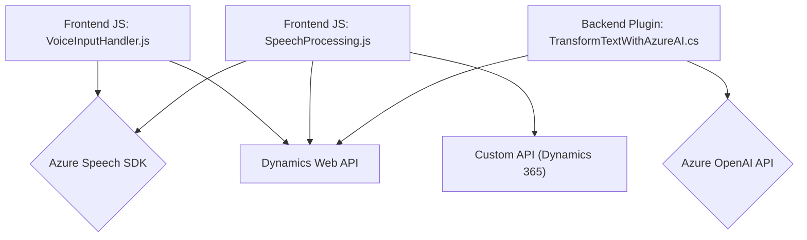

### Breve resumen técnico

Este repositorio presenta una solución híbrida que utiliza lógica del frontend en JavaScript y extensiones backend en .NET para integrar funcionalidades avanzadas basadas en inteligencia artificial y manipulación dinámica de datos de formularios en Microsoft Dynamics CRM. Las tareas incluyen síntesis de voz, reconocimiento de voz, asignación de datos a campos en formularios, y transformación de texto utilizando Azure OpenAI.

---

### Descripción de arquitectura

La solución utiliza una arquitectura desacoplada que combina las siguientes capas:
1. **Frontend (JS):** Responsabilidad limitada al manejo de interface de usuario y comunicación con APIs externas.
2. **Backend (C# Plugin en Dynamics CRM):** Encargado de realizar la transformación de texto mediante Azure OpenAI y la manipulación de datos.
3. **Servicios externos:** Azure Speech SDK para síntesis y transcripción de voz, y Azure OpenAI para procesamiento textual.

La organización sigue un patrón orientado a servicios con modularidad en el frontend y un patrón de arquitectura de plugin para extensibilidad en Dynamics CRM. Esto permite integrar componentes externos como Azure SDK y APIs personalizadas para tareas específicas.

---

### Tecnologías usadas

1. **Frontend:**
   - **JavaScript:** Modular, orientado a funciones.
   - **Azure Speech SDK:** Para síntesis de voz y reconocimiento de voz.
   - **Dynamics 365 Web API:** Interacción directa con entidades y formularios del CRM.

2. **Backend:**
   - **C# (.NET Framework):** Código del plugin extendiendo Microsoft Dynamics CRM.
   - **Azure OpenAI API:** Procesamiento avanzado de texto con GPT-4 o GPT-3.
   - **Newtonsoft.Json:** Para manipulación de objetos JSON en transformaciones.

3. **Servicios externos:**
   - Dependencias en Azure Speech y Azure OpenAI, ambos cargados dinámicamente o invocados mediante APIs.

---

### Diagrama **Mermaid** válido para GitHub Markdown

---

### Conclusión final

La solución es una arquitectura híbrida con un frontend que maneja la interacción del cliente y lógica modularizada, mientras el backend extiende capacidades de Dynamics CRM mediante un plugin conformado con principios de responsabilidad única. Las dependencias principales corresponden a servicios externos como Azure Speech SDK y Azure OpenAI, con una integración directa hacia APIs externas y el uso de las capacidades del CRM como un hub central.

Esta arquitectura es ideal para aplicaciones empresariales que requieren IA avanzada y funcionalidad CRM extendida, ofreciendo un diseño escalable y flexible mediante la modularidad en el frontend y la integración en el backend. Sin embargo, aspectos como gestión de claves API y dependencias externas deben ser cuidadosamente manejados por buenas prácticas de seguridad y configuración.