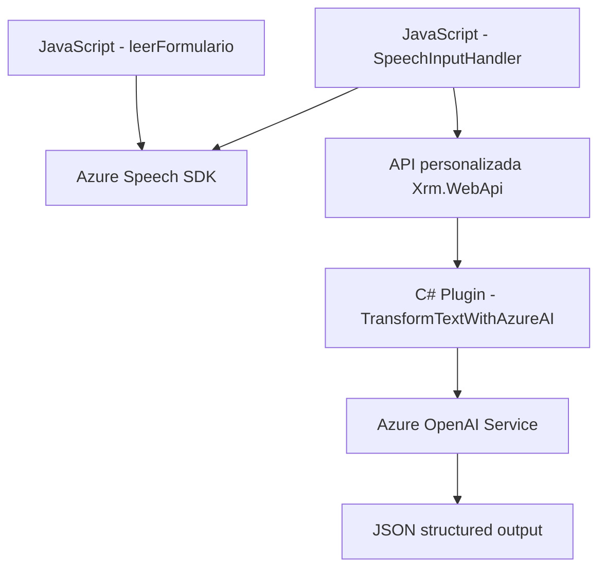

### Breve resumen técnico
El repositorio describe una solución orientada al reconocimiento y procesamiento de voz en un entorno de tipo CRM, con integración a servicios externos como Azure Speech SDK y OpenAI. Está distribuido en varias capas: frontend para la interacción con voz y datos de formularios, y backend para procesamiento avanzado mediante un plugin que se comunica con Azure OpenAI.

---

### Descripción de arquitectura
La solución tiene arquitectura **n-capas con integración de servicios externos**, que incluye las siguientes componentes:
1. **Frontend (JavaScript):** Procesa interacción con el usuario mediante reconocimiento de voz y manipulación de formularios CRM.
2. **Backend (Plugin en C# para Dynamics CRM):** Extiende funcionalidades del CRM con procesamiento avanzado mediante el servicio OpenAI.
3. **Servicios externos:** Azure Speech SDK para reconocimiento y síntesis de voz, y Azure OpenAI para operaciones más complejas.

---

### Tecnologías usadas
1. **Frontend:**
   - **JavaScript** para lógica cliente.
   - **Azure Speech SDK** para reconocimiento y síntesis de voz.
   - **HTML DOM Manipulation** para carga dinámica del SDK y manipulación de datos.
2. **Backend:**
   - **C# (.NET Framework)** para plugins CRM.
   - **Microsoft Dynamics CRM SDK** para integración directa con el CRM.
   - **Newtonsoft.Json** para manejo de objetos JSON.
   - **HttpClient** para invocación de servicios externos.
3. **Servicios externos:**
   - **Azure Speech SDK:** Reconocimiento y síntesis de voz.
   - **Azure OpenAI:** Procesamiento avanzado de texto.
4. **Patrones arquitectónicos:**
   - Modularidad.
   - Plugin Pattern.
   - Service Integration.
   - Carga dinámica de dependencias.

---

### Diagrama Mermaid

---

### Conclusión final
La solución presentada utiliza **multicapas** para gestionar datos y experiencias, distribuidas entre frontend y backend. Además, aprovecha servicios robustos como el **Azure Speech SDK** y **Azure OpenAI**, integrados de manera eficiente con Dynamics CRM. Esta arquitectura es escalable y adecuada para entornos empresariales que requieren interacción avanzada con voz, procesamiento de texto y manejo dinámico de datos estructurados. Sin embargo, se podría integrar pruebas adicionales para garantizar la estabilidad frente a la carga dinámica del SDK, además de métricas de desempeño para optimizar tiempos de respuestas de servicios externos.