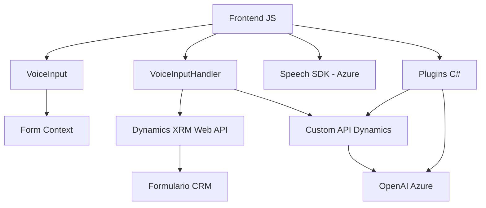

### Breve resumen técnico
El repositorio contiene archivos que implementan funcionalidades para interactuar con formularios mediante entrada de voz, síntesis de texto a voz, reconocimiento de voz y transformación de texto mediante inteligencia artificial. Utiliza servicios externos, como el Azure Speech SDK y la API de OpenAI alojada en Azure, y se conecta con Dynamics CRM para gestionar datos y campos del formulario.

### Descripción de arquitectura
La arquitectura sigue un diseño de **n capas**, donde cada componente está separado para cumplir roles específicos:
- **Frontend:** Archivos en formato JavaScript que interactúan con el usuario (formularios, voz, campos), procesan la entrada de datos y envían solicitudes HTTP. Los archivos son modulares y autónomos en su lógica de negocio.
- **Backend/Plugins:** Archivos en C# que actúan como extensiones de plugins en Dynamics CRM. Se encargan de consumir APIs externas, transformar datos y procesarlos conforme a las reglas del sistema.
- Existe una integración clara con microservicios externos (Azure Speech y OpenAI) que añaden características avanzadas como síntesis de texto a voz y transformación de texto.

### Tecnologías usadas
1. **Frontend**:
   - **JavaScript (Client-side)**: Principal lenguaje para la interacción con el usuario.
   - **Azure Speech SDK**: API para realizar reconocimiento de voz y conversión de texto a voz.
   - **Dynamics XRM Web API**: Interfaz utilizada para integrar con un sistema CRM y actualizar datos de formularios dinámicos.
   - **DOM Manipulation**: Para gestionar formularios y cargar scripts como el SDK de Azure.

2. **Backend Plugins**:
   - **C#/.NET**: Usado para implementar extensiones en Dynamics CRM mediante la interfaz nativa de plugins (`IPlugin`).
   - **Microsoft.Xrm.Sdk**: Para interactuar con datos del CRM.
   - **System.Net.Http**: Para realizar peticiones HTTP hacia APIs externas.
   - **System.Text.Json** y **Newtonsoft.Json.Linq**: Para manejar JSON serializando/deserializando objetos.
   - **OpenAI via API en Azure**: Aplicación de inteligencia artificial en transformación textual.

### Diagrama Mermaid válido para GitHub

### Conclusión final
La solución integra **capacidades modernas** como procesamiento de voz y APIs inteligentes en una arquitectura basada en **n capas**, con una fuerte dependencia en **servicios externos** como Azure Speech SDK y OpenAI API. El diseño muestra un enfoque modular, con separación lógica de frontend y backend, permitiendo su escalabilidad y mantenibilidad.

Aunque efectiva, existe un área de mejora en la seguridad y centralización de configuraciones externas (por ejemplo, almacenamiento seguro de claves de API en lugar de dejarlas en el código fuente). Por otro lado, la forma en que el SDK de Azure se carga dinámicamente favorece la flexibilidad en múltiples entornos web. 

En general, el repositorio presenta tecnología moderna y sigue patrones estándar que garantizan buen rendimiento y adaptabilidad para experiencias interactivas basadas en formularios y reconocimiento de voz.