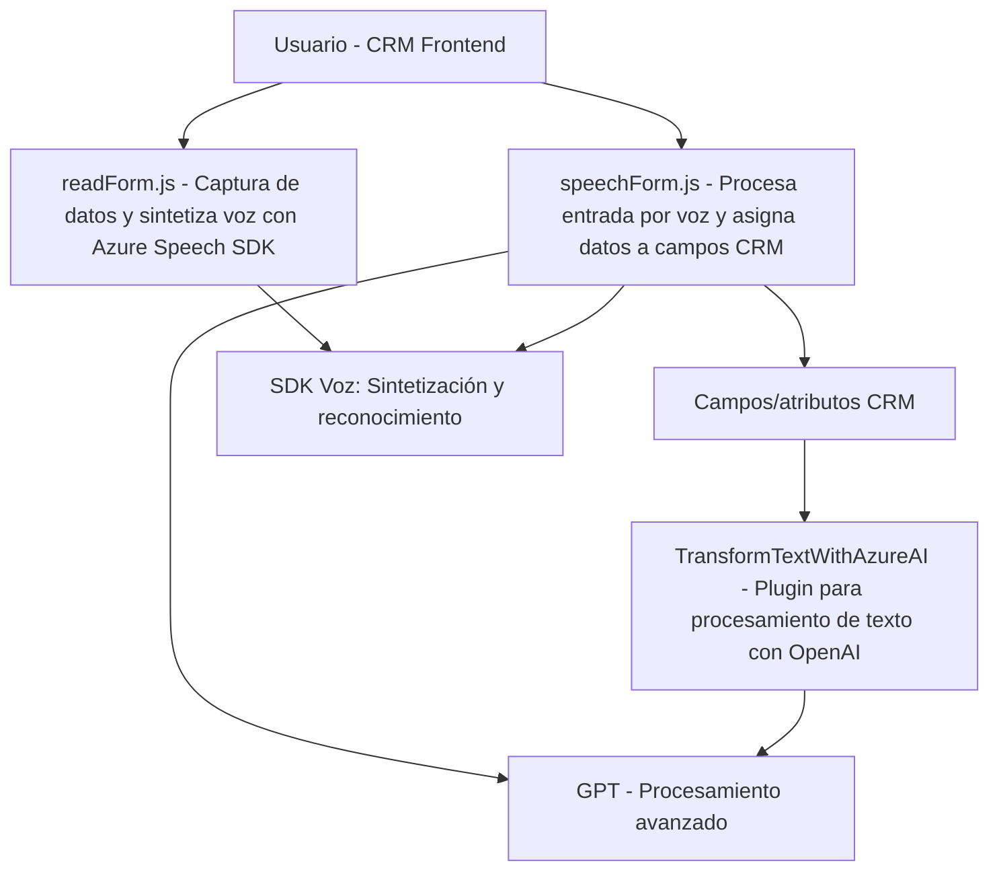

## Breve resumen técnico

Esta solución es una integración avanzada que conecta funciones de interacción por voz y procesamiento de texto mediante Azure Speech SDK y Azure OpenAI en un entorno CRM de Microsoft Dynamics. Está compuesta por tres componentes principales:
1. **Frontend (JavaScript):** Realiza interacción directa con formularios CRM para extracción de datos, síntesis de voz, procesamiento de entrada por voz y manipulación de atributos.
2. **Plugin Backend (.NET/C#):** Utiliza un servicio de Azure OpenAI para transformar texto según normas definidas por el usuario en Dynamics CRM.
3. **Dependencias externas:** Servicios cloud (Azure) que amplían la interacción del sistema con IA y voz.

---

## Descripción de arquitectura

### Tipo de solución
- **Integración basada en API y plugins:** La solución consta de una integración de dos niveles:
  - Nivel cliente: Scripts JavaScript que interactúan con el entorno CRM y Azure Speech SDK.
  - Nivel servidor: Código backend en C# que opera como un plugin en Dynamics CRM, procesando texto mediante Azure OpenAI.

### Tipo de arquitectura
- **Monolito distribuido (n-capas):** Aunque descentraliza funciones (frontend y plugins), sigue un esquema de arquitectura en capas:
  - **Frontend (UI + API cliente):** Maneja datos de usuario y voz.
  - **Business Logic Plugin:** Procesa texto con Azure OpenAI y aplica las reglas dentro del contexto CRM.
  - **Externa:** Dependencia hacia SDK y APIs de servicios en Azure (Speech SDK y OpenAI).

### Patrones utilizados
1. **Facade:** Para el manejo suave de interacciones entre formularios y datos usando `formContext`.
2. **Adapter:** Integración directa con SDK y APIs externas mediante funciones.
3. **Plugin Architecture:** Backend (.NET) diseñado como un plugin que se activa en contextos específicos del CRM.
4. **RESTful Pattern:** Interacción del plugin con Azure OpenAI mediante una API REST.

---

## Tecnologías usadas

1. **Frontend:**
   - **JavaScript ES6:** Manejo de formularios dinámicos y análisis de datos.
   - **Azure Speech SDK:** Para reconocimiento y síntesis de voz.
   - **DOM API:** Para cargar dinámicamente scripts y procesar campos de formularios.

2. **Backend:**
   - **.NET Framework (Microsoft Dynamics SDK):** Para definición de plugins y manejo de procesos en Dynamics CRM.
   - **Azure OpenAI API:** Procesamiento avanzado de texto usando modelos GPT.

3. **Externo:**
   - **REST APIs (Azure Speech y OpenAI):** Servicios cloud externos que complementan las funcionalidades locales.

---

## Componentes y dependencias externas

1. **Azure Speech SDK:** Para manejo de capacidades de voz (in/out).
2. **Azure OpenAI:** Para procesos avanzados de transformación de texto.
3. **Microsoft Dynamics SDK:** Para integración de plugins y manipulación de datos en contextos CRM.
4. **JSON Serializers:** Uso de `System.Text.Json` y `Newtonsoft.Json` para transformar datos JSON (capa backend).
5. **HTTP Cliente (`System.Net.Http`)**: Para conectar con servicios REST.

---

## Diagrama Mermaid

---

## Conclusión final

Esta solución representa una integración avanzada de capacidades de interacción humana (voz y texto) con un entorno dinámico como Microsoft Dynamics CRM. Aunque los scripts y plugins están bien organizados funcionalmente, podría beneficiarse de mayor modularización y un enfoque hacia patrones sólidos como **hexagonal arquitectura** para separación de lógica interna y dependencias externas. En general, logra combinar servicios cognitivos (Azure) y la funcionalidad CRM de Dynamics para proveer una experiencia moderna al usuario, dando como resultado un sistema flexible y extensible.