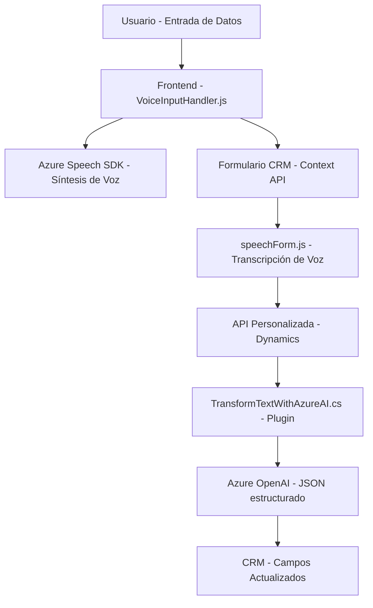

### Breve resumen técnico:

El repositorio contiene tres archivos principales:
1. **readForm.js**: Una lógica en JavaScript que extrae datos visibles de formularios, utiliza el **Azure Speech SDK** para sintetizar voz desde texto, y emplea patrones como Event-Driven y Modular.
2. **speechForm.js**: Implementa el reconocimiento de voz usando el **Azure Speech SDK** en formularios de Dynamics CRM, realizando procesamiento de datos y comunicación con APIs personalizadas.
3. **TransformTextWithAzureAI.cs**: Plugin para Dynamics CRM que utiliza **Azure OpenAI API** para transformar entrada de texto en JSON estructurado con reglas específicas, siguiendo los principios de Plugin-Based Architecture.

Los archivos interactúan con la plataforma Dynamics CRM y servicios como **Azure Speech SDK** y **Azure OpenAI API**.

---

### Descripción de arquitectura:

La solución muestra características de arquitectura modular con integración de servicios externos. Cada archivo funciona como un componente especializado:
- **Frontend**: Contiene lógica de entrada y procesamiento de voz, así como extracción de datos de formularios.
- **Backend (Plugins)**: Utiliza un plugin en Dynamics CRM para transformar texto mediante el servicio Azure OpenAI.

En términos de estructura global, la arquitectura se orienta hacia un diseño de **microservicios funcionales**, donde cada módulo asume una responsabilidad específica, conectándose al sistema CRM y servicios externos.

---

### Tecnologías usadas:

1. **Frontend**:
   - **JavaScript**
   - **Azure Speech SDK**: Para reconocimiento y síntesis de voz.
   - **Dynamics CRM context API**: Para manipular formularios.

2. **Backend**:
   - **C#**: Desarrollo de plugin para Dynamics CRM.
   - **Azure OpenAI API**: Para generar y estructurar texto.
   - **Newtonsoft.Json**: Procesamiento avanzado de JSON.
   - **System.Net.Http**: Realización de solicitudes HTTP.

### Patrones reconocidos:
- **Event-Driven**: El uso de callbacks y eventos para inicio de procesos relacionados con SDK.
- **Facade**: Simplificación del acceso a funcionalidades complejas mediante puntos de entrada como `startVoiceInput`.
- **Plugin-Based Architecture**: La clase `TransformTextWithAzureAI.cs` está diseñada bajo los principios de plugins para Dynamics CRM.
- **Helper Functions**: Métodos reutilizables para tareas específicas (e.g., `GetOpenAIResponse`, `applyValueToField`).
- **Service Gateway**: Conexión con servicios externos como Azure OpenAI y Speech SDK.

---

### Diagrama Mermaid válido para GitHub:

---

### Conclusión final:

Esta solución está diseñada como una implementación modular cuyo propósito es mejorar funcionalidades de entrada de datos y procesamiento en Dynamics CRM. Utiliza tecnologías de Microsoft Azure (Speech SDK y OpenAI) para integración avanzada de inteligencia artificial en transcripción y generación de contenido estructurado. La arquitectura sigue principios de separación de responsabilidades y utiliza patrones modernos como Event-Driven y Service Gateway para garantizar escalabilidad y flexibilidad.