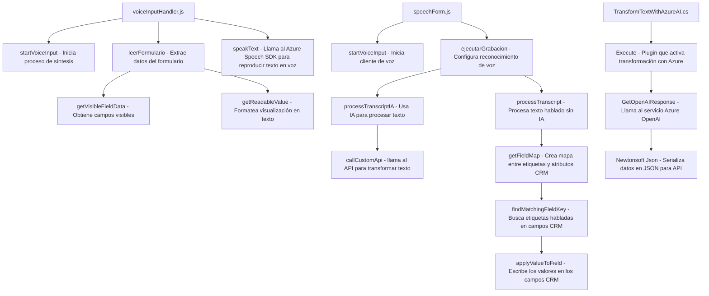

### Análisis del Repositorio

#### **Breve Resumen Técnico**
Este repositorio contiene módulos de software centrados en la interacción usuario-interface mediante voz, junto con transformaciones de datos basadas en servicios Cloud (Azure). La solución se orquesta entre un sistema de frontend que procesa datos y un plugin en Dynamics CRM respaldado por IA y reconocimiento de voz.

---

### **1. Tipo de solución**
La solución puede ser clasificada como:
- **Frontend:** En el directorio `FRONTEND/JS/` se observan archivos con lógica para integrar formularios dinámicos con reconocimiento y síntesis de voz (utilizando Azure SDK).
- **Plugin para Dynamics CRM:** En el directorio `Plugins/`, el archivo `TransformTextWithAzureAI.cs` implementa una extensión o plugin que realiza transformación de texto usando Azure OpenAI.
- Conjunto de scripts tiene interacción directa con aplicaciones de **CRM Dynamics** y servicios en la nube.

---

### **2. Tecnologías, Frameworks y Patrones**

#### **2.1. Tecnologías utilizadas**
1. **Frontend:**
   - **JavaScript**: Lenguaje principal en los scripts que gestionan la interacción de voz y del formulario.
   - **Azure Speech SDK**: Utilizado para la síntesis y reconocimiento de voz.
   - **Dynamics CRM**: APIs para manipular formularios y datos en un contexto CRM (`Xrm.WebApi.online`).

2. **Backend Plugin:**
   - **C# (.NET Framework)**: Lenguaje utilizado para crear plugins en Dynamics CRM.
   - **Azure OpenAI**: Proporciona transformación avanzada de textos.
   - **REST API**: Uso extensivo para comunicación con servicios externos.
   - **Newtonsoft.Json**: Para el manejo y serialización/deserialización de JSON.

#### **2.2. Patrones observados**
1. **Separación por módulos funcionales:** Cada archivo se organiza para contener responsabilidades específicas (lectura de formularios, síntesis, reconocimiento, procesamiento de datos).
2. **Patrón de Plugin**: El archivo `TransformTextWithAzureAI.cs` aplica el patrón de extensión basado en la interfaz `IPlugin`, típico de Dynamics CRM.
3. **Patrón Adapter:** En el manejo de SDK y API externa (como en los helpers usados para la integración con Azure Speech SDK y OpenAI).
4. **Service-Oriented Architecture (SOA):** Dependencia de servicios externos (Azure APIs) para delegar lógica avanzada como reconocimiento de voz y procesamiento natural del lenguaje.
5. **Event-Driven Programming:** En el frontend se detectan llamadas asincrónicas basadas en eventos.

---

### **3. Tipo de arquitectura**
1. **Frontend (JavaScript):**
   - **Arquitectura Modular basada en eventos:** Cada funcionalidad está encapsulada en funciones independientes que interactúan mediante el contexto CRM o servicios externos.
   - Uso extensivo de promesas y operaciones asincrónicas con APIs.
   
2. **Plugin (C#):**
   - **Service-Oriented Architecture:** Se aplica este enfoque al delegar transformación a servicios externos como Azure OpenAI.
   - **Plugin Architecture:** La lógica de negocio específica se implementa en el ciclo de vida del plugin, donde depende del contexto CRM.
   - **Multicapa:** Separación en capas para gestión de lógica aplicativa, servicios HTTP externos y manejo de datos.

Ambos componentes, si bien tienen especificaciones propias, funcionan dentro del ecosistema CRM. La interacción a través de servicios externos como APIs ayuda en la separación de responsabilidades.

---

### **4. Dependencias y componentes externos**
#### **Externas:**
1. Azure Speech SDK: Para reconocimiento de voz y síntesis.
2. Azure OpenAI GPT-4: Transformación de texto y procesamiento de lenguaje natural.
3. Dynamics CRM API:
   - `Xrm.WebApi.online`: Manipulación de CRUD en el sistema CRM.
   - Plugin en C#: Conector de Dynamics CRM.

#### **Internas:**
1. Gestión del contexto de formulario (`executionContext`, `formContext`).
2. Helpers para asignación de campos y normalización de datos visibles.

---

### **5. Diagrama Mermaid**

---

### **Conclusión Final**
Este repositorio implementa una solución integral para interacción vocal y procesamiento avanzado en el contexto de Dynamics CRM. Utiliza tecnologías modernas como Azure Speech SDK y OpenAI para facilitar la experiencia del usuario, centrándose en modularidad y delegación de servicios a la nube. La arquitectura combina patrones de SOA, programación basada en eventos y plugins dinámicos, lo que la hace altamente extensible y robusta.