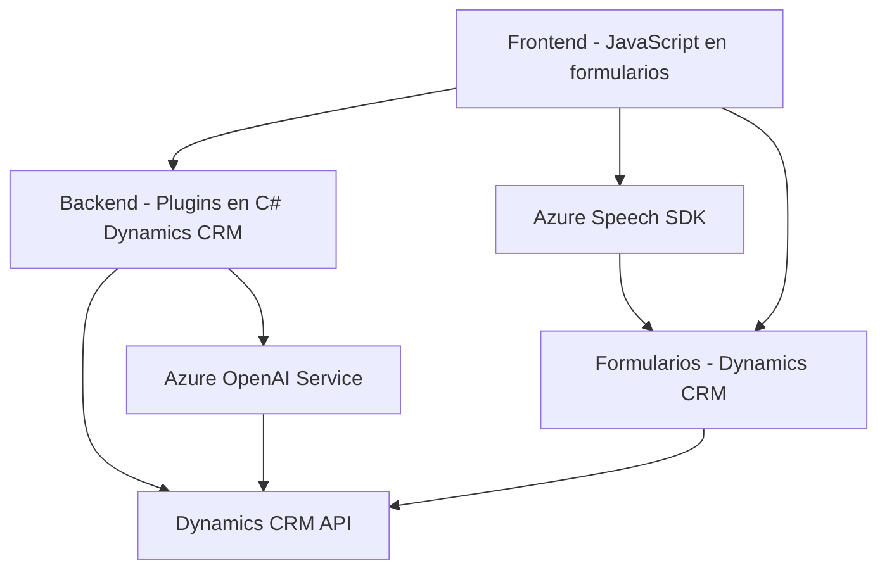

### Breve resumen técnico
El repositorio presenta una solución que combina funcionalidades de frontend y backend con integración de tecnologías basadas en Microsoft Dynamics CRM y Azure. Incluye módulos para interacción con datos en formularios dinámicos (captura y transformación) y una extensión de plugin en Dynamics CRM para procesamiento avanzado de texto utilizando Azure OpenAI.

---

### Descripción de arquitectura
La arquitectura observada es **n capa** (multi-capa), configurada para un entorno empresarial de Microsoft Dynamics CRM. Las capas identificadas incluyen:
1. **Frontend**: Implementación en JavaScript para formularios y eventos, que interactúa con Azure Speech SDK para reconocimiento y síntesis de voz.
2. **Backend (Plugins)**: Lógica escrita en C#, implementada como un plugin de Dynamics CRM, interactuando con el servicio Azure OpenAI para transformación avanzada de datos.
3. **Infraestructura externa**: Conexión al servicio Azure (Speech y OpenAI), lo que añade capacidades cognoscitivas y procesamiento dinámico.

El código utiliza patrones como modularidad en el frontend, integraciones basadas en API en el backend y callbacks para manejo asíncrono.

---

### Tecnologías usadas
1. **Lenguajes**:
   - JavaScript: Scripts frontales para interacción con formularios y Azure Speech SDK.
   - C#: Plugins para Dynamics CRM.
2. **Frameworks y Bibliotecas**:
   - **Frontend**: Azure Speech SDK para síntesis y reconocimiento de voz.
   - **Backend**: Microsoft Dynamics SDK (para CRM extendido); Newtonsoft.Json para JSON; HttpClient para solicitudes HTTP.
3. **Servicios Externos**:
   - Azure Speech SDK: Procesamiento de voz.
   - Azure OpenAI Service: Transformación de texto.
4. **Patrones**:
   - Modularidad en funciones reutilizables (e.g., `speakText`, `applyValueToField`).
   - Event-driven (reacción a eventos dentro del contexto CRM y eventos de voz/speech).
   - Integración basada en API y plugins para extensibilidad.

---

### Dependencias o componentes externos
1. **Azure Speech SDK**: Utilizado para síntesis de texto en voz y reconocimiento de comandos.
2. **Azure OpenAI Service**: Integración para procesamiento y transformación textual avanzada.
3. **Microsoft Dynamics CRM SDK**: Extensiones específicas para manipulación de datos en formularios, `Xrm.WebApi`.
4. **Entidades externas vinculadas (lookup)**: Interacción con entidades externas almacenadas en Dynamics CRM mediante búsquedas (e.g., `getLookupTypes`).

---

### Diagrama Mermaid

---

### Conclusión final
Esta solución es una implementación robusta basada en infraestructura de Microsoft Dynamics CRM y Azure, orientada a mejorar la interacción de aplicaciones empresariales utilizando tecnologías de voz y procesamiento de IA. La arquitectura en capas permite una separación clara entre frontend y backend, además de facilitar la integración de servicios externos especializados como Azure Speech y OpenAI. Es ideal para entornos corporativos que dependen de formularios dinámicos y capacidades avanzadas de interacción vocal y textual.