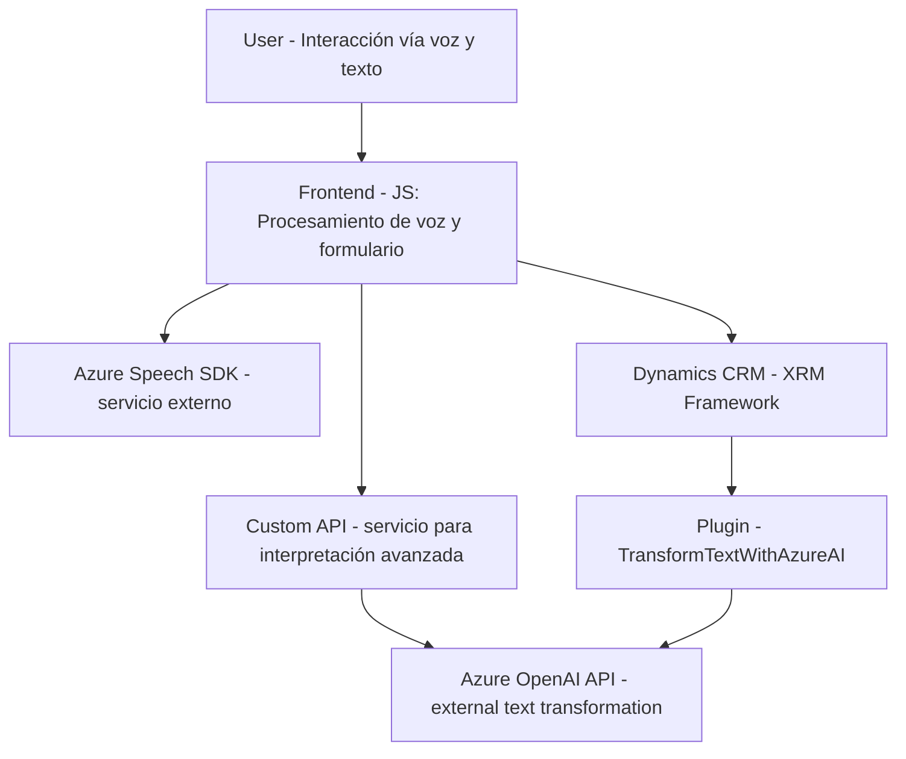

### Breve resumen técnico
El repositorio contiene tres archivos asociados a una solución que se integra con **Microsoft Dynamics CRM**, mediante interacción con usuarios a través de voz y texto. Utiliza el **Azure Speech SDK** para reconocimiento/síntesis de voz y el **Azure OpenAI API** para transformar datos de texto en JSON estructurado. Los principales objetivos de la solución son brindar accesibilidad basada en voz y facilitar el procesamiento de formularios con inteligencia artificial.

---

### Descripción de la arquitectura
La solución se organiza en tres módulos principales:
1. **Frontend (JS)**: Con dos archivos relacionados (`readForm.js`, `speechProcessing.js`) que implementan la interacción con el usuario y la manipulación de datos de formularios en Dynamics CRM. Estos se conectan al **Azure Speech SDK** y a una **API personalizada**.
2. **Plugin (.NET/C#)**: Un plugin ejecutado directamente en Dynamics CRM (`TransformTextWithAzureAI.cs`) que complementa las herramientas del frontend mediante un evento específico. Realiza llamadas al servicio **Azure OpenAI** para procesar datos y devolver resultados en formatos estructurados.

La arquitectura general del sistema es **n-capas cliente-servidor**, donde:
- **Frontend** maneja la interacción del cliente.
- **Azure Speech SDK** y **OpenAI** se integran como capas de servicios externos.
- **Dynamics CRM** actúa como la capa de datos empresariales y lógica del negocio.

Además, dado el uso de servicios externos y paralelismo en la ejecución, se puede considerar un enfoque de **microservicios híbrido**, donde elementos como la integración con Speech SDK y la API de OpenAI pueden ser vistos como servicios atomizados.

---

### Tecnologías usadas
1. **Frontend (procesamiento de formularios y voz)**:
   - **JavaScript**: Lenguaje principal.
   - **Azure Speech SDK**: Reconocimiento y síntesis de voz, cargado dinámicamente.
   - **Entorno Dynamics CRM**: Uso de APIs como XRM para acceder a atributos de formularios dinámicos.

2. **Backend (.NET/C#)**:
   - **Microsoft Dynamics CRM SDK**: Para lógica dentro del contexto CRM.
   - **Azure OpenAI API**: Procesamiento avanzado de datos textuales.
   - **Newtonsoft.Json** y **System.Text.Json**: Para manejo de estructuras JSON.

3. **Patrones arquitectónicos**:
   - **Carga dinámica de dependencias**: Asegura el uso de SDK mediante carga en tiempo de ejecución.
   - **Integración de microservicios**: Interacción con Azure Speech y OpenAI.
   - **Adaptadores**: Utilizados para mapear y transformar datos entre formularios y servicios externos.

---

### Diagrama Mermaid válido para GitHub

---

### Conclusión final
Este repositorio describe un sistema diseñado para optimizar la interacción entre usuarios y un entorno Dynamics CRM mediante el uso de reconocimiento y síntesis de voz (Azure Speech SDK) y transformación avanzada de texto (Azure OpenAI API). Se basa en arquitecturas de múltiples capas con características de microservicios. El diseño modular y la separación clara de responsabilidades permiten su extensibilidad y aplicabilidad a diversas soluciones empresariales con requisitos de accesibilidad y entrada basada en voz.

Se recomienda:
1. Incorporar manejo seguro de las claves de API externas (por ejemplo, Azure Speech o OpenAI) utilizando herramientas como **Azure Key Vault** o configuraciones seguras.
2. Agregar logging y mecanismos de traza en el plugin para facilitar la depuración y seguimiento de errores ante fallas en los servicios externos.
3. Considerar la implementación de pruebas unitarias para los módulos JS y el plugin .NET para mejorar la confiabilidad del sistema.