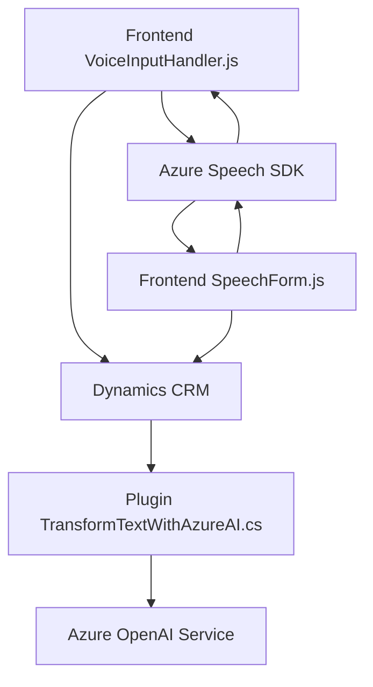

### Breve Resumen Técnico
El repositorio presenta una solución híbrida que combina funcionalidades de entrada por voz, procesamiento de texto estructurado mediante Azure Speech SDK, y transformación avanzada de texto vía Azure OpenAI. La solución está orientada principalmente a trabajar como una extensión para formularios en Dynamics CRM, permitiendo integración con servicios externos para casos de uso centrados en voz, inteligencia artificial y datos contextuales provenientes de formularios.

---

### Descripción de Arquitectura
La arquitectura empleada es una **multi-capa orientada a servicios**, dado que:
1. **Capas de presentación**: Módulos frontend (`readForm.js`, `speechForm.js`) interactúan con el usuario y manejan datos del formulario.
2. **Capas de lógica de negocio**: Funcionalidades del plugin (`TransformTextWithAzureAI.cs`) procesan texto y aplican transformaciones mediante servicios avanzados.
3. **Integración de servicios externos**: Se conecta con Azure Speech SDK para manejo de entrada y salida por voz, y realiza peticiones al Azure OpenAI Service para análisis textual.
4. **Modularidad y extensibilidad**: Cada componente (frontend en JavaScript, plugin en C#) es independiente pero integrable, facilitando la adaptabilidad.

Patrones observados:
- **Event-driven architecture**: Uso de callbacks en el manejo del SDK en frontend.
- **Plugin architecture**: Implementación en Dynamics CRM para extensibilidad.
- **Modular pattern**: Funciones en frontend y métodos de negocio en backend presentan responsabilidad única para cada etapa del proceso.

---

### Tecnologías Usadas
La solución usa las siguientes herramientas y frameworks:
1. **Frontend**:
   - **JavaScript** para interacción en formularios y lógica de procesamiento.
   - **Azure Speech SDK** para síntesis y reconocimiento de voz.
   - **Dynamics Xrm.WebApi** para interacción con datos de formularios en CRM.

2. **Backend Plugin**:
   - **C# y .NET Framework** para lógica del plugin en Dynamics CRM.
   - **Azure OpenAI Service (GPT-4)** para transformación avanzada de texto.
   - **Newtonsoft.Json** para manejo de datos JSON.
   - **HTTP Client** (C#) para integración con servicios externos.

3. **Servicios Externos**:
   - **Azure Speech SDK**: Entrada/salida de voz.
   - **Azure OpenAI Service**: Análisis y transformación de texto.

---

### Diagrama Mermaid
El diagrama representa las relaciones y flujo entre los componentes principales del sistema, incluyendo frontend, backend y servicios externos.

---

### Conclusión Final
La solución es una **extensión modular para Dynamics CRM** que integra funcionalidades avanzadas basadas en inteligencia artificial y servicios en la nube. El repositorio aborda casos de uso de entrada y salida por voz, proceso estructurado de datos transcritos y asociación lógica con formularios. Es adecuada para entornos empresariales que requieren interacción directa con usuarios mediante voz y procesamiento de datos automatizado.

Consideraciones críticas:
1. **Dependencia de Azure**: Toda la lógica avanzada está atada a servicios de Azure, lo que puede ser limitante en términos de portabilidad.
2. **Escalabilidad**: La arquitectura modular facilita la integración de nuevos servicios o componentes en futuras versiones.
3. **Seguridad**: Es vital manejar claves como `AzureKey` y `apiKey` mediante un sistema seguro, como Azure Key Vault, en aplicaciones reales.

En resumen, el diseño presentado es óptimo para soluciones empresariales donde se precisa entrada/salida vía voz y análisis en formularios dinámicos gestionados por sistemas como Dynamics CRM.