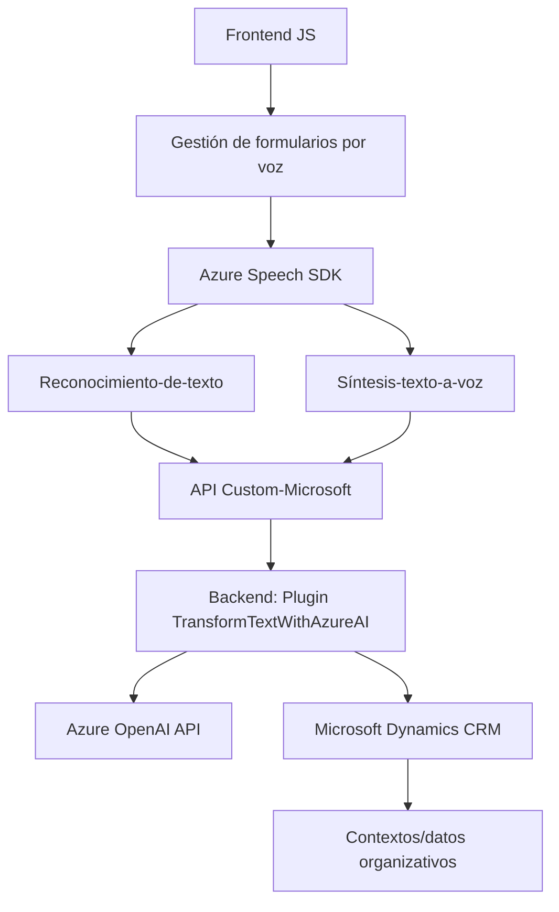

### Análisis detallado

#### **Breve resumen técnico**
El repositorio presenta una solución que combina frontend basado en JavaScript y un plugin backend en .NET para Microsoft Dynamics CRM. La funcionalidad principal gira en torno a interactuar con formularios dinámicos y ofrecer accesibilidad mediante voz y texto enriquecido mediante el empleo de servicios externos como Azure Speech SDK y Azure OpenAI.

---

### **Descripción de arquitectura**
La solución tiene un enfoque **multicapa**:
1. **Frontend (JavaScript):**
   - Gestión de formularios y frontales en aplicaciones web.
   - Conversión de formularios visibles a texto y, eventualmente, a voz mediante Azure Speech SDK.
2. **Backend (Plugin en .NET):**
   - Funcionalidad para realizar procesamiento avanzado y transformaciones de texto mediante servicios de IA en Azure.
   - Directamente acoplado con Microsoft Dynamics CRM para transformaciones en tiempo real.

Por tanto, la arquitectura del sistema se clasifica como una **arquitectura basada en capas** (n-capas). Adopta una separación clara entre el cliente (frontend) y servidor (plugin backend). Además, hay un patrón de integración API para servicios externos como reconocimiento de voz, conversión de texto y generación de texto estructurado.

---

### **Tecnologías usadas**
1. **Frontend:**
   - Lenguaje: **JavaScript**.
   - SDK de terceros:
     - **Azure Speech SDK**: Cargado dinámicamente desde una URL externa.
     - Integración con formularios internos de Microsoft Dynamics 365 via `WebApi`.
2. **Backend:**
   - Lenguaje: **C#** con .NET Framework.
   - Extensiones CRM:
     - **Microsoft.Xrm.Sdk** (Microsoft Dynamics CRM).
   - API Externa:
     - **Azure OpenAI API** para transformación de texto.
   - Librerías:
     - `Newtonsoft.Json.Linq` (procesamiento JSON avanzado).
     - `System.Text.Json` (serialización/deserialización JSON).
     - `System.Net.Http` (comunicación vía REST).

---

### **Dependencias o componentes externos**
1. **Servicios externos:**
   - Azure Speech SDK (`https://aka.ms/csspeech/jsbrowserpackageraw`): Activación dinámica para reconocimiento de voz y conversión texto-a-voz.
   - Azure OpenAI API (`https://openai-netcore.openai.azure.com/`): Procesamiento avanzado de IA para normalización y estructuración de datos.
2. **Framework interno:**
   - Microsoft Dynamics 365 CRM: Utilizado para contextos organizativos, conexiones de API y ejecución del plugin.

---

### **Diagrama Mermaid válido para GitHub**

---

### **Conclusión final**
La solución combina tecnologías modernas (Azure Speech SDK, Azure OpenAI) con el ecosistema de **Microsoft Dynamics CRM**, lo que la convierte en una herramienta poderosa para la automatización y mejora de la interacción con formularios dinámicos. Su arquitectura implementa un aproach de n-capas soportado por integraciones de servicios externos, lo que garantiza flexibilidad, accesibilidad y alto nivel de funcionalidad. Aunque no es completamente desacoplada, es robusta para cumplir propósitos específicos.

