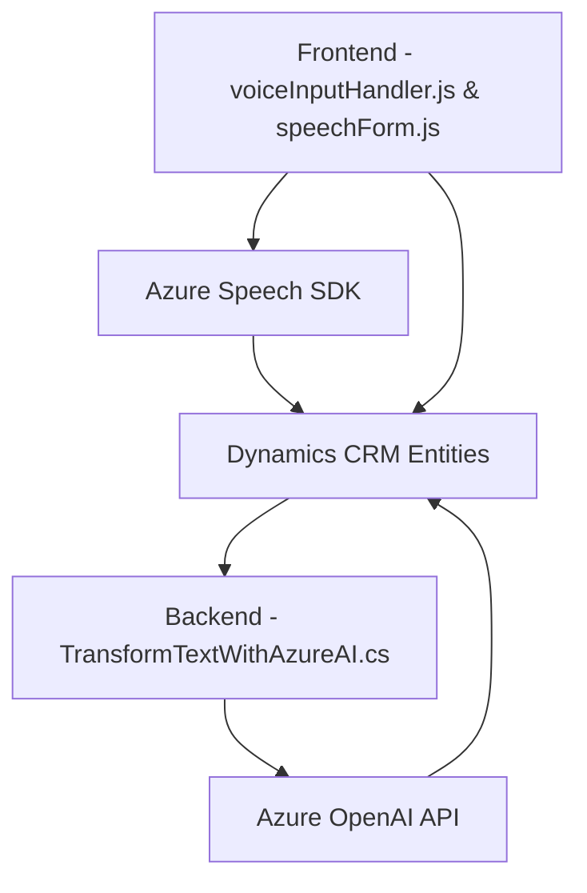

### Análisis Técnico y Resumen

**Breve resumen técnico:**
El repositorio incluye archivos relacionados con dos principales módulos de programación: una solución de frontend en JavaScript (`voiceInputHandler.js` y `speechForm.js`) altamente interactiva, que hace posibles la creación de síntesis y transcripción de voz, y un backend en C# (`TransformTextWithAzureAI.cs`) destinado a la transformación de textos utilizando modelos de IA en Azure OpenAI. Estas soluciones están diseñadas principalmente para usarse dentro del ecosistema de Dynamics CRM, lo que significa que son complementos específicos para extender sus funcionalidades.

---

### Descripción de Arquitectura

- **Tipo de Proyecto:** El análisis de los archivos consolida que el repositorio es un conjunto de soluciones para un **frontend interactivo con integración de un backend de plugins orientados al contexto CRM**. El frontend facilita la interacción entre usuarios y formularios mediante voz, donde el backend complementa la capacidad de procesamiento avanzado de textos usando IA.

- **Arquitectura:**  
El proyecto tiene características de una **arquitectura de cliente-servidor multicapas**:  
  1. **Frontend - GUI**: Responsable de la interacción del usuario y comunicación directa con APIs externas como Azure Speech SDK.  
  2. **Backend - Plugin en Dynamics CRM**: Orientado a complementar la funcionalidad de Dynamics CRM mediante lógica de procesamiento especializada con integración a la API de Azure OpenAI.  
Las dos capas están conectadas funcionalmente a través de un contexto común en Dynamics CRM.

- **Patrones Aplicados:**
  - **Client-Side Logic** en el frontend: Módulos reutilizables y funciones segmentadas para gestión de voz y datos.  
  - **Event-Driven Architecture**: Uso extensivo de callbacks y promesas para flujos asíncronos.  
  - **Facade Pattern** en el backend: Capa de abstracción para encapsular la interacción entre Dynamics CRM y Azure OpenAI.  
  - **Plugin Architecture** en Dynamics CRM: Extiende capacidades nativas usando lógica personalizada.  
  - **Service-Oriented Architecture (SOA)**: Integración directa con servicios externos como Azure Speech SDK y Azure AI.

---

### Tecnologías Usadas

1. **Frontend (JavaScript):**
   - **Azure Speech SDK**: Para transcripción y síntesis de voz.
   - **Dynamics CRM FormContext API (Xrm.WebApi)**: Extensión funcional de formularios.
   - **HTML DOM Manipulation**: Para extracción y validación dinámica de campos.
   - **Promise/Callback Pattern**: Coordinación de flujos asíncronos.
   - **Modular JS**: Código separado en funciones específicas de cada tarea.

2. **Backend (C# Plugin):**
   - **Microsoft Dynamics CRM SDK**: Para integrar lógica personalizada como plugins.
   - **Azure OpenAI API**: Para transformar texto usando GPT-4.
   - **C# Frameworks:**
     - `System.Net.Http` (Petición HTTP).
     - `Newtonsoft.Json` (Manejo de JSON).
     - `System.Text.Json` (Serialización adicional).
   - **Service-Oriented Design**.

---

### Dependencias y Componentes Externos
1. **Azure Speech SDK**: Utilizado a través de referencia directa en el frontend.  
2. **Azure OpenAI API**: Integra capacidades de IA para procesamiento avanzado en el backend.  
3. **SDK Dynamics CRM (`Microsoft.Xrm.Sdk`)**: Para una correcta integración entre plugins y entidades del sistema.  
4. **HTTP frameworks (`HttpClient`)**: Asistencia para interactuar con las APIs de Azure.  
5. **JavaScript FormContext API (`Xrm.WebApi`)**: Manipulación y enlace de datos dinámicos en formularios.

---

### Diagrama Mermaid

---

### Conclusión Final

El repositorio representa una solución orientada a mejorar la interacción del usuario con formularios de Dynamics CRM mediante capacidades avanzadas de síntesis de voz, transcripción y procesamiento basado en IA. La arquitectura es eficiente, centrada en un modelo multicapas donde el frontend y el backend están claramente diferenciados. El uso de SDKs externos como **Azure Speech SDK** y **Azure OpenAI API** refuerza el enfoque moderno y adaptable de esta solución. Las tecnologías implementadas indican que el proyecto prioriza tanto la modularidad como el cumplimiento de flujos empresariales complejos, lo que permite extender las capacidades del CRM de manera innovadora.