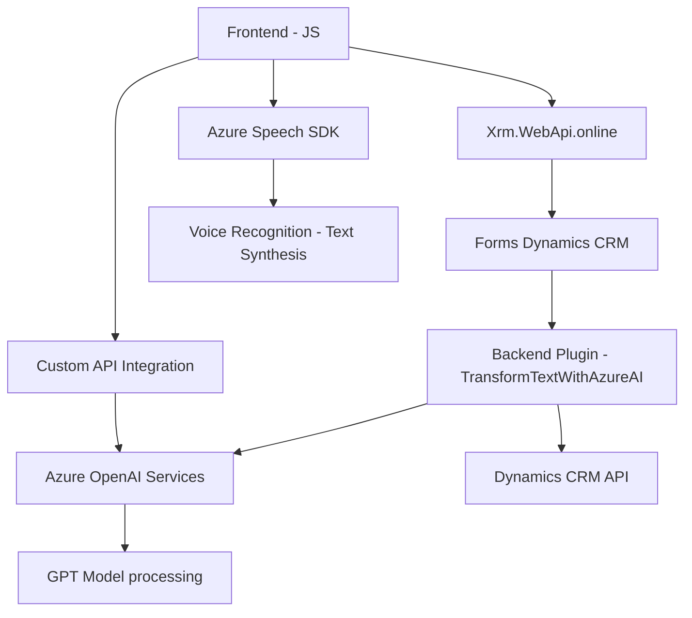

### Breve resumen técnico  
El repositorio describe funcionalidad para integrar servicios avanzados de Azure relacionados con reconocimiento de voz (Speech SDK) y procesamiento de lenguaje natural (Azure OpenAI) dentro de un entorno de Dynamics CRM. Los scripts y el plugin central habilitan una interacción dinámica entre usuarios y formularios mediante voz y capacidades de inteligencia artificial, con diseño enfocado en modularidad y escalabilidad.

---

### Descripción de arquitectura  
La solución presenta una arquitectura de integración en capas con las siguientes características principales:  
1. **Frontend (JavaScript):** Encargado de interactuar con el usuario mediante reconocimiento de voz y sintetización, transformando datos dinámicos del CRM con Azure Speech SDK y ajustando campos del formulario.  
2. **Backend:** Plugin de Dynamics CRM implementado en C#. Este interactúa con Azure OpenAI para transformar texto ingresado con estándares definidos.  
3. **Servicios externos:** Comunicación con APIs de Azure OpenAI y Speech SDK para procesar y enriquecer datos en tiempo real.  
4. **Patrones de diseño:**  
   - Modular: Separación de los módulos funcionales del frontend, cada uno con una única responsabilidad.  
   - Adapter: Implementación para transformar datos visibles en formularios (e.g., `getReadableValue`).  
   - API-driven: Integración basada en solicitudes HTTP para servicios externos.  
   - Repository: Técnicas de manejo de datos en formularios CRM, e.g., correlación de etiquetas visibles (`getFieldMap`).

---

### Tecnologías usadas  
1. **Frontend:**  
   - Azure Speech SDK (gestión de voz/salida de texto).  
   - JavaScript ES6 para modularidad y operaciones asincrónicas.  
   - APIs de Dynamics CRM como `Xrm.WebApi.online` para formularios dinámicos.  
   - DOM API para manejar dinámicamente la carga de SDKs externos.  

2. **Backend:**  
   - C#.NET (vía Dynamics CRM Plugins) para lógica de conexión del CRM con Azure AI.  
   - Microsoft.Xrm.Sdk para operaciones internas de CRM (e.g., parámetros de contexto).  
   - Newtonsoft.Json & System.Text.Json para manejo de datos JSON.  
   - HTTPClient para solicitudes REST hacia Azure OpenAI.  

3. **Servicios Externos:**  
   - Azure Speech SDK (reconocimiento y sintetización de voz).  
   - Azure OpenAI API (procesamiento de texto avanzado).  
   - API personalizada integrada al entorno CRM: `trial_TransformTextWithAzureAI`.

---

### Diagrama Mermaid   

---

### Conclusión final  
El repositorio se orienta hacia integrar herramientas inteligentes (voz y IA) en un ecosistema de Dynamics CRM, mejorando accesibilidad y productividad. La arquitectura es híbrida, combinando **capas frontend** ligeras y un **plugin backend conectado a servicios externos como Azure**. Los patrones de diseño aseguran flexibilidad y modularidad para adaptarse a futuras ampliaciones, como soporte adicional de idiomas o estándares personalizados. Aunque la arquitectura podría evolucionar hacia un diseño más descentralizado, como microservicios si se requiere escalabilidad distribuida (especialmente en las operaciones IA), el diseño actual es apto para el propósito que cumple.