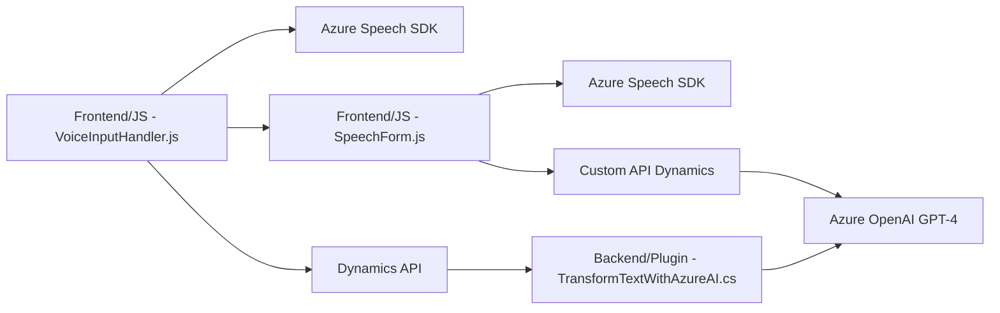

### Resumen técnico
El repositorio presenta una solución enfocada en la integrabilidad entre formularios de Dynamics CRM y servicios de Azure. Combina capacidades de entrada/salida de voz (mediante Azure Speech SDK) junto con procesamiento de texto avanzado utilizando Azure OpenAI. Los archivos aportan lógica distribuida para accesibilidad y dinamismo en formularios.

---

### Descripción de arquitectura

La solución consta de tres componentes principales:
1. **Frontend/JavaScript**: Scripts del lado del cliente diseñados para interactuar con el UI de formularios, leer datos visibles, aplicar valores tras procesamiento y ofrecer funcionalidades de entrada por voz y síntesis de voz desde Azure Speech SDK.
2. **Backend/Plugins**: Extensión en Dynamics CRM a través de un plugin que utiliza OpenAI para estructurar texto en formatos como JSON aplicables en campos del CRM.
3. **APIs externas**: Azure Speech SDK (entrada y salida de voz) y Azure OpenAI (GPT-4) manejan funcionalidades avanzadas.

La arquitectura global sigue un enfoque de componentes integrados:
- **Frontend**: Procesa datos del usuario y delega tareas al backend y servicios externos.
- **Backend**: Se conecta al servicio de OpenAI para estructurar información de entrada y trabajar con la API personalizada de Dynamics CRM.
- **Servicios externos**: Amplían las capacidades del sistema con reconocimiento/síntesis de voz y transformaciones contextuales del texto.

#### Tipo de arquitectura
- **Distribuida e híbrida** basada en:
  - Lógica del cliente en **Frontend JavaScript** (a través de Dynamics).
  - Plugins como un patrón de capas adicional que actúa del lado de **Backend** de Dynamics CRM.
  - **Microservicios** como los servicios independientes de Azure (Speech SDK y OpenAI).

#### Patrones utilizados
- **Modularidad**: Funciones organizadas para independizar cada tarea.
- **Orientación a eventos**: Los procesos se disparan mediante contextos o manipulación de formularios.
- **Interfaz conectada**: Uso intensivo de SDK y APIs externas como Azure Speech y OpenAI para convertir texto en voz, analizarlo o ajustarlo a un formato dinámico.
- **Decorador extensible** (Plugin Pattern) en `TransformTextWithAzureAI.cs`.

---

### Tecnologías utilizadas

1. **Lenguajes**:
   - JavaScript (UI/fuentes de frontend Dynamics 365).
   - C# (Plug-in en Dynamics CRM para integraciones avanzadas).
2. **Frameworks y SDK**:
   - Azure Speech SDK: Procesamiento de datos por voz (entrada/salida).
   - Dynamics CRM SDK: API para interacción con formularios de Dynamics 365.
   - Azure OpenAI (GPT-4): Interpretación y transformación avanzada de texto.
3. **Servicios externos**:
   - REST endpoint para el modelo GPT-4 (`https://api.azure.com`).
   - Speech SDK incluye fuentes dinámicas desde Microsoft (`https://aka.ms/csspeech/jsbrowserpackageraw`).

#### Componentes adicionales esperados:
- Configuración basada en Azure para las claves de Speech y OpenAI.
- Dependencias como `Newtonsoft` y `System.Net.Http`.

---

### Diagrama Mermaid

---

### Conclusión final

La solución refleja una arquitectura híbrida donde se integran componentes en frontend, backend y servicios externos, aprovechando SDKs y APIs (Speech SDK y OpenAI GPT-4). Es adecuada para plataformas empresariales como Dynamics 365, brindando mayor accesibilidad (entrada y salida de voz) y procesamiento de datos complejos. Sin embargo, la dependencia de claves estáticas y configuraciones embebidas puede limitar su escalabilidad y personalización sin refactorización. Ordenada, modular y orientada a mejorar la experiencia del usuario en formularios interactivos, la solución sigue estándares de desarrollo modernos y explota servicios avanzados ofrecidos por Azure.