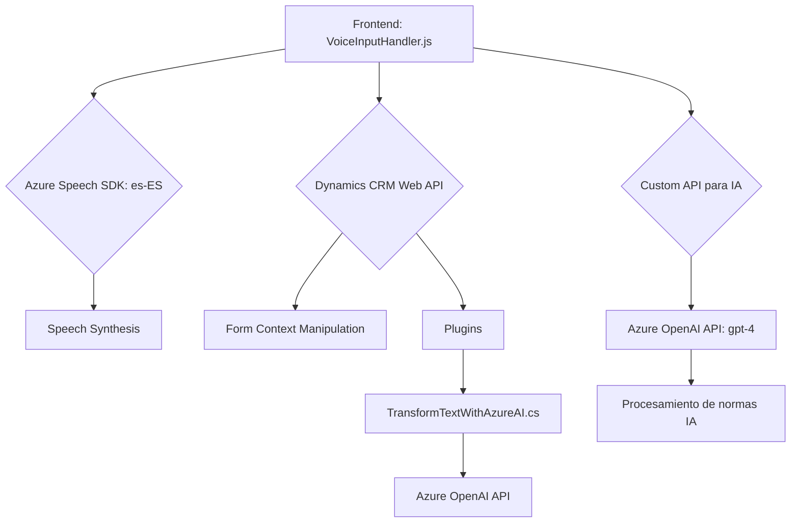

### **Breve resumen técnico:**
El repositorio parece implementar una solución para interacción con formularios Dynamics CRM utilizando voz y texto, integrando servicios de Azure Speech SDK para reconocimiento/síntesis de voz y Azure OpenAI para procesamiento de texto mediante IA. Incluye un frontend en JavaScript para eventos de usuario y plugins en C# para la lógica del backend.

---

### **Descripción de Arquitectura:**
1. **Tipo de solución:**  
   - La solución se clasifica como una interfaz interactiva (frontend) acoplada a una lógica backend, que usa inteligencia artificial, reconocimiento de voz y dinámicas basadas en formularios de Dynamics CRM.

2. **Modelo arquitectural:**  
   - **Componentes Frontend**:  
     Utilizan programación modular, integrando dependencias como Azure Speech SDK en el navegador y realizando operaciones sobre formularios dinámicos a través de la DOM API.  
   - **Backend (Plugins)**:  
     Es altamente especializado con arquitectura **SOA** (Service-Oriented Architecture). Los plugins del CRM interactúan con Dynamics Web API y Azure OpenAI, delegando tareas independientes de procesamiento IA.  

---

### **Tecnologías usadas:**
1. **Frontend (JavaScript):**
   - **Azure Speech SDK**: Para reconocimiento de voz, síntesis de texto en audio.
   - DOM API: Manipulación de formularios DOM del CRM interactivo.
   - **CRM Web API** (Xrm.WebApi): Llamadas asíncronas para búsqueda/modificación de datos CRM.

2. **Backend (C#):**
   - **Microsoft.Xrm.Sdk**: Generación de plugins para Dynamics CRM.
   - **Azure OpenAI API**: Llamadas HTTP para procesar texto con modelos GPT.
   - Json & Newtonsoft.Json.Linq: Trabajo con estructuras JSON.

3. **Patrones:**
   - **Event-driven programming:** Procesos desencadenados por eventos (interacción de usuario, grabación de voz).
   - **Dynamic Dependency Injection:** Carga dinámica de SDKs y ejecución de lógica backend conectada a servicios cloud.
   - **Plugin Architecture:** Lógica del backend bajo el modelo de plugins de Dynamics CRM.

---

### **Diagrama Mermaid válido para GitHub:**

---

### **Conclusión final:**
La arquitectura implementada combina un **frontend interactivo** con gestión de reconocimiento de voz y un **backend especializado** (plugins de Dynamics CRM) que utiliza servicios innovadores como **Azure Speech SDK** y **Azure OpenAI**. Está estructurada correctamente bajo principios de modularidad y separación de responsabilidades, siendo ideal para aplicaciones que necesitan integrar inteligencia artificial y herramientas de reconocimiento de voz con sistemas CRM.

#### **Mejoras sugeridas:**
1. **Seguridad:** Externalizar las claves (API Key/Regions) a variables de entorno para evitar exposición directa en el código fuente.
2. **Optimización de procesos IA:** Consolidar las llamadas a Azure OpenAI y permitir configuraciones adaptables según necesidades.
3. **Test unitarios:** Generar pruebas unitarias y mocks para garantizar la calidad de cada componente del sistema mediante simulaciones (SDK y Web API).