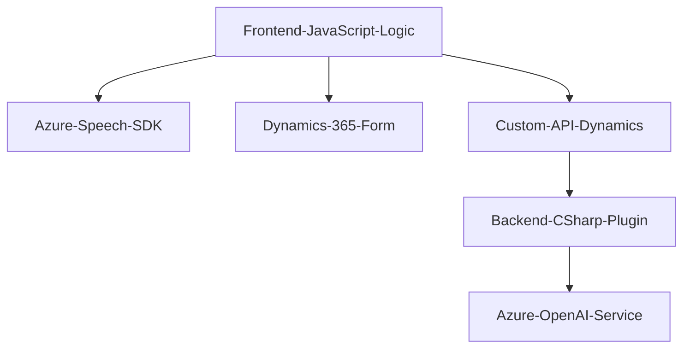

### Breve Resumen Técnico
El repositorio configura una solución arquitectónica para la integración de entrada y síntesis de voz con formularios dinámicos de Dynamics 365, utilizando el **Azure Speech SDK** y un **plugin personalizado** que integra Azure OpenAI para transformar texto. Es una plataforma híbrida que combina un frontend basado en JavaScript y un backend en C# para la extensión funcional de Dynamics CRM.

---

### Descripción de Arquitectura
Esta solución utiliza una arquitectura **n-capas**, dividiendo responsabilidades claras entre:
1. **Frontend (JavaScript)**:
   - Procesamiento de datos desde formularios y entrada/salida de voz.
   - Uso directo de Azure Speech SDK para transcripción y síntesis de voz.
2. **Backend (Plugin en C#)**:
   - Transformación de datos textuales mediante Azure OpenAI.
   - Escalabilidad para extender funcionalidades personalizadas a Dynamics 365.
3. **Integración de APIs externas**:
   - Azure Speech SDK y OpenAI para capacidades ampliadas de procesamiento de voz y texto.

La colaboración entre componentes representa un diseño modular con integración externa y patrones de interacción en tiempo real con servicios distribuidos.

---

### Tecnologías Usadas
1. **Frontend**:
   - Lenguaje: JavaScript.
   - Framework: No explícito (posiblemente nativo con enfoque SPA).
   - SDK Externo: Azure Speech SDK.
   - Dinámica de formularios: Integración directa con Dynamics 365, usando DOM API para manipulación de datos.

2. **Backend**:
   - Lenguaje: C#.
   - Plataforma: Microsoft Dynamics CRM.
   - SDK: Azure OpenAI, Microsoft.Xrm.Sdk para interacción con Dynamics 365.
   - Herramientas Adicionales: `Newtonsoft.Json`, `System.Net.Http`, `System.Text.Json`.

---

### Dependencias y Componentes Externos
#### Externas:
1. **Azure Speech SDK** _(Frontend)_:
   - Para transcripción y síntesis. Consume llaves de suscripción y datos de región.
   
2. **Custom API en Dynamics 365** _(Frontend)_:
   - Procesa salida de voz transcrita.

3. **Azure OpenAI Service** _(Backend)_:
   - Para transformar texto en JSON estructurado basado en normas.

#### Internas:
1. Componentes DOM y manipulación de formularios mediante Xrm.Forms en Dynamics.
2. Plugin para Dynamics (proporciona extensibilidad en procesos de CRM).

---

### Diagrama **Mermaid**

---

### Conclusión Final
La solución del repositorio es una plataforma híbrida que mezcla entrada y salida por voz, integración modular con APIs externas (Azure), y personalización robusta de Dynamics 365. Su arquitectura **n-capas** permite la separación de preocupaciones y escalabilidad. Mientras el frontend maneja la interacción directa del usuario con formularios, el backend delega procesamiento avanzado a servicios modernos como Azure OpenAI, ofreciendo un esquema extensible ideal para CRM dinámicos y adaptativos.