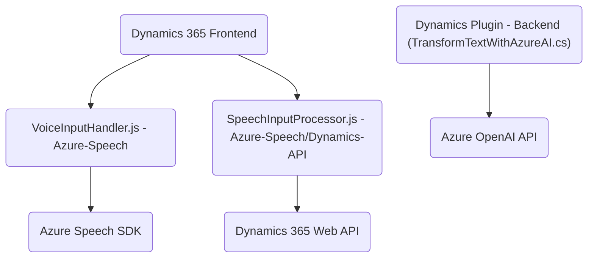

### Breve Resumen Técnico
El repositorio parece implementar una solución híbrida para interacciones con formularios en Dynamics 365 usando voz y texto natural, y también un plugin para transformación de datos mediante Azure OpenAI API. Los archivos del repositorio indican que se trata de una aplicación de cliente enriquecido para la parte de frontend y un desarrollo basado en plugins de CRM para el backend.

---

### Descripción de Arquitectura
La arquitectura principal parece ser una **n-capas** con una separación clara entre el frontend y el backend. 

El **frontend** está compuesto por JavaScript alojado en Dynamics 365, utilizando el Azure Speech SDK para realizar síntesis y reconocimiento de voz en el cliente. La arquitectura parece estar orientada hacia un modelo de cliente enriquecido, donde el procesamiento significativo de datos ocurre localmente en el navegador.

El **backend** parece seguir el patrón de **plugins CRM**, definido con clases y métodos que interactúan con Dynamics CRM y servicios externos como Azure OpenAI. Este diseño permite extender las capacidades de Dynamics CRM sin modificar el núcleo de la aplicación.

---

### Tecnologías Usadas
1. **Frontend:**
   - **Base:** Vanilla JavaScript.
   - **SDK:** Azure Speech SDK para síntesis y reconocimiento de voz.
   - **Contextos:** Integración con Dynamics 365 Forms.

2. **Backend:**
   - **Plataforma:** Microsoft Dynamics 365 CRM (implementación de plugins).
   - **Lenguaje:** C# (.NET Framework).
   - **Librerías:** Newtonsoft.Json, System.Text.Json, System.Net.Http.
   - **Integración con servicios externos:** Azure OpenAI API.

3. **Patrones de Diseño y Arquitectura:**
   - Separación de tareas mediante funciones individuales (Single Responsibility Principle).
   - Modularidad en la lógica para facilitar la reutilización y ampliación.
   - Uso del patrón `IPlugin` para integración con Dynamics CRM.
   - Integración API en backend con servicios de Azure.
   - Event-driven programming en frontend para responder a voz.

---

### Dependencias o Componentes Externos
1. **Azure Speech SDK**:
   - Para síntesis de voz y reconocimiento de entrada de voz, cargado dinámicamente.
2. **Azure OpenAI API**:
   - Procesamiento de texto y transformación en objetos JSON, configurado en el plugin.
3. **Dynamics 365 Web API**:
   - Usada tanto en los scripts de cliente como en el plugin.
4. **JavaScript y Libraries**:
   - JSON manipulación (acción directa o mediante objetos).
5. **HTTP Client Libraries**:
   - Para conectar y enviar datos a servicios Azure desde el plugin (`System.Net.Http` en C#).

---

### Diagrama Mermaid

---

### Conclusión Final
Este repositorio representa una solución híbrida basada en **Azure AI y Dynamics 365**, permitiendo integración avanzada de voz y datos con formularios interactivos en el cliente y procesamiento de texto eficiente en el backend mediante un plugin. La arquitectura es modular, utiliza múltiples servicios externos, y sigue patrones de diseño orientados a eventos y separación de responsabilidades.