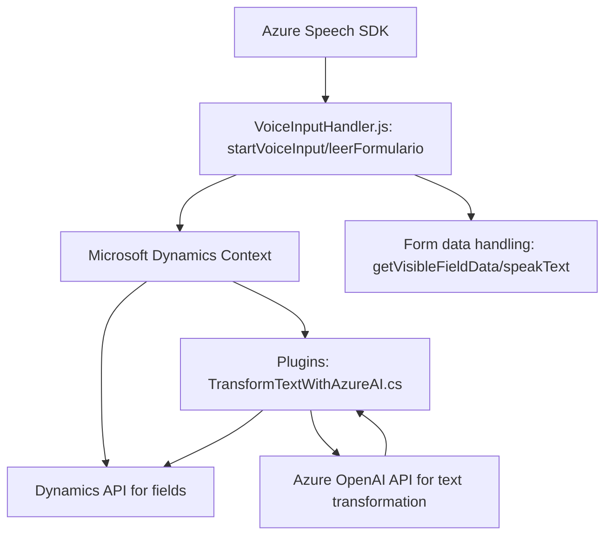

### Breve resumen técnico
El repositorio presenta una solución que integra una **experiencia de entrada de voz** con el manejo de datos en formularios de **Microsoft Dynamics CRM**. La solución está compuesta por tres archivos con funcionalidades relacionadas con frontend en JavaScript, procesamiento IA con Azure OpenAI y un plugin en .NET para ejecutar una integración directa como parte del pipeline de Dynamics CRM.

### Descripción de arquitectura
La arquitectura se basa en un enfoque **modular y distribuido** con una combinación de tecnologías cliente-servidor y procesamiento en la nube. Específicamente:
1. **Frontend:** Se gestiona mediante scripts de JavaScript que interactúan con Dynamics CRM y Azure Speech SDK para entrada de voz, síntesis de texto y actualización del modelo de datos del CRM.
2. **Backend:** Integra extensiones del pipeline de Dynamics CRM mediante un plugin desarrollado en `.NET`, centralizando el procesamiento de texto con Azure OpenAI.
3. **Azure Services:** Utiliza componentes de Azure como Speech SDK y OpenAI para funcionalidades avanzadas, como síntesis de voz y transformación de texto.

### Tecnologías usadas
1. **Azure Speech SDK**:
   - Utilizado para entrada de voz y síntesis de texto.
2. **Microsoft Dynamics CRM SDK**:
   - Provee la infraestructura para interactuar con la plataforma CRM.
3. **Azure OpenAI Service**:
   - Utilizado en el plugin para transformar texto en información estructurada.
4. **JavaScript (ECMAScript)**:
   - Implementación de la lógica en los formularios dinámicos.
5. **.NET Framework**:
   - Programación del plugin para integración en el backend.

### Diagrama Mermaid válido para GitHub Markdown

### Conclusión final
La solución utiliza una combinación de frontend y backend que habilita entrada de voz, la lectura de formularios y la integración con servicios avanzados de IA, construyendo una experiencia enriquecedora en una plataforma CRM como **Microsoft Dynamics**. Se basa en una arquitectura modular con integración de APIs externas de Azure, enfocada en la distribución de responsabilidades y desacoplamiento. 

Aunque es funcional y modular, se identifica riesgo potencial en términos de seguridad por el manejo de credenciales en texto plano dentro del código fuente. Esto puede mejorarse utilizando servicios de configuración segura para las claves y la región de Azure.