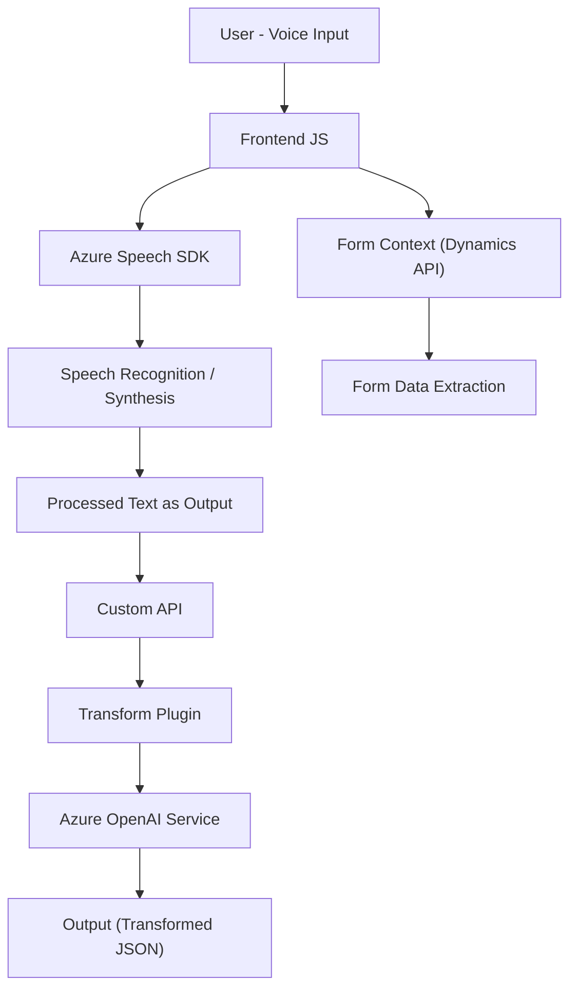

### Breve resumen técnico:
El repositorio analiza tres archivos principales que implementan funcionalidades clave:
1. **Frontend:** Interacción en tiempo real con formularios accesibles mediante procesamiento de datos y síntesis/reconocimiento de voz en integración con Azure Speech SDK.
2. **Plugins:** Transformación de texto en Dynamics CRM mediante la API de Azure OpenAI, estructurándolo como JSON según reglas especificadas.
3. **Reconocimiento de voz:** Uso activo de Azure Speech SDK, procesamiento de datos y análisis semántico/estructurado.

El enfoque del proyecto está orientado al reconocimiento de voz, interacción dinámica y procesamiento estructurado de datos entregables.

---

### Descripción de arquitectura:
La solución tiene características compatibles con arquitectura orientada a servicios (SOA), combinada con integración a **APIs de terceros** (Azure Speech SDK, Azure OpenAI) como microservicios. Integra un **backend basado en plugin** acoplado a Dynamics CRM (Plugin-based Architecture). A nivel de frontend, la aplicación sigue un diseño **modular en capas**, donde el procesamiento de formularios y la integración con APIs están segregados en funciones orientadas a tareas específicas.

---

### Tecnologías usadas:
1. **Frontend:**
   - **JavaScript ES6:** Programación de lógica de usuario en el navegador.
   - **Azure Speech SDK:** Síntesis y reconocimiento de voz.
   - **Microsoft Dynamics Forms API:** Manipulación de datos de formularios dinámicos.
2. **Backend/Plugins en Dynamics CRM:**
   - **C#:** Implementación de lógica de negocio con clases y métodos orientados a servicios.
   - **Azure OpenAI SDK:** Consumo y procesamiento de datos mediante GPT (modelo `gpt-4o`).
   - **HTTPClient / REST APIs:** Comunicación síncrona con endpoints de OpenAI.
   - **JSON Utilities (Newtonsoft + System.Text.Json):** Para serialización y transformación de datos.
3. **SDKs y APIs Externas:**
   - **Dynamics SDK API:** Extensiones específicas de sistemas empresariales.
   - **Azure Speech to Text y Text to Speech APIs.**

---

### Diagrama Mermaid:

---

### Conclusión final:
La solución presenta una arquitectura híbrida, integrando modularidad en frontend con capacidad de realizar reconocimiento de voz y síntesis de texto en tiempo real gracias a Azure Speech SDK. El backend acoplado al entorno Dynamics CRM utiliza arquitecturas plugin y SOA para la transformación de textos mediante Azure OpenAI, consolidando una integración efectiva de microservicios. El diseño cumple estándares de accesibilidad, modernidad e interoperabilidad entre sistemas, siendo una solución apta para sistemas empresariales de formularios interactivos accesibles y procesamientos IA.