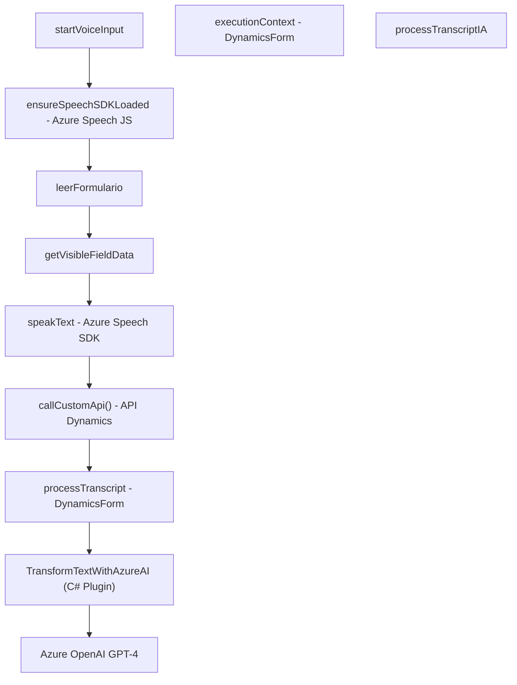

### Breve resumen técnico

El repositorio es parte de una solución que integra tecnologías de voz, inteligencia artificial (IA) y Microsoft Dynamics 365 para enriquecer la funcionalidad de formularios empresariales. Cuenta con componentes externos como Azure OpenAI y Azure Speech SDK, organizados en archivos frontend (`.js`) y backend (`.cs`) que colaboran mediante APIs y servicios.

---

### Descripción de arquitectura

La arquitectura combina:
1. **Frontend**: Lógica de entrada y salida de voz utilizando Azure Speech SDK.
2. **Backend (plugins)**: Extensiones de Dynamics 365 que procesan los datos de texto utilizando servicios de Microsoft Azure OpenAI.
3. **Patrones de integración**:
   - **Modularidad**: Cada funcionalidad está encapsulada en archivos específicos con funciones reutilizables.
   - **Microservicios (externos)**: Uso de servicios como Azure Speech SDK y Azure OpenAI para proporcionar reconocimiento y transformación.
   - **Orientación API**: Dependencia hacia APIs de Dynamics 365 y Azure.
4. **Flujo basado en capas**:
   - **Capa de presentación (frontend APIs)**: Captura datos mediante voz/transcripción.
   - **Capa de negocio (backend plugins)**: Procesa datos (como transformaciones IA) antes de interactuar con Dynamics 365.
   - **Capa externa (Azure SDK)**: Ejecuta servicios como síntesis de voz y transformación de texto.

Se puede interpretar esta solución como una **arquitectura de n capas**, pero con una dependencia frontal hacia servicios externos de Microsoft, lo que extiende sus capacidades.

---

### Tecnologías usadas
#### Frontend:
- **JavaScript**: Base principal del desarrollo.
- **Azure Speech SDK**: Usado para reconocimiento de voz, síntesis de audio y carga dinámica del SDK.
- **Dynamics 365 APIs**: `Xrm.WebApi` para manipular formularios mediante contexto.

#### Backend:
- **C# (Microsoft Dynamics Plugin)**: Extensiones para manejo backend en Dynamics 365 CRM.
- **Azure OpenAI GPT-4 API**: Procesamiento y transformación semántica de datos.
- **System.Net.Http**: Envío de solicitudes REST a servicios externos.
- **Newtonsoft.Json o System.Text.Json**: Manipulación de datos JSON.
- **Microsoft Dynamics SDK**: Ejecución nativa en CRM sobre `IPlugin`.

#### General:
- **Asincronismo**: Uso de promesas en JavaScript y tareas asíncronas en C# para procesos API dependientes.
- **Azure Cloud**: Dependencia hacia SDKs y servicios IA.
- **RESTful APIs**: Comunicación externa y entre capas.

---

### Diagrama Mermaid válido para GitHub

---

### Conclusión final

La solución presentada es una **arquitectura de n capas extendida**, con dependencias claras hacia APIs de Microsoft Dynamics y servicios externos de Azure (Speech y OpenAI). Integra tecnologías modernas como IA, reconocimiento de voz y transformación semántica de texto para enriquecer formularios en aplicaciones empresariales. Además, organiza la lógica en módulos reutilizables y explícitos tanto en frontend como en backend.

Potenciales mejoras incluyen la abstracción de configuraciones (clave API, región) y la optimización de flujos para manejo de errores más robusto. Es una solución bien estructurada y versátil para entornos empresariales que dependen de interacciones dinámicas mediante voz e inteligencia artificial.