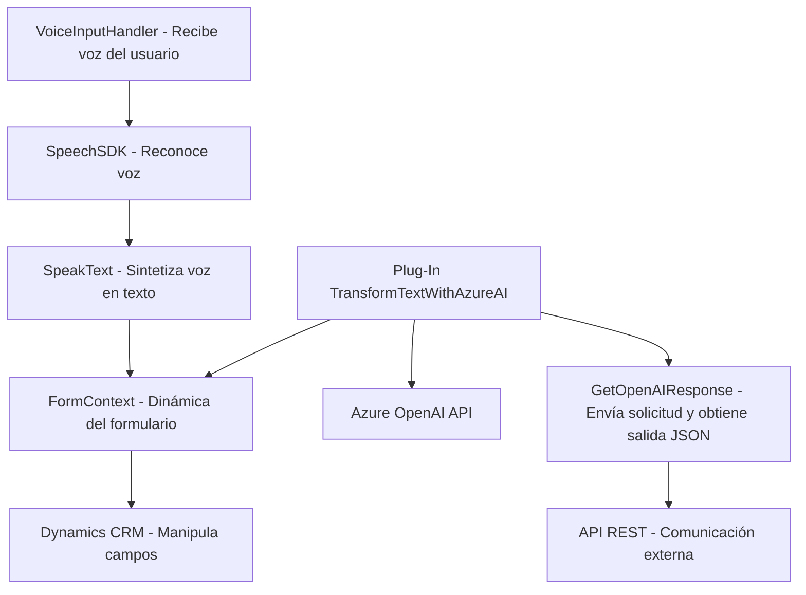

### Breve Resumen Técnico
Este repositorio implementa una solución basada en entrada y procesamiento de voz con integración en formularios de Dynamics CRM. Utiliza tecnologías como Azure Speech SDK para síntesis y reconocimiento de voz, además de Azure OpenAI para procesamiento avanzado de texto. Los archivos están distribuidos como componentes funcionales específicos, cada uno cumpliendo roles claros en el procesamiento de datos, interacción con APIs externas, y conexión con entidades en CRM.

---

### Descripción de la Arquitectura
La arquitectura combina:
1. **Frontend para interacción dinámico:** Dos módulos principales de JavaScript (`readForm.js` y `speechForm.js`) proporcionan entrada de voz y procesamiento manual o asistido por IA.
   - Modularización explícita con métodos separados para cada paso lógico.
   - Uso de SDK externos cargados dinámicamente (Azure Speech).
2. **Backend basado en microservicio:** Componente `TransformTextWithAzureAI.cs` basado en plugins para Dynamics CRM que se conecta con Azure OpenAI.
   - Arquitectura basada en plugins y solicitud HTTP a APIs externas.
   - Patrón "más cercano" a **hexagonal**, donde se incorporan tanto APIs internas como externas alrededor del núcleo del negocio (datos del formulario).

La solución combina múltiples capas (frontend, servicios API externos en Azure, operaciones backend en Dynamics CRM).

---

### Tecnologías Usadas
**Frontend**
- **Azure Speech SDK:** Para reconocimiento y síntesis de voz mediante interacción con formularios.
- **Microsoft Dynamics CRM:** Utilización de APIs internas como `executionContext`.

**Backend**
- **Microsoft.Xrm.Sdk:** Interacción directa con Dynamics CRM.
- **Azure OpenAI Model:** Procesamiento de texto con modelos GPT.
- **Sistema HttpClient:** Conexión HTTP con APIs REST.
- **Newtonsoft.Json o System.Text.Json:** Para manejo de respuestas JSON.

**Patrones**
- **Modularización:** Separación clara de funciones por actividad.
- **Capa de Servicios:** Integración con diferentes SDK y APIs para procesamiento de datos dinámico.
- **Patrón Hexagonal:** En el backend se observa una dependencia externa (Azure OpenAI) y conexión a un núcleo CRM, lo que elimina acoplamientos innecesarios.

---

### Dependencias o Componentes Externos
1. **SDKs Cargados dinámicamente:**
   - Azure Speech SDK (contiene scripts de interacción para voz).
2. **API REST (Azure OpenAI):**
   - Implementado en `TransformTextWithAzureAI`, utiliza modelos GPT para transformar texto en JSON estructurado.
3. **APIs de Dynamics CRM:**
   - Interacción directa con objetos `executionContext` y manipulación de entidades relacionadas.

---

### Diagrama Mermaid
A continuación, se presenta el diagrama solicitado en formato Mermaid compatible con GitHub Markdown:

---

### Conclusión Final
Este repositorio implementa una solución **modular**, **escalable**, y altamente dependiente de servicios en la nube (Azure Speech SDK + Azure OpenAI). El diseño es claro y usa principios sólidos como la separación de responsabilidades por capas. En el frontend, se utiliza modularidad JS para entrada de voz y formulación de datos contextuales. En el backend, la arquitectura basada en plugins con integración API es efectiva para delegar la lógica de transformación avanzada a un servicio externo mientras se mantiene la conexión con CRM.