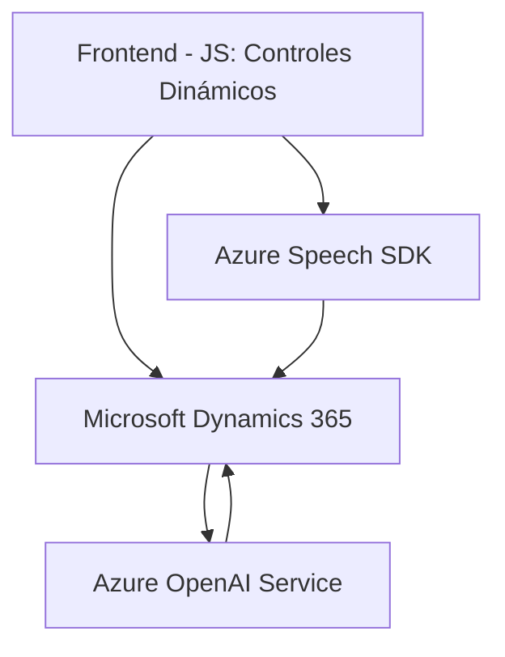

### Breve Resumen Técnico

El repositorio se centra en una solución híbrida que integra un frontend basado en JavaScript junto con un backend de servicios personalizados (como plugins) para Dynamics CRM y el uso del Azure OpenAI Service y Azure Speech SDK. Ofrece capacidades avanzadas de reconocimiento de voz, procesamiento de lenguaje natural (NLP) y síntesis de texto a voz.

---

### Descripción de Arquitectura

La arquitectura que se puede deducir involucra una estructura **n-capas** donde:
- **Frontend (JavaScript)**:
  - Responsable de interfaces de usuario.
  - Captura y transformación de datos hacia servicios externos.
  - Interacción con dinamismo vía Azure Speech SDK y DOM.
- **Backend (C# Plugin)**:
  - Procesa datos en el servidor de Dynamics CRM usando integraciones con APIs externas, como Azure OpenAI Service, para transformar texto.

Además, hay uso claro de dependencias externas para las funcionalidades de reconocimiento de voz, síntesis de texto a voz, y procesamiento avanzado mediante servicios de Azure.

---

### Tecnologías Usadas

1. **Frontend**:
   - **JavaScript**: Base del desarrollo del frontend.
   - **Azure Speech SDK**: Para realizar reconocimiento de voz y síntesis de texto a audio.
   - **Microsoft Dynamics 365**: Contexto de formularios web y datos de Dynamics CRM como base para la solución.

2. **Plugins Backend**:
   - **C#/.NET Framework**: Para la lógica empresarial en el entorno Dynamics CRM.
   - **Microsoft.Xrm.Sdk**: Para interactuar con las API de Dynamics CRM.
   - **Azure OpenAI API**: Para procesamiento de texto con herramientas avanzadas de IA.
   - **System.Net.Http** y **System.Text.Json**: Para manejo de peticiones HTTP y procesamiento de JSON.

---

### Diagrama Mermaid

---

### Conclusión Final

Esta solución combina tecnologías modernas utilizadas en aplicaciones empresariales avanzadas. Ofrece:
- **Reconocimiento de voz y síntesis de texto**: Aprovechando el Azure Speech SDK en el frontend.
- **Inteligencia Artificial personalizada**: Con Azure OpenAI Service para transformar texto en el backend.
- **Conexión directa con Dynamics CRM**: A través de plugins altamente integrados.

La arquitectura es una mezcla de **n-capas** con microservicios habilitados por la API de Azure OpenAI. Se destaca la modularidad del código y una correcta separación de responsabilidades.