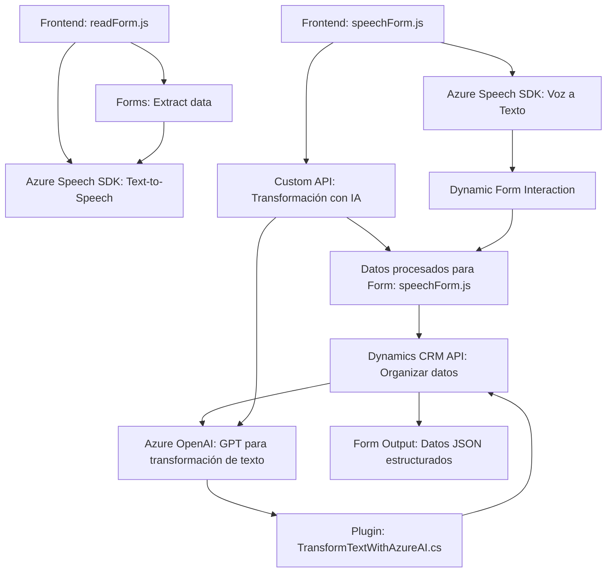

### Breve resumen técnico

El repositorio contiene una solución distribuida con múltiples componentes que interactúan a través de servicios externos, especialmente Azure Speech SDK y Azure OpenAI. Está orientado a la integración de funcionalidades avanzadas como reconocimiento y síntesis de voz, junto con procesamiento de texto y asignación dinámica de datos en formularios dinámicos de Dynamics 365. 

Cada archivo representa una parte específica del sistema:

1. **Frontend/JS/readForm.js:** Funcionalidades de síntesis de voz y extracción de datos legibles de formularios, integrándose con Azure Text-to-Speech.
2. **Frontend/JS/speechForm.js:** Procesamiento de comandos hablados mediante reconocimiento de voz, integración con una API de IA personalizada y mapeo de datos en formularios.
3. **Plugins/TransformTextWithAzureAI.cs:** Plugin de Dynamics CRM que procesa textos y los transforma en JSON estructurado mediante Azure OpenAI.

---

### Descripción de arquitectura

1. **Tipo de arquitectura:** La solución parece corresponder a una arquitectura orientada a servicios (SOA) con un enfoque modular. Combina una capa frontend (JS en el navegador) con una capa de backend (plugin en Dynamics CRM y comunicación con APIs externas).

2. **Sistemas involucrados:** Los módulos frontend interactúan con formularios dinámicos de Dynamics 365 y servicios externos como el Azure Speech SDK y una Custom API. El backend utiliza la API de Dynamics para ejecutar los plugins y realizar transformaciones avanzadas mediante Azure OpenAI.

3. **División de responsabilidades:**
   - **Frontend:** Interfaz del usuario (captura y síntesis de voz, visualización dinámica de formularios).
   - **Backend:** Procesamiento de datos mediante plugins y comunicación con servicios de AI en la nube (Azure OpenAI).

4. **Patrón dominante:** En el backend, la funcionalidad está basada en el **Plugin Design Pattern** típico de Dynamics CRM. En el frontend, se pueden identificar patrones como **Modular Programming** y una variante de **MVC** para interacción con datos.

---

### Tecnologías usadas

1. **JavaScript para el frontend:**
   - Creación dinámica de comportamientos en el navegador.
   - Uso de Azure Speech SDK para reconocimiento y síntesis.

2. **Microsoft Azure:**
   - **Speech SDK:** Reconocimiento y síntesis de voz.
   - **OpenAI GPT API en Azure:** Procesamiento avanzado de texto con IA.

3. **Microsoft Dynamics CRM:**
   - SDK de Dynamics CRM (`IPlugin`, `Xrm.WebApi`) para integrar funciones a través de eventos de plugins.

4. **C#:**
   - Implementación de lógica de negocio en plugins.
   - Integración con servicios REST (Azure OpenAI).

5. **Frameworks y librerías:**
   - `Newtonsoft.Json` en backend para procesamiento eficaz de JSON.
   - `System.Net.Http` y `System.Text.Json` para interacción externa.

---

### Dependencias y componentes externos

1. **Azure Speech SDK:** Imprescindible para las funcionalidades de síntesis y reconocimiento de voz.
2. **Azure OpenAI:** Procesamiento avanzado de textos utilizando reglas predefinidas por lógica IA configurada en OpenAI.
3. **Dynamics 365 SDK:** Para conectarse y manejar formularios dinámicos dentro del CRM.
4. **Custom API:** Utilizada en `speechForm.js` para transformación dinámica de datos.
5.    **Frontend assets:** Archivos de JavaScript y elementos relacionados a la interfaz de usuario.

---

### Diagrama **Mermaid** válido para **GitHub Markdown**

---

### Conclusión final

La solución descrita en este repositorio está claramente orientada a la integración y expansión de funcionalidades en Dynamics CRM utilizando servicios externos avanzados como reconocimiento/síntesis de voz y procesamiento de datos basado en IA. Por su diseño modular y distribución de responsabilidades, muestra un excelente uso de patrones de arquitectura como SOA combinado con el Plugin Design Pattern en el backend, mientras establece una interfaz moderna y eficiente en el frontend. Todo esto lo convierte en una implementación robusta y escalable adecuada para entornos empresariales.