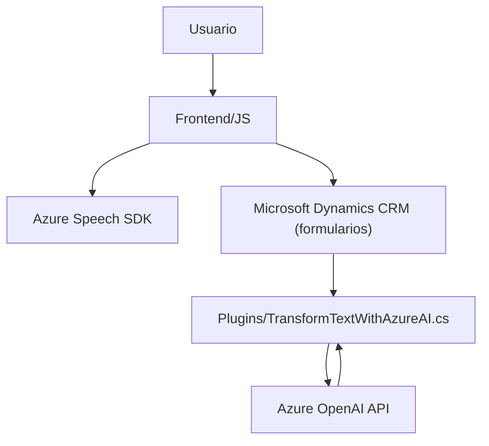

# Análisis de la solución

## Breve resumen técnico:
La solución en análisis está compuesta por un conjunto de módulos que implementan funcionalidades avanzadas para la interacción voz-formulario en un sistema de CRM (Microsoft Dynamics). Se hace uso extensivo de tecnologías de reconocimiento de voz y síntesis de texto a voz mediante **Azure Speech SDK** y transformación de datos con **Azure OpenAI API**. 

Esta solución es una **integración de servicios externos** utilizada principalmente como un complemento para Dynamics CRM y, por su diseño modular, parece estar orientada a aplicaciones de entorno empresarial. 

---

## Descripción de arquitectura:
La arquitectura del sistema puede clasificarse como una **multi-layered architecture (arquitectura multinivel)** con una capacitación para soporte de micro-servicios:
1. **Nivel de UI/Formularios**: Implementación cliente-frontend para manejar la interacción con el usuario y los formularios CRM.
2. **Nivel de Servicios de Reconocimiento y Voz**: Interacción con servicios de **Azure Speech SDK** para convertir voz a texto y sintetizar datos como audio.
3. **Nivel de Plugins**: Lógica encapsulada en **plugins CRM (.NET)** para transformación avanzada de texto mediante **Azure OpenAI API**.
4. **Integración con servicios externos**: Uso de SDKs (Azure Speech SDK, Dynamics SDK) y APIS (Azure OpenAI).

Su diseño es modular, lo que facilita el mantenimiento y la extensión basada en necesidades específicas dentro del ecosistema Dynamics.

---

## Tecnologías usadas:
1. **Frontend**:
   - JavaScript: Implementación de funciones cliente para interacción directa con API y datos de formularios.
   - Azure Speech SDK: Reconocimiento de voz y síntesis.

2. **Backoffice/plugins**:
   - **.NET/C#**:
     - SDK de Microsoft Dynamics.
     - Uso de librerías como Newtonsoft para manejo de JSON.
   - **Azure OpenAI API**: Interfaz para transformaciones avanzadas de texto.

3. **CRM APIs**:
   - `Xrm.WebApi.online.execute` y `retrieveMultipleRecords` para llamadas al CRM.

4. **Arquitectura de servicios**:
   - REST API para servicios con interacción directa mediante HTTPClient.

### Patrones identificados:
- **Event-Driven Design**: Sistema basado en eventos para el disparo del reconocimiento de voz y lectura/síntesis de texto.
- **Integración de servicios externos (Azure Speech SDK y Azure OpenAI)**.
- **Modularización**: Separación lógica de la funcionalidad en diferentes archivos y componentes.
- **Plugin Pattern**: Aplicado para la integración de lógica empresarial en Dynamics.
- **RESTful API Integration**: Comunicación con endpoints de Azure OpenAI mediante HTTP.

---

## Diagrama Mermaid

### Diagrama de interacción de las componentes:

---

### Descripción del diagrama
1. **A (Usuario)**: Interacciones con el sistema mediante comandos de voz y parámetros de entrada.
2. **B (Frontend/JS)**: Implementación de funciones cliente para captura de datos del formulario en Dynamics, sintetización de texto y generación de eventos con el Azure Speech SDK.
3. **C (Azure Speech SDK)**: SDK utilizado para reconocimiento de voz y síntesis de texto.
4. **E (Microsoft Dynamics CRM)**: Punto de integración con formularios del CRM como input/output de los datos procesados por el SDK o los plugins (actualización dinámica).
5. **F (Plugins)**: Clase en C# que implementa lógica empresarial avanzada utilizando el CRM SDK y servicios externos.
6. **G (Azure OpenAI API)**: Endpoint externo para transformar texto según reglas predefinidas. Se comunica con los plugins para devolver respuestas a los formularios en Dynamics.

---

## Conclusión final

La solución es un **complemento para Dynamics CRM** que lleva la interacción de formularios al siguiente nivel, utilizando comandos de voz y procesamiento avanzado de texto. Está diseñada con una arquitectura modular y multinivel, aprovechando servicios cloud escalables (Azure Speech y OpenAI), mientras garantiza integración directa con APIs de Dynamics CRM.

Este sistema puede ser ampliamente extensible y está orientado al entorno empresarial, específicamente a soluciones CRM, optimizando la interacción entre el usuario y la gestión de datos. 

Se destacan los patrones de integración y modularidad, así como la separación clara de responsabilidades por niveles.