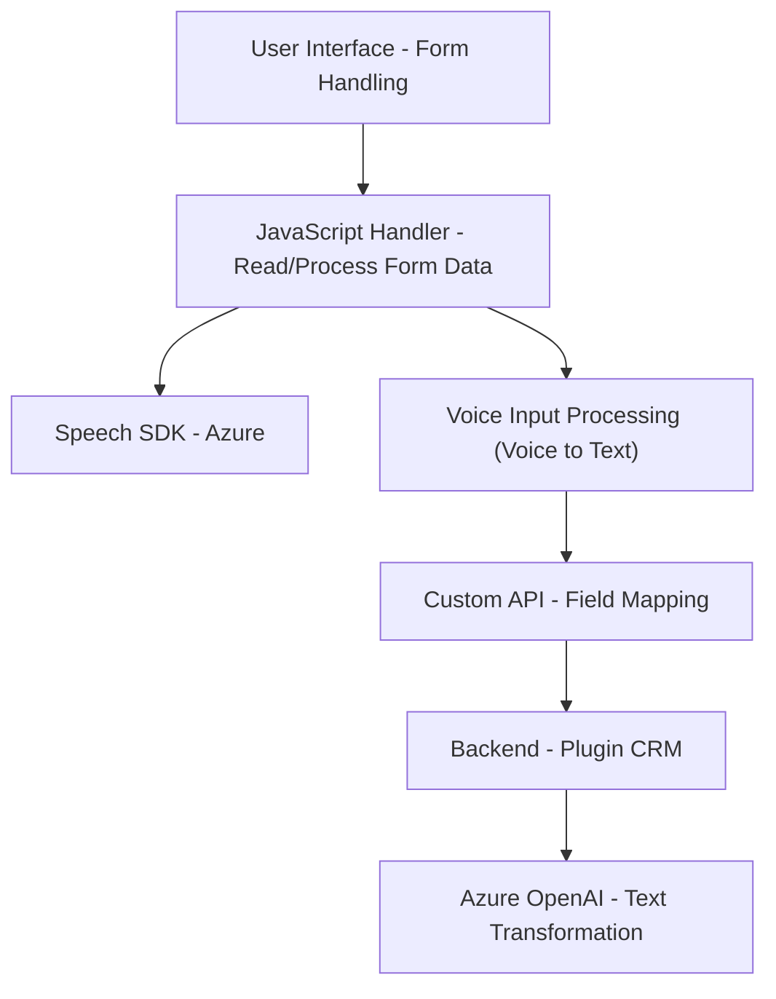

### Resumen Técnico

El repositorio contiene un conjunto de archivos para implementar una solución centrada en el reconocimiento de voz y síntesis de voz, integrado con sistemas backend y frontend. Utiliza tecnologías como Azure Speech SDK y una API personalizada para manejo de procesos IA y OpenAI. Además, incluye un plugin para Microsoft Dynamics CRM, extendiendo su funcionalidad con Azure OpenAI.

---

### Descripción de la Arquitectura

La arquitectura general del sistema parece estar dividida en capas, cumpliendo con el paradigma de **N capas** debido a la clara separación de responsabilidades entre la interfaz (frontend), lógica y presentación de datos (JavaScript Handler) y procesamiento backend (plugin para Dynamics CRM). Es una solución híbrida que integra tanto lógica cliente (frontend) como extensiones en el servidor de Dynamics CRM (backend), incluyendo comunicación sincrónica con servicios externos.

#### Características clave:
1. **Frontend:** 
   - Implementa las funcionalidades interactivas del usuario (manejo de input por formularios y síntesis de voz con Azure Speech SDK).
   - Modularizado por funciones para tareas específicas, dividido en el manejo del formulario y entradas de voz.
   
2. **Backend (Plugins):**
   - Lógica de negocio para procesamiento más complejo y comunicación con servicios Azure OpenAI está concentrada en plugins personalizados para Dynamics CRM.
   
3. **Servicios Externos:**
   - Azure Speech SDK para entrada de voz y síntesis de textos.
   - Azure OpenAI para interpretación y transformación avanzada de texto.

---

### Tecnologías Usadas
1. **Frontend:**
   - **JavaScript**: Lenguaje base con uso de funciones.
   - **Azure Speech SDK**: Para reconocimiento de voz y síntesis de voz.
   - **Dynamic CRM APIs**: Para interactuar con campos y registros dentro del sistema CRM.

2. **Backend (Plugin):**
   - **C#:** Lógica del plugin.
   - **Microsoft Dynamics CRM SDK**: Para extender el sistema.
   - **Azure OpenAI Service:** Para procesamiento de textos usando GPT.
   - **Newtonsoft.Json & System.Text.Json:** Para serialización/deserialización JSON.

---

### Arquitectura Aplicada
La solución utiliza una **arquitectura de N capas** con una división clara entre:
- **Presentación (frontend):** Interacción directa con el usuario y manejo de formularios.
- **Aplicación (JavaScript handlers):** Coordinación de procesos.
- **Lógica de negocios (backend plugins):** Extiende capacidades avanzadas de CRM.

Además, existe un enfoque hacia la integración de servicios externos (Azure Speech SDK y OpenAI).

---

### Dependencias o Componentes Externos
1. **Azure Speech SDK**: Para la captura y síntesis de datos vocales.
2. **Azure OpenAI Service (GPT)**: Procesamiento de texto avanzado.
3. **Microsoft Dynamics CRM SDK**: AM plugin depende del contexto del CRM.
4. **APIs Personalizadas**: Transformación y mapeo de datos de CRM mediante servicios personalizados.

---

### Diagrama **Mermaid**

---

### Conclusión Final

La solución es un sistema avanzado distribuido en frontend y backend que implementa una aplicación centrada en el manejo de interacción entre reconocimiento de voz, procesamiento de datos dinámicos y respuestas inteligentes con una IA. La arquitectura utilizada permite escalabilidad y modularidad, logrando la integración efectiva entre servicios provenientes de Azure, CRM, y elementos del frontend. Las tecnologías empleadas son modernas y optimizadas para soportar funcionalidades de IA y síntesis de voz.