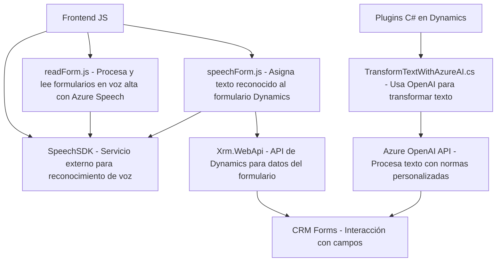

## Breve resumen técnico
Este repositorio incluye tres archivos distintos que trabajan en conjunto para integrar reconocimiento y síntesis de voz, procesamiento de texto con IA y transformación de datos en formularios de Dynamics 365 utilizando APIs externas (Azure Speech SDK y Azure OpenAI). Es una solución híbrida que combina módulos frontend con plugins backend.

---

## Descripción de arquitectura
La arquitectura del proyecto parece ser una combinación modular de **n-capas**, con una separación clara del frontend (JavaScript para interacción con el usuario) y backend (C# plugin para Dynamics CRM). Es notable el uso de dependencias externas como los servicios de Azure Speech y OpenAI para extender las capacidades del sistema. Además, la solución muestra características de integración con microservicios externos (Azure Cognitive Services).

### Puntos clave de la arquitectura:
1. **Frontend dinámico**: Archivos en los que el formulario y audio son procesados directamente en el navegador, con funciones específicas para leer, editar y sintetizar información.
2. **Backend extensible**: Plugin ejecutado en el sistema Dynamics 365 que transforma texto utilizando el modelo GPT de Azure OpenAI.
3. **Integración API**: Dependencias con Azure Speech y Azure OpenAI sugieren interacción continua con servicios externos basados en REST o HTTP.
4. **Patrones de diseño presentes**: Callback/event-driven, modularidad, composición de servicios.

---

## Tecnologías usadas
1. **Frontend/JavaScript**:
   - **Azure Speech SDK**: Para síntesis y reconocimiento de voz.
   - **Dynamics 365 Web API (Xrm namespace)**: Interacción con el backend CRM.
   - **ES6+ JavaScript**: Programación orientada a funciones y manejo dinámico de DOM/formularios.

2. **Backend/C#**:
   - **Azure OpenAI API**: Procesamiento de texto avanzado utilizando modelos GPT.
   - **Dynamics 365 CRM SDK**: Framework estándar para desarrollar plugins en sistemas CRM.

3. **Entorno de integración**:
   - **Servicios remotos**: Azure Cognitive Services.
   - **Plugins en Dynamics**: Sistema extensible con eventos disparadores customizados.

---

## Diagrama Mermaid válido para GitHub

---

## Conclusión final
Este repositorio representa un conjunto de módulos integrados que implementan una **solución intermedia de n-capas**, con carga funcional distribuida entre frontend y backend. Por un lado, el frontend maneja interacción con el usuario (voz y formularios dinámicos). Por otro, el backend complementa la lógica de negocio aplicando técnicas avanzadas de procesamiento de texto mediante Azure OpenAI. La solución hace un uso extensivo de **services composition** al delegar responsabilidades clave, como procesamiento de voz y IA, a APIs externas especializadas.