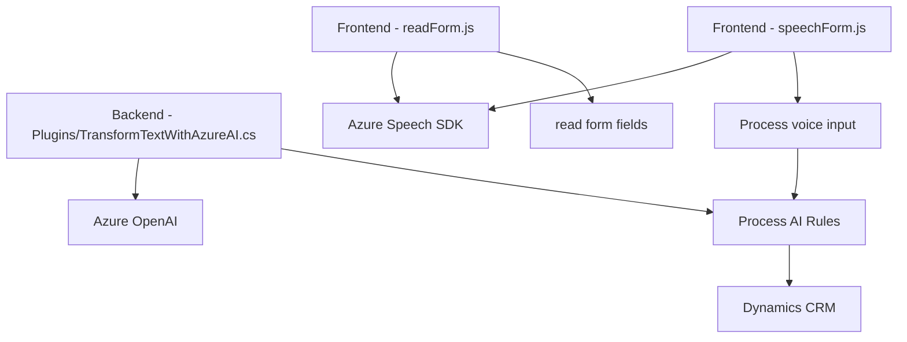

### Resumen Técnico

El repositorio en cuestión implementa una solución que integra un sistema de entrada y salida de voz y un procesamiento avanzado de datos mediante API externas. Esta solución está orientada a aplicaciones empresariales, especialmente las que interactúan con Dynamics CRM o similares. Los archivos analizados incluyen funcionalidades frontend que usan el Azure Speech SDK, backend que utiliza Azure OpenAI y plugins para Dynamics CRM.

---

### 1. Tipo de Solución

La solución es una integración híbrida:
- **API**: A través del uso de servicios como Azure OpenAI y Azure Speech SDK.
- **Frontend**: Mediante funciones que manejan contextos de formularios para síntesis de voz y grabación.
- **Backend/Plugins**: Interacción directa con el sistema Dynamics CRM para manipulación y procesamiento de datos.
  
Por lo tanto, la solución puede clasificarse como **un ecosistema de microservicios y plugins conectados mediante APIs externas**.

---

### 2. Tecnologías, Frameworks y Patrones Usados

#### Tecnologías:
- **Frontend**:
  - JavaScript (uso extensivo de funciones asincrónicas y API para manejo de voz).
  - Azure Speech SDK: Para la síntesis de voz y reconocimiento de voz.
  
- **Backend**:
  - Dynamics CRM SDK (`IPlugin`): Para implementar plugins personalizados.
  - Azure OpenAI: Procesamiento avanzado de texto con GPT-4.

#### Patrones:
- **Event-driven architecture**: En el frontend, se ejecutan callbacks por eventos, como la carga del SDK o el reconocimiento de voz.
- **Modularización**: Código dividido en funciones específicas e independientes (lectura de formularios, asignación de valores, procesamiento de transcripciones).
- **Plugin pattern**: Dinámica en el backend para extender la funcionalidad de Dynamics CRM mediante clases que implementan `IPlugin`.
- **SOA (Service-oriented architecture)**: Uso de servicios externos (Azure Speech SDK y OpenAI).

---

### 3. Tipo de Arquitectura

La solución tiene una **arquitectura híbrida**, compuesta por:
1. **Microservicios**: Integración con APIs externas (Azure OpenAI y Azure Speech SDK), desacoplados del entorno.
2. **Plugins de CRM** (Dynamics Plugin): Backend conectado mediante el `IPlugin` para integración directa con el CRM.
3. **Arquitectura de N capas**:
   - Capa de presentación (Frontend JS).
   - Capa de lógica empresarial (Plugins y APIs).
   - Capa de servicios externos (Azure Speech y OpenAI).

---

### 4. Dependencias o Componentes Externos

#### Externos:
- **Azure Speech SDK**:
  - Usado para procesamiento de voz, generación de síntesis y entrada de datos hablados.
  - Requiere una clave API y configuración de región.
  
- **Azure OpenAI**:
  - Transforma texto según normas definidas mediante API REST.

- **Dynamics CRM SDK**:
  - API interna para interactuar con el entorno CRM, manipular datos y configurar procesos.

#### Internos (auxiliares/críticos):
- **Xrm.WebApi**: Utilizado para integración con datos en Dynamics CRM (lectura de entidades, asignación de valores).
- Funciones auxiliares:
  - Conversión texto-a-numero.
  - Validación de contexto del formulario.

---

### 5. Diagrama Mermaid Compatible con GitHub Markdown

---

### Conclusión Final

La solución integra múltiples capas tecnológicas (frontend, backend y servicios externos) para mejorar la experiencia en entornos empresariales como Dynamics CRM. Su enfoque en la modularidad y uso de patrones como SOA y plugins asegura una configuración escalable y fácil de mantener.

Puntos destacados:
1. **Flexibilidad**: Usa servicios externos sin depender estrictamente de su internals.
2. **Modularidad**: Cada componente tiene una responsabilidad bien definida.
3. **Escalabilidad**: Arquitectura híbrida que puede crecer horizontamente añadiendo nuevos servicios externos.

La integración con APIs de Azure asegura un nivel alto de fiabilidad y potencia, clave para entornos empresariales. El diseño arquitectónico es robusto, aunque dependiendo de los costos de los servicios de Azure, esta implementación puede volverse costosa a largo plazo.