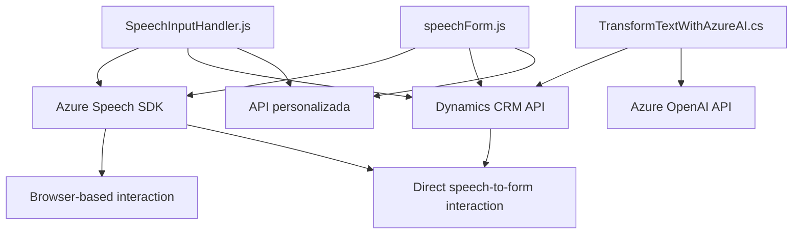

### Breve resumen técnico
El repositorio describe una solución integrada con tecnologías web y Azure, diseñada para procesamiento de formularios basado en voz (Speech SDK) y generación de texto estructurado mediante OpenAI en un sistema CRM (Dynamics). Consta de:
1. Frontend: Scripts de JavaScript que gestionan formularios y voz.
2. Backend: Plugin en C# orientado a transformar texto con OpenAI para uso en Dynamics CRM.

---

### Descripción de arquitectura
La solución implementa una arquitectura híbrida de **n-capas** y **orientación a servicios**:
1. **Frontend (Browser-based interaction)**:
   - Procesos de reconocimiento de voz (Azure Speech SDK).
   - Mapeo dinámico y actualización de formularios en CRM.
   - Interacción directa con Dynamics API y servicios personalizados.

2. **Backend (Dynamics Plugin)**:
   - Extensión del CRM mediante la arquitectura tradicional de plugins (`IPlugin`).
   - Uso de servicios externos (Azure OpenAI API) para procesamiento de datos.

Esta disposición organiza funcionalidad específica en capas independientes con una clara delimitación:
- **Presentación (Frontend/JS)**: Procesos del cliente (navegador) encargados de la entrada por usuario (voz).
- **Lógica de negocio (Plugin)**: Transformación de datos y valorización de formularios.
- **Servicios externos**: Azure Speech y OpenAI como componentes externos clave.

---

### Tecnologías usadas
1. **Frontend**:
   - **JavaScript (ES6)**: Para integraciones dinámicas con formularios en CRM.
   - **Azure Speech SDK**: Manejo de voz y síntesis de texto a habla.
   - **Dynamics CRM API**: Manipulación contextual del formulario.

2. **Backend**:
   - **C#**: Desarrollo de plugins para Dynamics CRM.
   - **Newtonsoft.Json**: Procesamiento de JSON.
   - **System.Net.Http**: Integración con APIs externas.
   - **Azure OpenAI API**: Uso del modelo GPT para transformación de texto.

3. **Patrones utilizados**:
   - **Modularidad**: Funciones encapsulan componentes de lógica específica (Frontend y Backend).
   - **Singleton**: Uso de objetos globales como `window.SpeechSDK` o contextos dinámicos de CRM.
   - **Service-oriented architecture (SOA)**: Integración con servicios externos (Azure Speech, OpenAI).

---

### Diagrama Mermaid válido para GitHub

---

### Conclusión final
La solución se centra en la integración de procesamiento de formularios con funcionalidades de reconocimiento y síntesis de voz (Azure Speech SDK), además de transformación de datos mediante OpenAI para un sistema CRM. Se destaca por su modularidad y enfoque orientado a servicios, complementando la arquitectura tradicional de extensiones para Dynamics con tecnología moderna de IA. Aunque el diseño es funcional, la separación de responsabilidades podría mejorar —considerando que la lógica de negocio del frontend podría beneficiarse de una capa más limpia o servicios específicos.