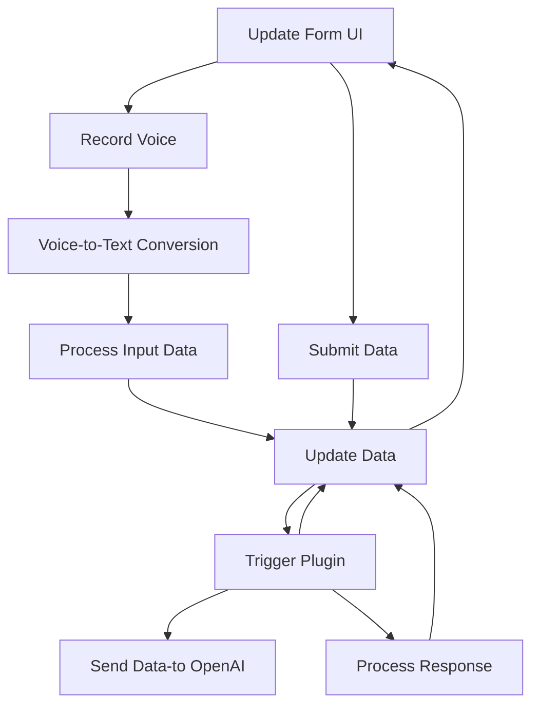

### Breve resumen técnico

El repositorio parece abordar la integración de funcionalidades avanzadas relacionadas con voz e inteligencia artificial en el contexto de formularios de Microsoft Dynamics CRM. Utiliza un enfoque basado en módulos (JavaScript y C#) para implementar funciones clave: captura y síntesis de voz con Azure Speech SDK en el frontend, procesamiento del texto transcrito en el cliente web o vía inteligencia artificial, y transformación de datos con Azure OpenAI desde un plugin backend en Dynamics CRM.

---

### Descripción de arquitectura

**Arquitectura aplicada**:  
- Se observa una **arquitectura n capas**, donde las responsabilidades están distribuidas entre:
  1. **Frontend**: Responsabilidades de interacción con el usuario, como captura de voz y lectura del formulario.
  2. **Middleware y Backend**:
     - Plugins como `TransformTextWithAzureAI.cs` actúan como intermediarios para comunicación entre las APIs externas (Azure OpenAI) y Dynamics CRM.
     - APIs personalizadas son utilizadas en el procesamiento de datos vía IA y configuración del formulario en Dynamics CRM.
  3. **Externo**: Integración con servicios de terceros como Azure Speech SDK y Azure OpenAI.

**Patrones utilizados**:
1. **Dynamic Loading**: En el frontend, el SDK de Azure Speech se carga dinámicamente si aún no está disponible.
2. **Facade/Adapter Pattern**: En los métodos de integración, tanto en frontend como en backend (e.g., `callCustomApi` y `GetOpenAIResponse`), para proporcionar una capa de abstracción entre el sistema principal y las APIs externas.
3. **Encapsulación mediante Plugins**: En el backend mediante la implementación de `IPlugin` para Dynamics CRM, encapsulando la lógica de transformación de datos que luego se devuelve al sistema.
4. **API Communication Pattern**: Tanto el frontend como el backend utilizan APIs externas (Azure Speech SDK, Azure OpenAI) para realizar tareas específicas.

---

### Tecnologías usadas

1. **Frontend**:
   - **JavaScript** para la manipulación de formularios y activación de Azure Speech SDK.
   - **Azure Speech SDK** para captura y síntesis de voz.
   - **Dynamics 365 SDK** para interactuar con formularios y sus valores, junto con el sistema Xrm.WebApi.

2. **Backend**:
   - **C#** para el desarrollo de plugins en Dynamics CRM.
   - **Dynamics 365 Plugin Framework** con clases y métodos como `IPlugin` y `IPluginExecutionContext`.
   - **System.Net.Http** y JSON libraries (native `System.Text.Json` and `Newtonsoft.Json.Linq`) for API calls.
   - **Azure OpenAI API** for text transformation and conversational AI.

3. **External Services**:
   - Azure OpenAI (GPT models for text transformation and intelligent data processing).
   - Azure Speech SDK (conversion of voice to text and vice versa).

4. **Modern Frontend Practices**:
   - Dynamic import of external dependencies (JavaScript).
   - Modular function design for reusable and isolated functionalities.

---

### Diagrama Mermaid válido para GitHub

---

### Conclusión final

Este repositorio representa una hybrid architecture que combina frontend-client interactions (Dynamic CRM forms) con backend plugins and third-party integrations (Azure Speech and Azure OpenAI). This modular and extensible design makes the solution ideal for providing accessible and intelligent input techniques. It implements patterns like dynamic loading and API communication effectively, ensuring reusability and scalability.