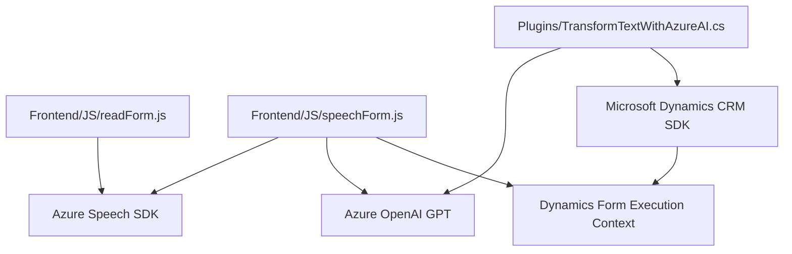

### Breve resumen técnico:
El repositorio es un sistema compuesto por varios módulos y servicios enfocados en interacción con formularios mediante tecnologías de reconocimiento y síntesis de voz. Utiliza Azure Speech SDK para ambas tareas, y Azure OpenAI para procesamiento avanzado de texto. Ofrece las siguientes funcionalidades:
- Lectura de formularios en voz.
- Entrada de voz para actualización dinámica de campos de formularios.
- Uso de inteligencia artificial para transformar texto en estructuras JSON personalizadas dentro de Dynamics CRM.

### Descripción de arquitectura:
La arquitectura del sistema puede describirse como un **híbrido entre n capas y microservicios**:
- **Frontend:** Los módulos JavaScript manejan integraciones con Azure Speech SDK para lectura y transcripción de datos en formularios.
- **Backend:** Representado por el plugin de Dynamics (`TransformTextWithAzureAI.cs`), que actúa como un microservicio interactuando con Azure OpenAI GPT.
- **Modularización:** Divide funcionalidades específicas (lectura y entrada de voz, procesamiento por IA, interacción con formularios) en bloques independientes pero interoperables.

### Tecnologías usadas:
1. **Frontend:**
   - Azure Speech SDK: Síntesis y reconocimiento de voz.
   - JavaScript (modular approach): Manejo de lógica de negocio asociada a formularios y procesamiento de datos.
2. **Backend:**
   - Microsoft Dynamics CRM (SDK): Extensible mediante plugins.
   - Azure OpenAI (GPT models): Transformación avanzada de texto.
   - Newtonsoft.Json y System.Text.Json: Serialización y manejo de objetos JSON.
   - System.Net.Http: Comunicación REST con Azure OpenAI.
3. **Integraciones:**
   - A través de un microservicio basado en APIs externas (Azure Speech SDK, Azure OpenAI) para manejar procesos complejos.

### Diagrama Mermaid 100 % compatible con GitHub Markdown:

### Conclusión final:
Este repositorio implementa un sistema modular con interacción entre frontend y backend, usando servicios externos (Azure Speech SDK y OpenAI) para integrar características de voz y procesamiento inteligente de texto. La arquitectura primaria es una combinación de n capas para la interacción directa con formularios y microservicios para el procesamiento externo en Azure. Sin embargo, se observa una posible vulnerabilidad, como la inclusión de claves privadas directamente en el código. Se recomienda externalizarlas a variables de entorno o servicios secretos para mayor seguridad en entornos de producción.