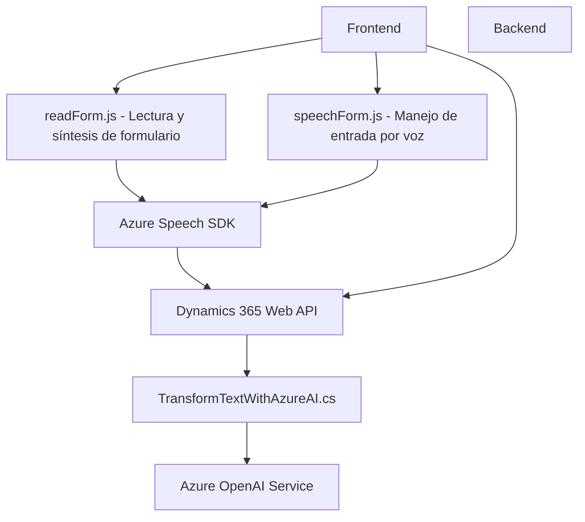

### Breve resumen técnico

El repositorio consta de archivos para manejar entrada por voz y síntesis de texto a voz en el frontend web, integrándose con Dynamics 365 y Azure Speech SDK. También incluye un plugin backend (`TransformTextWithAzureAI.cs`) para procesar texto usando Azure OpenAI. El diseño general apunta a una solución que mezcla funcionalidades de frontend y backend orientadas a la interacción vocal y la interoperabilidad con Dynamics CRM.

---

### Descripción de arquitectura

#### Tipo de solución
La solución parece ser una *aplicación modular* que usa frontend y backend:
1. **Frontend**:
   - Gestiona interacción por voz en formularios y está integrado con Dynamics 365.
   - Funcionalidades incluyen lectura y procesamiento de datos mediante voz.
2. **Backend**:
   - Comprende un plugin extensible para Dynamics CRM, que procesa texto usando Azure OpenAI.
   - Usa arquitectura basada en plugins para ampliar funcionalidad nativa de Dynamics.

#### Arquitectura general
1. **En el Frontend**:
   - Arquitectura modular (funciones independientes).
   - Basada en eventos (event-driven patterns) con callbacks para manejar cargas dinámicas (SDK).
   - Integra servicios como Azure Speech SDK y APIs personalizadas de Dynamics CRM.
2. **En el Backend**:
   - *Plugin-based architecture*. Cada plugin tiene responsabilidad única y lógica específica.
   - Usa principios como SRP (Single Responsibility Principle) en métodos individuales.

---

### Tecnologías usadas
1. **Frontend**:
   - **JavaScript** para manejar lógica dinámica (lectura, síntesis, mapeo, etc.).
   - **Azure Speech SDK** para voz-a-texto y texto-a-voz.
   - **Dynamics 365 Web API** para integración con formularios.
   - Event-driven programming con callbacks/promesas.
2. **Backend**:
   - **C#** como lenguaje base.
   - **Microsoft Dynamics SDK** para crear Plugins.
   - **Azure OpenAI Service**, probablemente usando GPT-4.
   - **JSON** para intercambio estructurado de datos.
   - Librerías .NET: `HttpClient`, `Newtonsoft.Json.Linq`.

---

### Dependencias externas
1. **Frontend**:
   - Azure Speech SDK: Cargado dinámicamente desde un script externo.
   - Dynamics 365 Web API para lectura/modificación de formularios y ejecución de APIs personalizadas.
2. **Backend**:
   - Azure OpenAI (API externa para IA).
   - HTTP y JSON manipulation (via .NET libraries).
   - Dynamics CRM SDK para acceso a datos de entidad y operaciones relacionadas.

---

### Diagrama Mermaid

El diagrama muestra cómo interactúan los componentes del sistema. Los nodos describen los principales elementos, interacciones y dependencia de APIs o SDKs externos.

---

### Conclusión final

El repositorio implementa mecanismos avanzados para trabajar con datos de formularios mediante entrada por voz en frontend (usando Azure Speech SDK y Dynamics Web API) y procesamiento de texto en backend con ayuda de Azure OpenAI. Combina integración de diversos servicios cloud con diseño modular y patrones como evento-callback y plugin architecture. El diseño es adecuado para soluciones basadas en Dynamics CRM con extensiones vocales y procesamiento inteligente mediante IA, aunque suelta en términos de separación por capas entre frontend y backend.