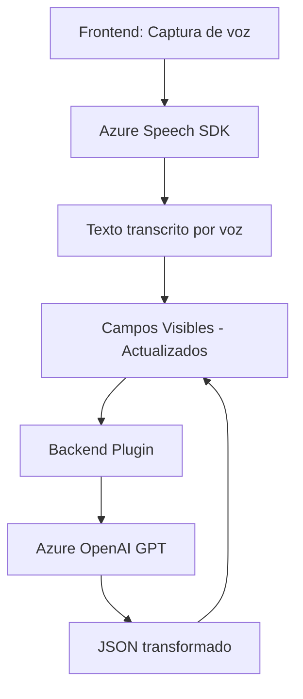

### Breve Resumen Técnico
El repositorio corresponde a una solución integrada que conecta formularios de Dynamics 365 con servicios de Azure Speech SDK y Azure OpenAI GPT. Su propósito es capturar datos del formulario mediante síntesis y reconocimiento de voz, transformarlos en texto procesable y aplicar valores a campos del formulario. También cuenta con un plugin que permite transformar texto en estructuras JSON utilizando Azure OpenAI.

---

### Descripción de Arquitectura
La arquitectura global combina los siguientes elementos:
1. **Patrón Modular**: Las funcionalidades están separadas en archivos según responsabilidades específicas (captura de voz y proceso de transformación de texto).
2. **Integración de Servicios Externos**: El sistema se apoya en servicios externos como Azure Speech SDK y Azure OpenAI, además de la API interna de Dynamics 365.
3. **Frontend**: Procesos relacionados con la captura y lectura de voz están implementados en JavaScript para interacción directa con el usuario en los formularios.
4. **Backend Plugin**: Plug-in desarrollado en C# para extender el comportamiento del CRM mediante llamadas al servicio Azure OpenAI.

**Tipo de arquitectura:** 
La solución implementa una arquitectura distribuida de **n capas** con:
- **Capa de presentación**: Archivos JavaScript en el frontend gestionan la interfaz de usuario y conectan el contexto del formulario con APIs.
- **Capa de integración**: Comunicación con APIs externas, como Azure Speech SDK y OpenAI.
- **Capa de negocio**: Lógica de negocio implementada principalmente en el plug-in (`TransformTextWithAzureAI.cs`) y en funciones Javascript relacionadas con Dynamics 365.

---

### Tecnologías Usadas
1. **Frontend**:
   - JavaScript DOM para manipulación de formularios y lógica de voz.
   - Azure Speech SDK para síntesis y reconocimiento de voz.
   - Patrones asincrónicos como Promesas y Callbacks para manejo de eventos y comunicación con APIs.

2. **Backend**:
   - C# (.NET Framework): Plug-in que extiende y personaliza la funcionalidad en Dynamics CRM.
   - Microsoft Dynamics CRM SDK (`Microsoft.Xrm.Sdk`) para acceso al contexto del sistema.
   - Azure OpenAI para procesamiento avanzado.
   - `System.Net.Http` para conexiones HTTP REST.
   - Manejo de JSON (`System.Text.Json`, `Newtonsoft.Json.Linq`) para estructura de datos.

3. **Servicios Externos**:
   - Azure Speech SDK: Conversión de datos entre texto y voz.
   - Azure OpenAI GPT: Transformación de texto dentro del plugin.

---

### Diagrama Mermaid para Representar la Estructura y Flujo

---

### Conclusión Final
La solución representa un sistema distribuido para extender Dynamics 365 mediante Azure Speech SDK y Azure OpenAI. Su arquitectura de **n capas** organiza claramente la lógica del frontend y backend, delegando tareas específicas como síntesis y procesamiento de voz al cliente, y transformación avanzada al servicio OpenAI en el servidor. Este enfoque modular mejora la mantenibilidad, escalabilidad y facilita la integración con otros sistemas basados en IA y voz.

