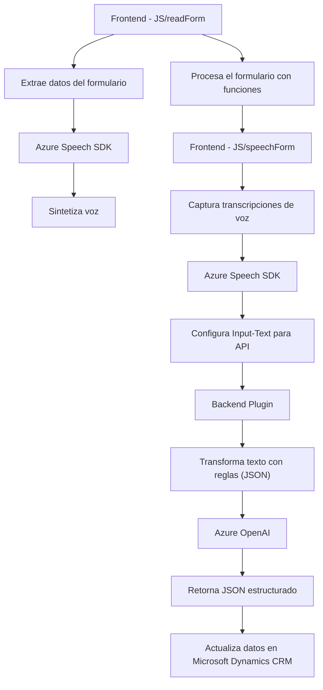

### Breve Resumen Técnico:
El repositorio contiene tres archivos principales con funcionalidades distintas pero interconectadas en el ámbito de interacción entre frontend (formularios) y servicios externos basados en Azure. Los scripts de JavaScript (`readForm.js` y `speechForm.js`) manejan la interacción con formularios y permiten la síntesis de voz y procesamiento de entrada mediante Azure Speech SDK. Por otro lado, el archivo `.cs` encapsula un plugin para Microsoft Dynamics CRM que utiliza Azure OpenAI para transformar textos con reglas específicas.

---

### Descripción de Arquitectura:
La solución se basa en una arquitectura **modular y de integración en capas**:
1. **Frontend**: Realiza interacciones directas con formularios y el SDK de Azure Speech para procesar datos y sintetizar voz.
2. **Backend Plugin**: Amplía las capacidades de Microsoft Dynamics, integrando la solución con Azure OpenAI para el procesamiento avanzado de textos y generación de JSON.
3. **Dependencias externas**: Servicios en la nube de Azure (Speech SDK y OpenAI) proveen funcionalidades críticas.

La parte del frontend es de tipo **multicapa modular**, enfocada al procesamiento del cliente. El plugin en el backend sigue el patrón **Gateway API** y **plugin-based architecture** para su interacción con Dynamics CRM y servicios externos.

---

### Tecnologías Usadas:
1. **Frontend**:
   - **JavaScript**: Herramienta base para manejar la lógica de formularios y la integración con Azure.
   - **Azure Speech SDK**: Para síntesis de voz y carga dinámica del SDK.
   - **Web APIs**: Manipulación del DOM y eventos del navegador.
   - **Patrones utilizados**:
     - **Facade Pattern**: Principal función que coordina varias operaciones internas.
     - **Lazy Dependency Loading**: Carga dinámica del SDK según requerimientos.

2. **Backend Plugin**:
   - **C#/.NET**: Usado para desarrollar el plugin en Microsoft Dynamics.
   - **Microsoft Dynamics CRM SDK**: Proporciona un marco para interactuar con entidades y datos del CRM.
   - **Azure OpenAI API**: Servicio para transformación de textos con inteligencia artificial.
   - **Patterns and Architecture**:
     - **Gateway API**: Llamadas a un servicio externo con respuestas estructuradas.
     - **Plugin-based architecture**: Utilización de la arquitectura de plugins para Microsoft Dynamics.

---

### Dependencias y Componentes Externos:
1. **Azure Services**:
   - **Azure Speech SDK**: Para realizar la síntesis de voz y reconocimiento de entrada.
   - **Azure OpenAI**: Para transformación de texto en JSON estructurado utilizando normas definidas en el código.
2. **Microsoft Dynamics CRM APIs**:
   - Integración con formularios mediante `Xrm.WebApi.online.execute`.
   - Manipulación de datos CRM con `Xrm.WebApi.retrieveMultipleRecords`.
3. **Librerías comunes**:
   - **Newtonsoft.Json**: Para manipulación de JSON.
   - **System.Net.Http**: Para llamadas HTTP al servicio externo de Azure.
   - **Web APIs** del navegador: `document, alert` para manipulación de contenido visible.

---

### Diagrama **Mermaid** válido para GitHub:

---

### Conclusión Final:
Este repositorio es una solución **híbrida** que conecta el frontend con servicios en la nube (Azure Speech y Azure OpenAI) y un backend basado en Microsoft Dynamics CRM. La arquitectura está bien segmentada:
1. **Frontend JavaScript modular**: Procesa formularios y entrada de voz mediante integración con Azure Speech SDK.
2. **Plugin backend**: Amplía la funcionalidad del CRM con integración directa a servicios de IA en la nube.
3. **Uso de nube (SaaS)**: Hace uso intensivo de componentes de Azure para síntesis de voz y procesamiento de lenguaje natural.

La solución está configurada para crear experiencias avanzadas en la interacción entre usuarios y sistemas mediante capacidades cognitivas (IA) y servicios de síntesis a través de la nube. Una posible mejora sería estructurar mejor los scripts del frontend mediante un enfoque de **arquitectura totalmente modular** para garantizar probar y escalar cada componente por separado.