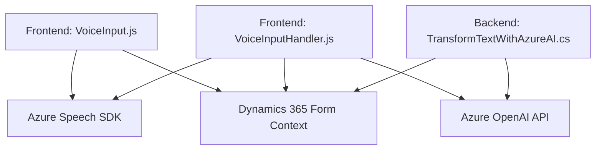

### **Análisis Completo del Repositorio**

#### 1. Breve resumen técnico
El repositorio implementa una solución orientada a la integración de funcionalidades de síntesis de voz con Azure Speech SDK y procesamiento de datos mediante Azure OpenAI. La solución parece ser una combinación de un frontend orientado al flujo de formularios en Dynamics 365 y un backend extensible mediante el uso de plugins. Las responsabilidades están distribuidas entre capturar datos del formulario, procesar entradas de voz y transformar el contenido con APIs inteligentes.

---

#### 2. Descripción de arquitectura
Esta solución tiene componentes de:
- **Frontend**: Implementado para interactuar con formularios dinámicos en un entorno cliente, incluyendo manipulación de un flujo de voz, lectura/síntesis de datos y envío de comandos.
- **Backend/Plugins**: Construido bajo el ecosistema de Dynamics 365, específicamente usando patrones de Plugins con integración de APIs externas (Azure OpenAI).

La arquitectura parece alinearse con una integración **n-capas**. Aunque no es un monolito completo ni una arquitectura de microservicios independiente, hay separación clara de responsabilidades:
- **Capa de presentación** (frontend, manipulación de formularios y lógica del cliente).
- **Capa de negocio** (definida dentro de los plugins, con lógica directamente asociada a Dynamics 365 y transformación de texto).
- **Capa de servicios externos** (Azure Speech SDK y Azure OpenAI).

---

#### 3. Tecnologías usadas
- **Frontend:**
  - **JavaScript**: Manejo de formularios dinámicos, manipulación DOM y ejecución de lógica local basada en voz.
  - **Azure Speech SDK**: Integración para síntesis de voz y reconocimiento.
  - **Browser APIs**: Dinámica de carga de dependencias mediante elementos como `<script>`.
  
- **Backend:**
  - **C#:**
    - Implementa la lógica del plugin para Dynamics 365.
    - Integración con Azure OpenAI mediante `HttpClient` y referencias JSON.
  - **Dynamics 365 SDK**: Framework para extender y acceder al modelo de datos del CRM.
  - **Azure OpenAI API**: Procesamiento avanzado de texto, usando modelos GPT pre-configurados.
  
#### Patrones utilizados:
1. **Patrón de Carga Condicional de Dependencias**: En el frontend (función `ensureSpeechSDKLoaded`) para evitar dependencias no utilizadas.
2. **Patrón API Gateway**: Cada integración externa (Azure Speech SDK, OpenAI) actúa como un punto de entrada controlado por métodos dedicados.
3. **Encapsulación**: Las funciones promueven separación de lógica y reusabilidad.
4. **Single Responsibility**: Métodos tienen tareas bien definidas (obtener datos visibles, sintetizar texto, invocar APIs).

---

#### 4. Dependencias externas presentes
- **Azure Speech SDK** (cliente en JavaScript, cargado dinámicamente en un navegador).
- **Azure OpenAI API** (backend, basado en modelos de lenguaje GPT para transformación avanzada).
- **Dynamics 365 SDK** (interacción nativa con datos de la plataforma Microsoft Dynamics CRM).
- **Web APIs comunes**:
  - `HttpClient` para solicitudes REST desde plugins de C#.
  - Manipulación del DOM en JavaScript.

---

#### 5. Diagrama **Mermaid** válido para GitHub

---

#### **Conclusión Final**
Este repositorio implementa un flujo completo de integración entre tecnologías de Azure (Speech SDK y OpenAI) y Dynamics 365. Por su naturaleza, combina un **modelo híbrido n-capas**, con un frontend centrado en el cliente y un backend extensible mediante Plugins, encapsulando lógica específica de negocio y transformación de datos. Destaca la modularidad y la adecuada separación de responsabilidades, pero podría beneficiarse de mejoras en la gestión de credenciales y configurabilidad.