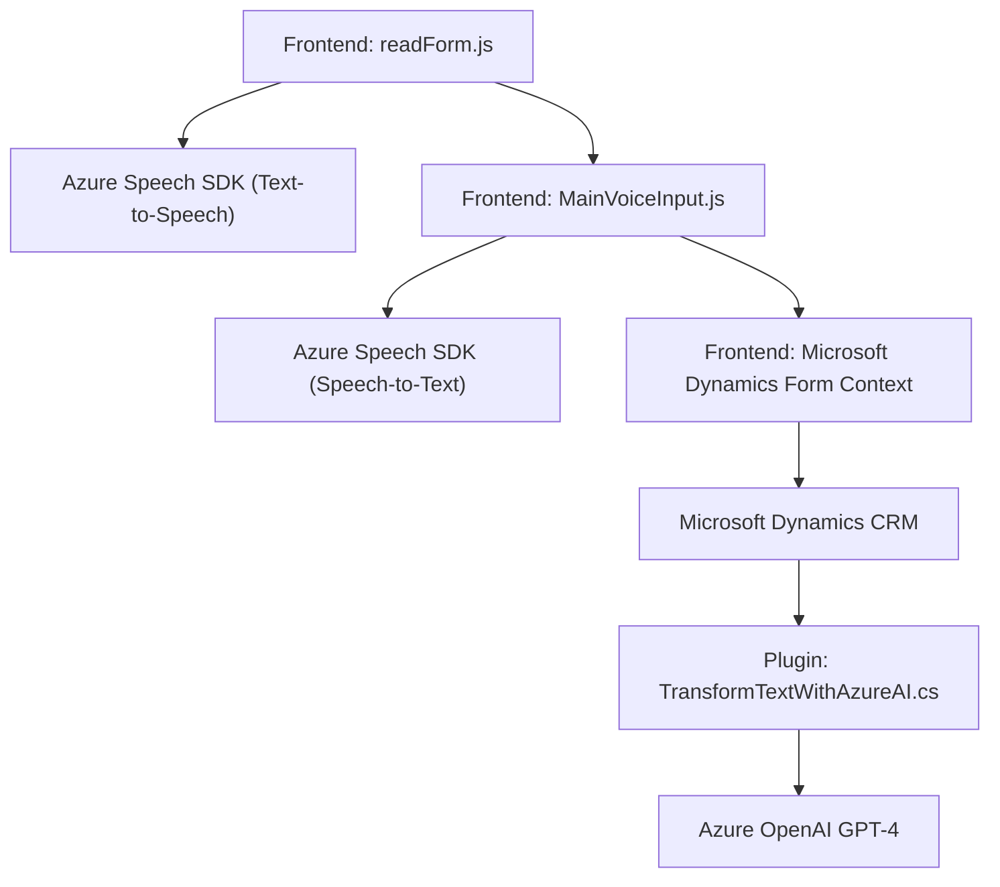

### Breve Resumen Técnico

El repositorio contiene archivos relacionados con una solución de software orientada a la habilitación de funcionalidades de reconocimiento y síntesis de voz, junto con la integración de procesamiento de texto a través de Azure Speech y OpenAI APIs. Esta solución interactúa con formularios en un entorno Microsoft Dynamics CRM.

---

### Descripción de Arquitectura

La arquitectura general del sistema sigue un enfoque **n-capas**. Se pueden identificar al menos tres capas principales:
1. **Frontend**: Archivos `readForm.js` y `MainVoiceInput.js`, que contienen funcionalidades de voz y procesamiento, además del mapeo con formularios.
2. **Business Logic Layer (BLL)**: El plugin `TransformTextWithAzureAI.cs` implementa la lógica compleja mediante el patrón de plugin en Dynamics CRM, delegando a Azure OpenAI la transformación de texto.
3. **Integration/Service Layer**: La solución interactúa con servicios de terceros como Azure Speech SDK y Azure OpenAI.

---

### Tecnologías Usadas

1. **Frontend/Javascript**:
   - **Azure Speech SDK**: Procesamiento de síntesis y reconocimiento de voz.
   - **DOM and browser APIs**: Inserción dinámica de scripts y manipulación de formularios.
   - **JavaScript ES6 Syntax**.

2. **Backend/C#**:
   - **Microsoft Dynamics CRM SDK**: Para implementación del plugin (`IPlugin`, `IOrganizationService`).
   - **Azure OpenAI GPT-4 API**: Procesamiento de texto basado en IA.
   - **.NET Framework**: Para manejar datos y realizar operaciones HTTP con `HttpClient`.

3. **Patrones Observados**:
   - **Integración con Servicios Externos**: Uso de SDKs y APIs como Speech SDK y OpenAI para expandir capacidades.
   - **Plugin Architecture**: Extiende funcionalidades en CRM.
   - **Delegation Pattern**: Delegación de tareas específicas en funciones como `ensureSpeechSDKLoaded`.

---

### Diagrama Mermaid

Diagrama de interacción de componentes principales y sus dependencias:

---

### Conclusión Final

La solución tiene una arquitectura bien definida basada en n-capas, donde cada componente cumple una función específica:
- **Frontend** maneja las interacciones del usuario y la síntesis/reconocimiento de voz.
- **Business Layer** implementa lógica específica para la integración y procesamiento mediante plugins en Dynamics CRM.
- **Service Layer** delega responsabilidades en servicios externos, como Azure Speech SDK y Azure OpenAI.

Se utiliza un conjunto sólido de tecnologías modernas, aunque se pueden mejorar ciertos aspectos, como la gestión de credenciales (API Key) para aumentar la seguridad del sistema. La integración con herramientas de Microsoft Dynamics demuestra que el sistema está destinado a aplicaciones empresariales robustas.