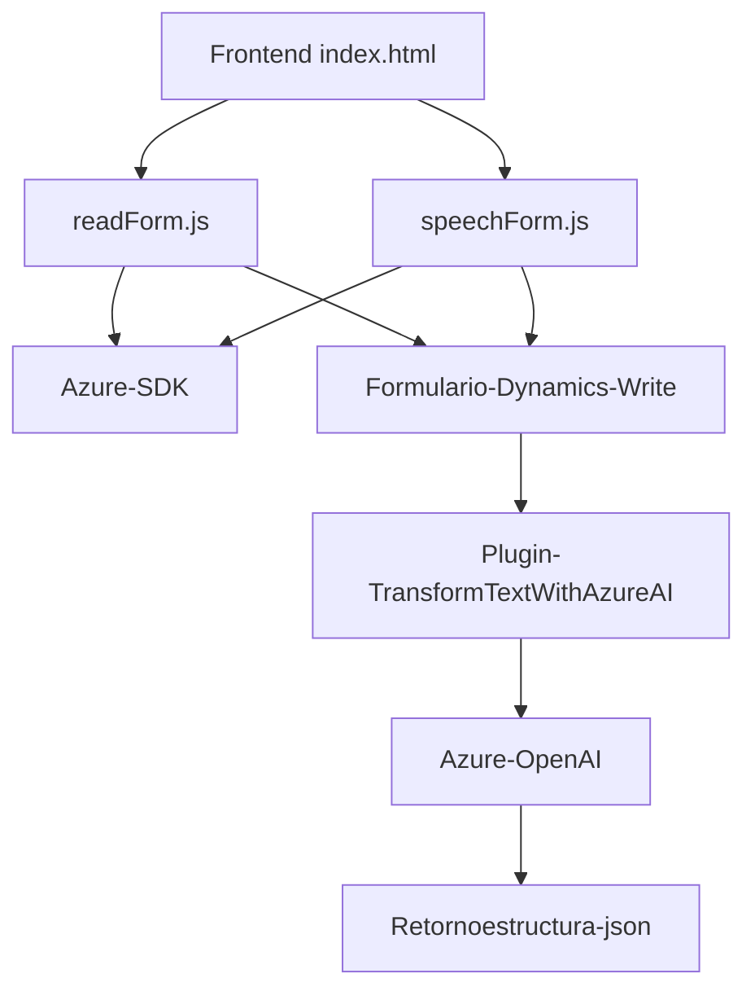

### **Breve resumen técnico**
El repositorio contiene una solución integrada orientada a la gestión y procesamiento de entrada por voz y texto en formularios, utilizando Azure Speech SDK y Dynamics 365 como principales componentes. Además, incluye un plugin para Dynamics CRM que transforma texto con Azure OpenAI.

---

### **Descripción de arquitectura**
La solución está diseñada como una arquitectura **n capas** que podría considerarse una aproximación hacia un **arquitectura híbrida**. Sus componentes principales interactúan entre sí de la siguiente forma:
1. **Capa de presentación (frontend):** Los archivos `readForm.js` y `speechForm.js` procesan datos visuales y de voz desde formularios y los integran dentro de Dynamics 365.
2. **API personalizada mediante plugin:** `TransformTextWithAzureAI.cs` actúa como una capa de integración que permite comunicación fluida entre Dynamics y Azure OpenAI.
3. **Servicios externos y SDKs:** Uso del Azure Speech SDK para conversión de texto y voz y consumo de Azure OpenAI para transformaciones avanzadas.

El diseño incluye patrones como:
- **SDK Facade:** Crea abstracciones funcionales en el frontend para interactuar con Azure Speech SDK.
- **Plugin:** Extensión funcional de Dynamics CRM para personalizar y consumir servicios mediante reglas de negocio.
- **Asincronía:** Manejo asíncrono de llamadas API en JavaScript y .NET para mejorar escalabilidad y rendimiento.

---

### **Tecnologías usadas**
1. Lenguajes:
   - **JavaScript:** Para el frontend (procesamiento de voz y datos).
   - **C#:** Para el plugin de Dynamics CRM.
2. Frameworks:
   - **Dynamics 365:** Integración completa en la lógica de negocio CRM.
   - **Azure Speech SDK:** Servicio externo para entrada/salida de voz.
   - **Azure OpenAI:** procesamiento de texto avanzado basado en IA.
3. Librerías:
   - **Newtonsoft.Json:** Manipulación de JSON en el plugin de C#.
4. Protocolos y patrones:
   - **HTTP APIs:** Para comunicación entre plugins y servicios de Azure.
   - **Abstracción del SDK:** Envolventes de funciones que simplifican el uso del SDK en múltiples puntos.
   - **Estrategia:** Manejo condicional para activar IA según configuración.

---

### **Dependencias o componentes externos**
1. **Azure Speech SDK:** Para la funcionalidad de síntesis de voz y conversión de voz a texto.
2. **Azure OpenAI API:** Para transformar texto en generar respuestas operables.
3. **Dynamics 365 Web API:** Interacción con los modelos de datos en CRM y lógica de negocio.
4. **Newtonsoft.Json:** Procesamiento de JSON en C#.
5. **System.Net.Http:** Para manejar solicitudes HTTP en C#.
6. **Lógica de mapeo personalizada:** Para interpretar y asignar textos a campos específicos.
7. **Posible conexión a una base de datos interna/evolutiva:** Basada en el contexto del plugin.

---

### **Diagrama Mermaid válido para GitHub**

---

### **Conclusión final**
La solución está diseñada como una integración compleja entre la capa de presentación, lógica empresarial de Dynamics CRM y las funcionalidades inteligentes provistas por Azure. Utiliza una arquitectura basada en capas y extensiones modulares que se apoyan en patrones de diseño como programación asíncrona, SDK Facade y plugin-based architecture. Es ideal para organizaciones que buscan capacidades de automatización por voz y texto dentro de aplicaciones CRM como Dynamics, específicamente en aquellos casos donde la conversión de datos y su interpretación juegan un rol crítico en la gestión.