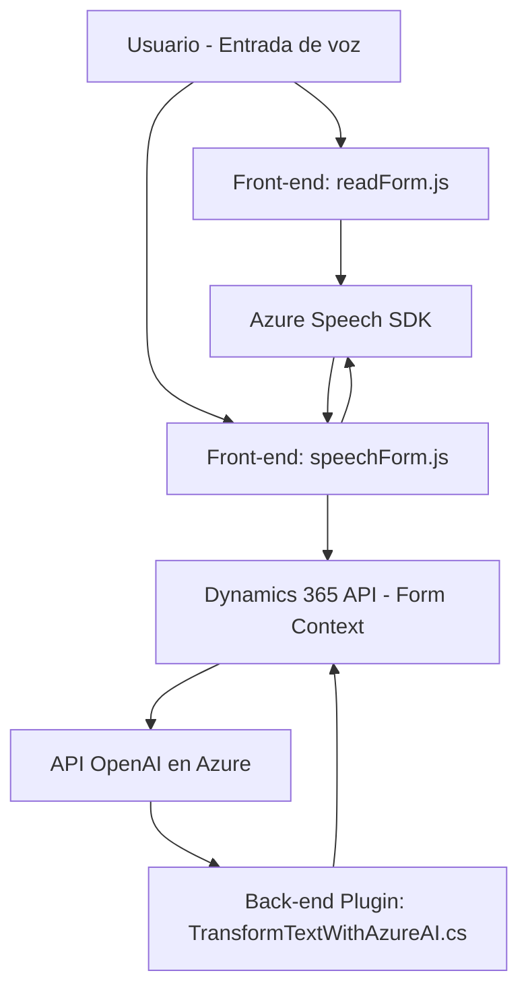

### Breve Resumen Técnico
El repositorio contiene una solución compuesta por múltiples archivos que en conjunto implementan una interacción entre un sistema CRM como Dynamics 365 y el Azure Speech SDK, además de la integración con Azure OpenAI. Los archivos `readForm.js` y `speechForm.js` están diseñados como módulos front-end para manejar la entrada y lectura de voz, mientras que el archivo `TransformTextWithAzureAI.cs` actúa como un plugin en el back-end, integrándose con Dynamics 365. El sistema permite tanto la transcripción y síntesis de voz como la transformación del contenido textual mediante procesamiento de lenguaje natural basado en inteligencia artificial.

---

### Descripción de Arquitectura
1. **Tipo de solución:** Es una **híbrida**, con componentes de front-end (JavaScript) y un plugin back-end (C#) que se integran con un CRM (Dynamics 365). La solución puede considerarse como un **API funcional** extendida hacia la interfaz y el procesamiento hablado.

2. **Arquitectura General:**
   - **N Capas**:
     - **Capa de presentación:** Interacción directa con usuarios, entrada de datos por voz, transcripción y actualización de formularios.
     - **Capa de integración o lógica de negocio:** Manejo del flujo transcripto (por IA o por procesamiento estándar) que actualiza atributos en Dynamics.
     - **Capa de servicios externos:** Llamadas a Azure Speech SDK y Azure OpenAI para hablar y transformar los textos en tiempo real.
     - **Capa de persistencia:** Operaciones en los datos CRM a través de APIs internas (`IOrganizationService`).

   - La división clara entre front-end (JavaScript) y back-end (C#) con interacciones vía SDK/APIs fomenta una arquitectura modular y distribuida.

3. **Patrones utilizados:**
   - **Event-driven architecture:** Los flujos de grabación, transcripción y procesamiento se activan en respuesta a eventos específicos como el inicio de la interacción o el procesamiento de comandos por voz.
   - **Dependency Injection:** Usado en el back-end (C#) con Dynamics CRM APIs.
   - **SDK-integration pattern:** Usado en la interacción con Azure Speech y Azure OpenAI, cargando dinámicamente el SDK.
   - **Helper utilities:** Modularización mediante funciones enfocadas en tareas específicas en los archivos JavaScript.

---

### Tecnologías utilizadas
1. **Lenguajes:**
   - **JavaScript:** Para la implementación del front-end interactivo y grabación/transcripción de voz.
   - **C#:** Para la lógica del plugin utilizado en Microsoft Dynamics CRM.

2. **Frameworks y SDKs:**
   - **Azure Speech SDK:** Para la síntesis y transcripción de voz directamente desde formularios.
   - **Azure OpenAI (GPT-4):** Para transformar texto según reglas específicas.
   - **Microsoft Dynamics 365 SDK:** Ideal para integrar APIs CRM, manipular formularios y registros.

3. **Dependencias importantes:**
   - **Newtonsoft.Json:** Para manipular JSON en C#.
   - `System.Net.Http`: Para realizar solicitudes HTTP hacia servicios de Azure.
   - JAXB Web APIs para manipular entidades y endpoints internos de Dynamics.

---

### Diagrama Mermaid para GitHub

---

### Conclusión Final
La solución presentada es una arquitectura híbrida basada en capas y altamente modular, integrada con servicios avanzados como Azure Speech SDK y Azure OpenAI. A nivel técnico:
1. Permite síntesis de voz de formularios y administración por voz en un entorno CRM (Dynamics 365).
2. Soporta la transformación avanzada de textos mediante inteligencia artificial de OpenAI.
3. Implementa patrones robustos como la arquitectura basada en eventos, integración con SDK externos, y separación de responsabilidades entre el front-end y el back-end.

Es una solución ideal para aplicaciones CRM que buscan enriquecer la experiencia de usuario y optimizar la gestión de datos mediante inteligencia artificial y procesamiento de voz.