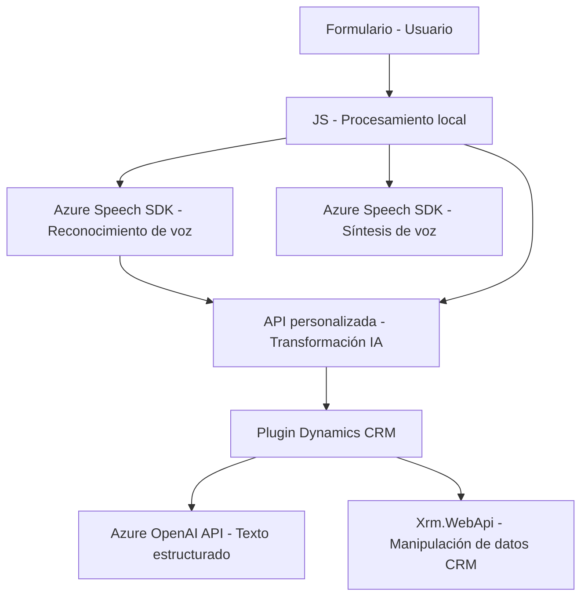

### Breve resumen técnico

El repositorio analizado evidencia una solución basada en la interacción entre formularios, reconocimiento de voz, y procesamiento de texto mediante IA. Implementa funcionalidades en múltiples capas: frontend (JavaScript para procesamiento de formularios y interacción con SDKs), API personalizada y plugins para Dynamics CRM, integrando servicios como Azure Speech y Azure OpenAI. La arquitectura presenta características destacables como modularidad, integración externa, y capacidad de extensión en plataformas empresariales.

---

### Descripción de arquitectura

1. **Tipo de solución:**
   - **Híbrida:** Combina un sistema frontend para manipulación visual y procesamiento en navegador, con un backend que utiliza plugins de Dynamics CRM y una API personalizada.
   - **Interacción con IA:** Usa SDKs y APIs de Azure para integrar IA y reconocimiento/síntesis de voz.

2. **Arquitectura:**
   - **Frontend:** Modularidad funcional (cada archivo JavaScript trata una tarea específica).
   - **Backend:** Arquitectura orientada a servicios integrándose con Microsoft Dynamics CRM, soportando plugins y extensibilidad.
   - **Patrones utilizados:**
     - **n-Capas:** Separación clara entre lógica frontend, almacenamiento CRM y procesamiento mediante plugins.
     - **API Gateway:** El enfoque sugerido en el plugin `TransformTextWithAzureAI.cs` permite una capa específica para intercambiar texto estructurado con Azure OpenAI.
     - **Integración modular/extensible:** Backend se amplía fácilmente con nuevos plugins o dependencias externas.

---

### Tecnologías usadas

1. **Frontend:**
   - **Azure Speech SDK:** Usado para reconocimiento y generación de texto basado en voz.
   - **JavaScript:** Lenguaje principal para manipulación asíncrona del DOM y formulación de interacciones con IA.
   - **Dynamics API (`Xrm.WebApi`):** Integración para manipular datos del contexto del sistema CRM.

2. **Backend:**
   - **Microsoft Dynamics SDK (C#):** Orientado a ampliar funcionalidades de CRM mediante plugins como `TransformTextWithAzureAI.cs`.
   - **Azure OpenAI API:** Usada para transformación avanzada de texto según reglas parametrizadas.
   - **C# y .NET:** Para implementación robusta de lógica empresarial.
   - **HTTPClient y `Newtonsoft.Json`:** Manejo HTTP y datos serializados en JSON.

---

### Dependencias o componentes externos

1. **Azure Speech SDK:** Biblioteca cargada dinámicamente para síntesis y reconocimiento de voz.
2. **API de Azure OpenAI:** Procesador remoto de texto con funcionalidad avanzada basada en IA.
3. **Microsoft Dynamics SDK:** Para desarrollo específico sobre contexto CRM.
4. **Newtonsoft.Json:** Procesamiento de información estructurada en JSON.
5. **Internas:** Elementos de API interna dinámica del sistema (`Xrm.WebApi`, `context.data`).
6. **Librerías estándar (.NET):** Soporte para solicitudes HTTP, manipulación JSON y manejo de servicios REST.

---

### Diagrama Mermaid

---

### Conclusión final

El repositorio evidencia una solución sólida y enfocada en la integración tecnológica para entornos empresariales. Implementando n-Capas, modularidad, y servicios basados en SDKs (Azure Speech y OpenAI), se habilita una arquitectura flexible y expansible. Tanto el frontend como el backend emplean patrones modernos para garantizar robustez, escalabilidad y extensibilidad.