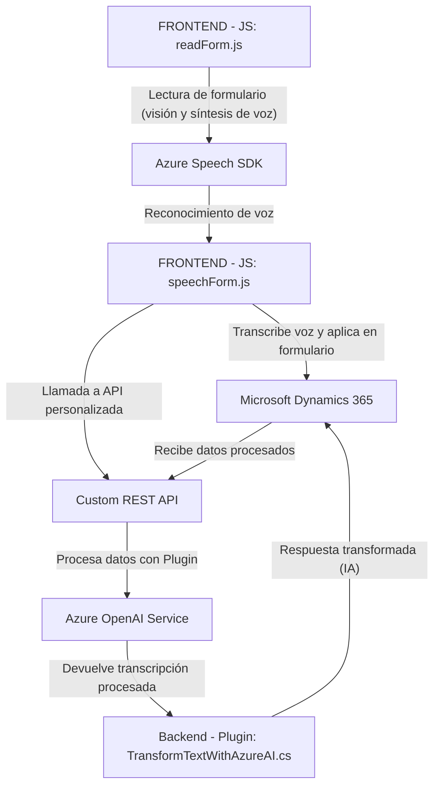

### **Breve resumen técnico**

La solución presentada establece una integración entre formularios y plugins de **Dynamics 365** con servicios avanzados en **Azure**, específicamente **Azure Speech SDK** y **Azure OpenAI API**. Su estructura de frontend utiliza JavaScript para el manejo de acciones relacionadas con formularios, como la lectura de datos y generación de voz, mientras que el backend, desarrollado en **C#,** extiende la funcionalidad de Dynamics CRM mediante un **plugin** que aprovecha modelos de procesamiento natural basados en **GPT** de OpenAI.

---

### **Descripción de arquitectura**

1. **Tipo de solución:**
   - Este proyecto cumple la función de ser un **microservicio adaptado para Dynamics CRM**. La combinación de:
       - Frontend en JavaScript para lectura y manipulación de formularios.
       - Backend en C# con un foco en **extensiones personalizadas** que interactúan con el sistema CRM y servicios de Azure.
     Lo convierten en una solución híbrida, que actúa como un integrador de servicios de accesibilidad (voz → texto → formulario) y automatización.

2. **Arquitectura y patrones utilizados:**
   - **Event-Driven Architecture:** Se observa la implementación de callbacks para la interacción basada en eventos, como la carga dinámica del SDK, el reconocimiento o la actuación según la transcripción obtenida.
   - **Service-Oriented Architecture (SOA):** El diseño incluye servicios externos (Azure Speech y OpenAI API), cada uno actuando como componentes independientes que trabajan en conjunto.
   - **Patrón de Plugin Extensibilidad:** El código C# utiliza el patrón de extensibilidad propio de Dynamics CRM mediante `IPlugin`.
   - **Basado en capas:** El sistema es modular y separa claramente la lógica de frontend (recopilación y síntesis de voz) de la lógica backend (transformación del texto y enlace con Dynamics CRM).

---

### **Tecnologías usadas**

1. **Frontend (JavaScript):**
   - **Azure Speech SDK:** Proporciona capacidades de reconocimiento de voz y síntesis.
   - **DOM API:** Usada para manipular el DOM y los formularios en el navegador.
   - **Dynamics 365 WebAPI (Xrm.WebApi):** Se utiliza para obtener el contexto del formulario (datos y campos visibles) y para enviar actualizaciones.

2. **Backend (C#):**
   - **Azure OpenAI Service API:** Para realizar transformaciones mediante el modelo GPT.
   - **Microsoft Dynamics SDK:** Integración de la lógica personalizada como un plugin.
   - **Newtonsoft.Json.Linq y System.Text.Json:** Para manipulación de los datos JSON generados por GPT.
   - **HttpClient:** Gestión de llamadas al servicio OpenAI mediante API REST.

3. **Ambiente y contexto:**
   - **CRM Dynamics 365**: El sistema se orienta a extender la funcionalidad de formularios en la plataforma.
   - **Cloud Integration:** Comunicación integral con servicios Azure gestionada mediante claves y endpoints específicos.

---

### **Diagrama Mermaid**

---

### **Conclusión final**

Esta solución ha sido diseñada para incrementar la accesibilidad y automatización en el entorno de **Microsoft Dynamics 365.** Se basa en una **arquitectura modular** que combina un **frontend versátil** en JavaScript para la interacción y síntesis de voz, con un **backend robusto** que emplea un **plugin CRM** para transformar texto mediante **Azure OpenAI**. La integración de servicios externos como **Speech SDK y OpenAI** permite aprovechar capacidades avanzadas de inteligencia artificial y accesibilidad.

Aunque está bien estructurado, se pueden hacer algunas mejoras:
1. **Seguridad de las claves:** Utilizar configuraciones externas o sistemas de secretos para almacenar claves API en lugar de valores estáticos.
2. **Modularidad:** El código JavaScript podría separarse aún más para mejorar su mantenimiento y pruebas.
3. **Dockerización:** Para garantizar reproducibilidad, se podría considerar portar el backend a un contenedor que simplifique la combinación de dependencias, especialmente si se migra la estructura a cloud-native o microservicios.

En resumen, es una solución orientada a eventos, modular y habilitada a través de servicios cloud, que integra accesibilidad, manejo de voz y procesamiento de lenguaje natural en una interfaz CRM moderna y personalizable.