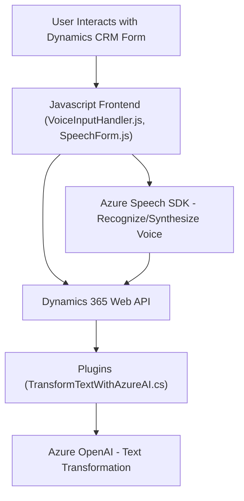

### Breve resumen técnico:
El repositorio describe un sistema distribuido para la gestión de formularios en Dynamics CRM utilizando Azure Speech SDK y Azure OpenAI. Los módulos se organizan en tres capas principales:
1. **Frontend JavaScript**: Implementa la interacción de reconocimiento de voz y procesamiento de datos.
2. **Backend Plugins en C#**: Manejo de lógica y transformación de texto a través de IA (Azure OpenAI) vía APIs.
3. **Integración con servicios externos**: Microsoft Azure Speech SDK y Azure OpenAI para reconocimiento y síntesis de voz, así como transformación de texto con inteligencia artificial.

---

### Descripción de arquitectura:
Este sistema sigue una arquitectura **n-capas**, ya que está dividido en tres niveles clave:
1. **Presentación (Frontend)**: Implementación de la interacción entre el usuario y Dynamics CRM mediante funciones JavaScript.
2. **Lógica empresarial (Plugins en C#)**: Capa donde se extiende la funcionalidad del sistema manejando eventos e integraciones como Azure OpenAI.
3. **Integración con servicios externos**: Utilización de SDKs (Azure Speech y Azure OpenAI) y APIs REST para tareas especializadas. Esto introduce elementos relacionados con microservicios (Azure siendo un proveedor externo).

La arquitectura combina características de n-capas y Elements of Serverless debido a su dependencia de servicios externos desacoplados.

---

### Tecnologías usadas:
1. **Frontend**:
   - Lenguaje: JavaScript.
   - Frameworks y SDKs: Azure Speech SDK, Dynamics 365 Web API.
   - Patrones:
     - Delegate Pattern (uso de callbacks).
     - Facade Pattern (simplificación de la interacción con servicios, ejemplo: funciones `startVoiceInput`).
2. **Backend Plugins**:
   - Lenguaje: C#.
   - Frameworks/Librerías:
     - Microsoft Dynamics CRM SDK.
     - Newtonsoft.Json para manejo avanzado de JSON.
     - Azure OpenAI Service para transformación de texto.
   - Patrones:
     - Plugin Pattern de Dynamics CRM.
     - Integration with External Systems.
3. **Plataformas externas**:
   - **Azure Speech SDK**: Reconocimiento de voz y síntesis de texto a voz.
   - **Azure OpenAI service**: Integración con APIs basadas en modelos GPT para transformación inteligente de texto.

---

### Diagrama Mermaid válido para GitHub:

---

### Conclusión final:
El repositorio presenta un modular y avanzado sistema que combina tecnologías de reconocimiento de voz, síntesis de texto y cálculo mediante inteligencia artificial. La arquitectura es híbrida, predominantemente **n-capas**, con integración de servicios externos como **Azure Speech** y **Azure OpenAI** que pueden considerarse elementos de un sistema **serverless**. Las dependencias externas son clave para el desempeño de las funciones principales de la solución. Los patrones utilizados, como Delegate y Integration with Services, optimizan la modularidad y extensibilidad del sistema, haciendo que sea más adaptable a nuevas funcionalidades en el futuro.