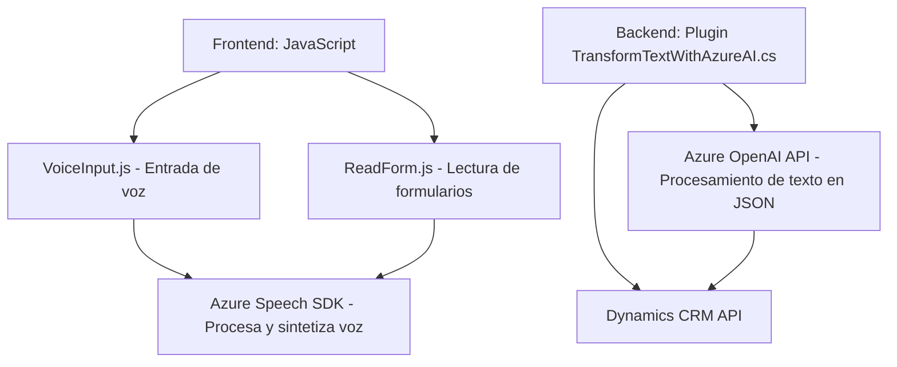

### Breve resumen técnico:
El repositorio parece estar diseñado para proporcionar funcionalidades avanzadas mediante el uso de voz (con Azure Speech SDK) y la integración de servicios de inteligencia artificial, específicamente Azure OpenAI, en un entorno de Microsoft Dynamics CRM. Los principales elementos incluyen frontend para interacción con datos y voz, y un plugin .NET que interactúa con el backend del CRM para procesamiento avanzado.

---

### Descripción de arquitectura:
La solución implementa una arquitectura híbrida compuesta por tres elementos:
1. **Frontend modular**: Contiene scripts en JavaScript para crear una interfaz web en entornos de CRM, permitiendo procesamiento por voz (reconocimiento y síntesis de voz).
2. **Backend con plugins**: Un plugin de Microsoft Dynamics CRM que maneja el procesamiento de texto transformándolos en formato estructurado con Azure OpenAI.
3. **Integración de servicios externos**:
   - **Azure Speech SDK**: Procesamiento de entrada/salida de voz en el frontend.
   - **Azure OpenAI API**: Usada en el plugin del backend para analizar texto y construir objetos JSON según requerimientos.

---

### Tecnologías usadas:
1. **Frontend**:
   - **JavaScript**: Implementa funciones de manejo de entrada/síntesis de voz y manipulación de datos de formularios.
   - **Azure Speech SDK**: Reconocimiento y síntesis de voz.
   - **Dynamics CRM API**: Manipulación y lectura de datos en formularios CRM.
   - **Browser APIs**: Para lógica de navegador y carga dinámica.

2. **Backend**:
   - **Microsoft.Xrm.Sdk**: Permite interacción con servicios de Dynamics CRM.
   - **.NET Framework**: Facilita la ejecución de plugins en el entorno CRM.
   - **Azure OpenAI API**: Procesamiento de texto usando GPT-4 o similar.
   - **External Libraries**:
     - `Newtonsoft.Json.Linq`: Manipulación de estructuras JSON.
     - `System.Net.Http`: Peticiones HTTP.
     - `System.Text.Json`: Serialización y normalización de JSON.

3. **Architecture Patterns**:
   - Modular design.
   - Event-driven operations in frontend (callbacks).
   - Plugin architecture for backend.
   - Integration and process automation via external microservices (Azure APIs).

---

### Diagrama Mermaid válido para GitHub:

---

### Conclusión final:
Este repositorio implementa una **arquitectura modular híbrida** con una mezcla de elementos de desarrollo frontend y backend integrados con servicios en la nube de Microsoft Azure. Los scripts en el frontend son responsables de manejar la entrada de voz y sintetizar datos desde formularios, usando el SDK de Azure Speech. En el backend, un plugin específicamente diseñado para el CRM transforma texto de entrada en objetos JSON estructurados utilizando Azure OpenAI, facilitando la automatización de procesos en aplicaciones empresariales. La elección de herramientas como Azure Speech SDK y Azure OpenAI API indica un enfoque hacia la accesibilidad y el procesamiento inteligente de datos.