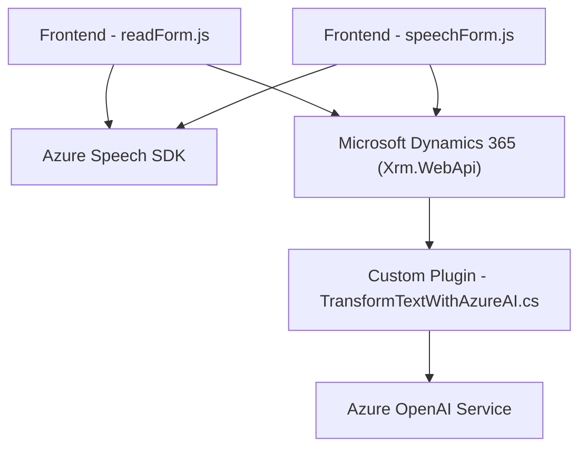

### Breve resumen técnico
El repositorio analiza una solución que combina tecnologías para interfaces, reconocimiento de voz, síntesis de texto hacia voz, y comunicación con servicios de inteligencia artificial y CRM en un contexto de Microsoft Dynamics 365. El ecosistema utiliza componentes frontend (`readForm.js`, `speechForm.js`) y un plugin backend (`TransformTextWithAzureAI.cs`) que interactúan con servicios como Azure Speech SDK y Azure OpenAI.

---

### Descripción de la arquitectura
La solución parece ser una **arquitectura híbrida** con componentes distribuidos. Combina un modelo de dos capas principales:
1. **Frontend**:
   - Encargado de la interacción con el usuario, incluyendo lectura de formularios en Dynamics 365 y reconocimiento de voz mediante Azure Speech SDK.
   - Encapsula lógicas de procesamiento locales y coordinación con backend para realizar operaciones que requieran más capacidades (como transformación avanzada del texto usando IA).
2. **Backend (Plugin en Dynamics 365)**:
   - Alojado dentro de la arquitectura de Dynamics CRM.
   - Responsable de procesar las solicitudes del frontend, invocar el servicio de Azure OpenAI para transformar el texto, y devolver respuestas JSON procesadas.

La solución utiliza servicios externos para realizar tareas clave, como el reconocimiento de voz y procesamiento de texto, siguiendo el principio de **orientación a servicios (SOA)**. Dado el diseño modular y la interacción con APIs externas, la arquitectura tiende hacia un enfoque **orientado a microservicios/separación de responsabilidades**.

---

### Tecnologías usadas
1. **Frontend (JavaScript)**:
   - **Azure Speech SDK**: Para reconocimiento de voz y síntesis de texto en voz.
   - **Dynamics 365 APIs**: Para operar sobre formularios y datos dinámicos.
   - **Ecmascript módulos**: Para mantener código modular y facilitar reusabilidad.

2. **Backend (C# en Dynamics 365)**:
   - **Azure OpenAI Service**: Procesamiento de texto basado en modelos GPT a través de servicios REST.
   - **Microsoft Dynamics SDK (Xrm)**: Para desarrollo de plugins personalizados que actúan como extensiones dentro del CRM.
   - **Newtonsoft.Json**: Para manejar y procesar objetos JSON.

---

### Diagrama Mermaid válido para GitHub

---

### Conclusión final
Este repositorio representa una solución de integración que conecta servicios avanzados de Azure con una plataforma CRM (Dynamics 365). El diseño modular y la dependencia de APIs externas, como Azure Speech SDK y Azure OpenAI Service, le otorgan características de una arquitectura moderna orientada a servicios. Sin embargo, los módulos adolecen de ciertas prácticas de seguridad, como evitar almacenamiento directo de claves API en el código. Además, se podría mejorar la gestión de errores para robustecer la interacción con los servicios externos.