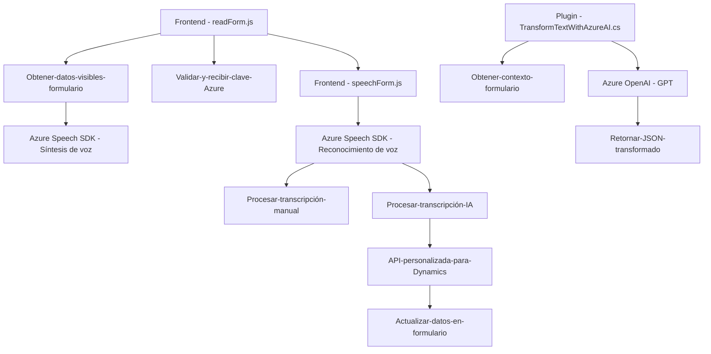

### Breve resumen técnico

La solución implementa un sistema integrado entre un frontend basado en JavaScript y la plataforma Microsoft Dynamics CRM. Utiliza herramientas y servicios como el Azure Speech SDK para síntesis/reconocimiento de voz y el servicio Azure OpenAI para transformación de texto en un contexto dinámico de formularios. La arquitectura es modular y está diseñada para funcionar en un entorno que interactúa frecuentemente con APIs y plataformas externas.

---

### Descripción de la arquitectura

1. **Tipo de solución**: Está diseñada como un componente para una aplicación CRM que utiliza un frontend de JavaScript y complementos de backend en C#. Se integra funciones de voz para la síntesis de texto y captura de transcripciones habladas, además de un procesamiento avanzado de texto mediante una API de IA.

2. **Arquitectura**:  
   - **Híbrida: n capas con integración externa**.  
   - El **frontend** realizado en JavaScript interactúa directamente con la interfaz de usuario, procesando datos del formulario y usando servicios como Azure Speech SDK dinámicamente cargado.  
   - El **backend** se ejecuta como un plugin conectado a Microsoft Dynamics CRM y comunicándose con el servicio Azure OpenAI.  

3. **Patrones de diseño aplicados**:  
   - **Modularidad**: Separación clara de responsabilidades en funciones individuales en los archivos JavaScript.  
   - **Plugin Pattern**: Utilizado en la solución C# para Dynamics.  
   - **External API Integration**: Implementación de solicitudes HTTP hacia Azure Speech SDK y Azure OpenAI en los diferentes componentes.  
   - **Event-driven Architecture**: Callback dinámico (`ensureSpeechSDKLoaded`) para establecer dependencias en JavaScript.  

---

### Tecnologías usadas

1. **Frontend**:
   - Lenguaje: JavaScript.
   - Framework: Ninguno aparente (se usa JavaScript nativo para la mayoría de las operaciones).
   - Servicio externo: **Azure Speech SDK** (síntesis y reconocimiento de voz).  
   - **Microsoft Dynamics CRM JS API**: Interacción con la estructura de los formularios y sus atributos.  

2. **Backend**:
   - Lenguaje: C# con .NET Framework/Core.
   - Framework: Microsoft Dynamics CRM SDK.
   - Servicio externo: **Azure OpenAI API (GPT-4 o similar)**.  
   - Complementos para procesamiento de JSON: `Newtonsoft.Json` o `System.Text.Json`.

3. **Dependencias comunes**:
   - APIs externas como Azure Speech SDK y Azure OpenAI.
   - Servicios de Dynamics: Web API y plugins personalizados.

4. **Interacción interna**:
   - El frontend envía y recibe información del formulario, mientras que el backend toma el texto y lo transforma en datos estructurados JSON.
   - Comunicación directa entre la aplicación del CRM y servicios de Azure.

---

### Diagrama Mermaid

---

### Conclusión final

Este repositorio implementa una solución robusta con integración profunda entre un frontend desarrollado en JavaScript y una arquitectura backend basada en Microsoft Dynamics CRM y Azure. Se centra en la interacción usuario-sistema mediante voz y el procesamiento de datos mediante inteligencia artificial. La arquitectura es un híbrido de n capas y adopta patrones como modularidad y plugin, conducida por servicios de Azure y APIs externas en un ecosistema empresarial.