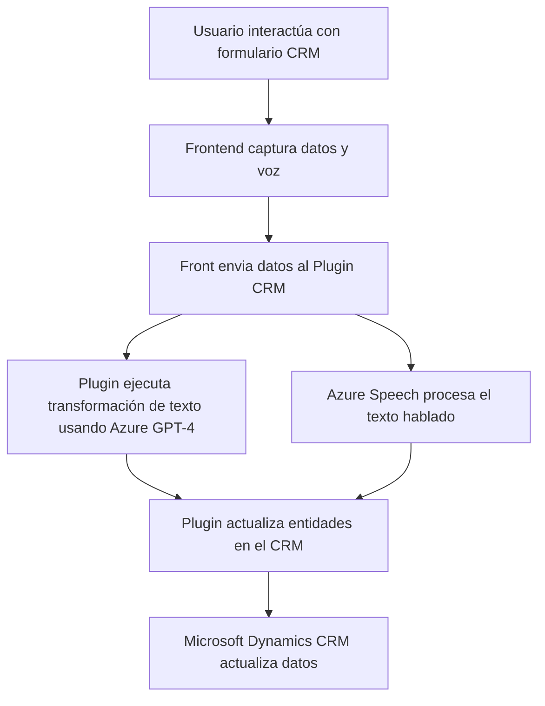

### Breve resumen técnico:
El repositorio implementa funcionalidades orientadas a capturar, procesar y transformar datos en formularios dinámicos de **Microsoft Dynamics CRM**. Se enfoca principalmente en el uso de **Azure Speech SDK** para reconocimiento/síntesis de voz y en **Azure OpenAI** para interpretaciones avanzadas de texto. La arquitectura combina módulos frontend basados en JavaScript y plugins backend creados en C#, integrándose directamente en Dynamics CRM.

---

### Descripción de arquitectura:
Este sistema refleja una arquitectura **en capas** orientada a servicios. Los archivos frontend actúan como la capa de presentación, mientras que los plugins en C# representan una capa de lógica empresarial/inteligencia procesal en el servidor. El sistema hace un uso extensivo de servicios cloud (Azure Speech, Azure AI) para delegar tareas complejas, como el reconocimiento de voz y transformación de texto. La interacción con Dynamics CRM adopta tanto APIs internas como enfoques asincrónicos mediante SDKs externos.

#### Estructura aproximada:
1. **Capa de presentación (Frontend JS):** Captura datos de formularios y envía comandos/asincronías al backend.
2. **Capa lógica empresarial basada en plugins (C#, Dynamics CRM):** Procesa solicitudes, transforma datos (JSON/AI), y actualiza entidades del CRM.
3. **Integración de servicios cloud:** Servicios externos utilizados para voz y APIs inteligentes.

---

### Tecnologías usadas:
1. **Frontend:**
   - **JavaScript:** Estructura funcional basada en modulación de funciones específicas para integración Dynamics.
   - **Azure Speech SDK:** Usado para reconocimiento/síntesis de voz en tiempo real.
   - **Dynamics CRM Web API:** Para manipulación directa de datos desde formularios.

2. **Backend:**
   - **C# (Plugins en Dynamics CRM):**
     - **Microsoft.Xrm.Sdk:** Para contexto y manejo del modelo de datos del CRM.
     - **Azure OpenAI:** Interacción con servicios GPT-4 para generar JSON estructurado.
     - **HTTP y JSON Libraries:** Realiza peticiones al endpoint API de OpenAI.

3. **Servicios de Azure:**
   - Azure Speech (CDN SDK para reconocimiento/síntesis).
   - Azure AI (GPT-4 para transformación avanzada de texto).
   - Azure Cloud Infrastructure para seguridad y despliegue.

4. **Patrones de diseño:**
   - Modularidad: Separación clara entre reconocimiento de voz, transformación de texto, y lógica CRM.
   - Integración de servicios cloud: Delegación de tareas avanzadas a plataformas como Azure.
   - Estructura en capas: Según el rol funcional (frontend/presentación, lógica empresarial/backend).

---

### Diagrama Mermaid válido:

---

### Conclusión final:
El sistema implementado en este repositorio evidencia una integración avanzada para Microsoft Dynamics CRM utilizando servicios cloud de **Azure (Speech SDK, OpenAI)** y arquitecturas basadas en servicios. La capa frontend maneja operaciones de presentación y la capa backend gestiona lógica empresarial. Aunque la arquitectura es suficientemente modular, hay áreas que requieren atención, como la inclusión directa de credenciales en el código o el acoplamiento fuerte al contexto de formulario. Para garantizar mayor seguridad y escalabilidad, las credenciales deben cifrarse y el código debe optimizarse para un desacoplamiento más claro.