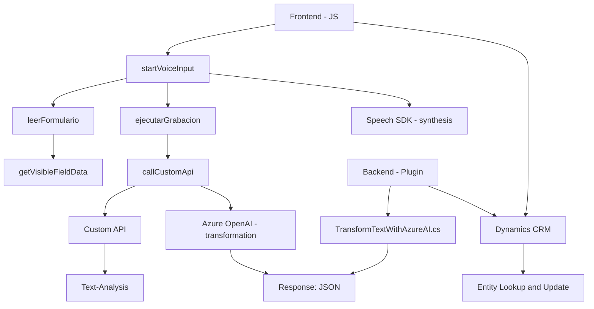

### Breve resumen técnico
El repositorio se define como una solución híbrida que implementa tanto un **Frontend** como plugins para un **CRM Dynamics 365**, especialmente enfocados en funcionalidad basada en procesamiento de texto y voz mediante el **Azure Speech SDK** y **Azure OpenAI**. La solución integra módulos de entrada de voz, lectura de formularios, y un plugin para transformar lenguaje natural a JSON estructurado utilizando inteligencia artificial.

---

### Descripción de arquitectura
La arquitectura parece tener una orientación **multicapa** (n capas), en la que se dividen responsabilidades entre la UI, la lógica de procesamiento y la interacción con servicios API externos (integrados mediante SDK). Estas capas son:

1. **Capa de presentación (Frontend/JS)**: Gestiona interacciones del usuario con la entrada de voz y actualiza formularios dinámicos en el CRM.
2. **Capa de lógica de negocio (Plugins)**: Define cómo procesar el texto usando reglas de negocio específicas y delegar tareas al servicio Azure OpenAI.
3. **Capa de acceso a datos (Dynamics CRM API)**: Interactúa con el contexto del CRM para facilitar modificaciones en los datos de los formularios.
4. **Capa externa/integración**: Uso extensivo del **Azure Speech SDK** y **Azure OpenAI Service** para síntesis de voz, reconocimiento de voz y análisis semántico avanzado.

La arquitectura implementa **modelos de integración de servicios**, respaldados con SDK externos y patrones como lazy loading, modularidad y delegación.

---

### Tecnologías usadas
1. **Frontend:**
   - Lenguaje: **JavaScript**.
   - Frameworks: **Azure Speech SDK**, **DOM API**.
   - Infraestructura externa: API de Azure Speech para síntesis y reconocimientos.

2. **Backend (plugins)**:
   - Lenguaje: **C#**.
   - Frameworks: **Microsoft Dynamics SDK**, **Azure OpenAI** (GPT Model).
   - Infraestructura: HTTP Client para solicitudes REST al servicio Azure OpenAI.
   - Dependencias adicionales:
     - **Newtonsoft.Json**.
     - **System.Text.Json**.

3. **Servicios integrados**:
   - Dynamics CRM API (Xrm.WebApi).
   - Servicios de Azure Speech y OpenAI.

---

### Diagrama Mermaid válido para GitHub

---

### Conclusión final
El análisis refleja que esta solución está orientada a proporcionar capacidades avanzadas de interacción mediante voz y lenguaje natural a un sistema CRM (Dynamics 365) conectado con servicios de **Azure Speech** y **Azure OpenAI**. La arquitectura n capas organiza correctamente las responsabilidades, tratando temas como modularidad y delegación en cada capa.

Asimismo, la integración con Azure servicios y la dependencia del contexto CRM confieren una gran potencia y flexibilidad a la solución, aunque también la vuelven dependiente de la disponibilidad de estos servicios. Este repositorio parece formar una parte esencial de aplicaciones enfocadas en procesamiento de voz y experiencia del cliente dinámicamente.