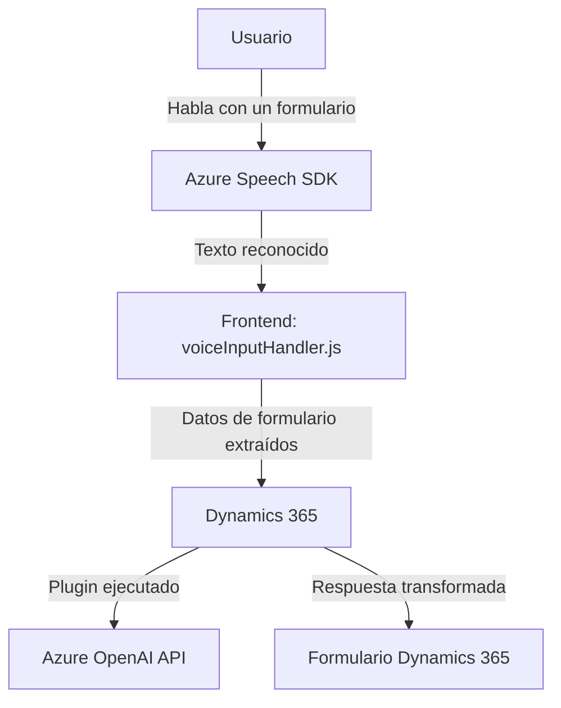

### Breve Resumen Técnico

El repositorio incluye archivos que implementan funcionalidades de inteligencia artificial sobre Dynamics CRM, interactuando con formularios y procesando datos con APIs externas como Azure Speech SDK y Azure OpenAI. Es una solución orientada principalmente a procesar datos del usuario (voz o texto) y convertirlos en información estructurada que es usada en formularios de Dynamics 365.

---

### Descripción de la Arquitectura

La arquitectura del proyecto parece estar centrada en un **modelo de capas** y **microservicios externos**:
1. **Capa de presentación**:
   - Los archivos en `FRONTEND/JS` tratan las interacciones directas con el usuario (formulario, sintaxis de voz, texto).
   - El frontend usa SDKs para integrar funciones (Azure Speech SDK).

2. **Capa de lógica de negocio**:
   - El archivo `.cs` en `Plugins` actúa como un plugin extendiendo Dynamics CRM.
   - Azure GPT-4 (OpenAI) maneja la lógica de transformación textual.

3. **Integraciones externas**:
   - Azure Speech SDK: Para sintetizar texto a voz y realizar reconocimiento de voz.
   - Azure OpenAI: Para procesamiento avanzado de texto. Esto se integra mediante un microservicio externo.

El diseño sugiere un modelo modular altamente extensible:
- El frontend (JavaScript) encapsula funciones específicas de interacción y síntesis de voz.
- Un backend basado en Dynamics CRM (C# Plugin) conecta con servicios externos para IA avanzada.
- La arquitectura propone **desacoplamiento funcional**, delegando tareas especializadas a las APIs de Azure, lo cual sigue los principios de integración en n-capas.

---

### Tecnologías y Frameworks

1. **Frontend**:
   - Lenguaje: JavaScript.
   - Frameworks/SDKs:
     - Dynamics 365 SDK (manejo de `executionContext` y formularios).
     - Azure Speech SDK (síntesis y reconocimiento de voz).

2. **Backend/Integración**:
   - Lenguaje: C#.
   - Framework:
     - Dynamics CRM SDK para plugins.
   - Servicios Externos:
     - Azure GPT-4 (API de OpenAI para transformar texto estructurado).
   - Librerías:
     - `System.Text.Json`, `Newtonsoft.Json.Linq` (procesamiento JSON).
     - `System.Net.Http` (peticiones HTTP).

---

### Dependencias Externas

1. **Azure Speech SDK**:
   - Usado para la síntesis de voz y reconocimiento de voz.
   - Carga dinámica en frontend.

2. **Azure OpenAI API**:
   - Usada por el plugin para procesamiento avanzado de texto.

3. **Dynamics 365 API**:
   - En C# para gestionar interacciones con el contexto CRM vía `IPlugin`.

4. **Framework/plugin en Dynamics**:
   - Permite extender la funcionalidad del CRM integrando código específico.

5. **APIs Dom (frontend)**:
   - Gestiona la carga dinámica de scripts.

---

### Diagrama Mermaid

---

### Conclusión final

La solución descrita en estos archivos combina funcionalidades avanzadas de IA (Azure OpenAI y Speech SDK) para extender Dynamics 365 mediante:
- **Frontend:** Modular y diseñado para reconocimiento/síntesis con interacción directa sobre formularios.
- **Backend:** Extensibilidad dinámica a través de un plugin que enlaza con microservicios de IA externos.

La arquitectura general está diseñada en **n-capas**, promoviendo un diseño modular y que desacopla la lógica de procesamiento IA del resto del sistema. Es ideal para escenarios donde Dynamics CRM requiera automatización e inteligencia habilitada por voz y texto, integrándose fluidamente con Azure Cloud.