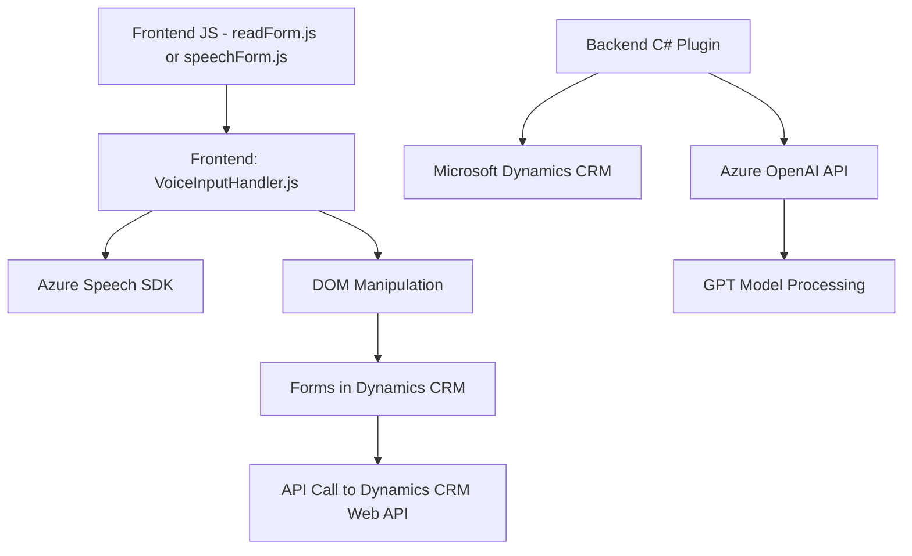

### Breve resumen técnico
El repositorio presenta una solución que integra servicios de procesamiento de voz y texto con Microsoft Dynamics CRM. La funcionalidad principal incluye la captación de voz para transformar texto en tiempo real, gestionar información en formularios, y transformar texto utilizando IA en contextos de CRM. Utiliza tecnologías de Microsoft (Azure Speech SDK, Azure OpenAI) y combina arquitectura de cliente-ligero con la extensibilidad basada en plugins dentro de Dynamics CRM.

---

### Descripción de arquitectura
1. **Tipo de solución**:
   - Principalmente una integración de varios servicios utilizando **SDKs de Azure** y un plugin en **Microsoft Dynamics CRM**. 
   - Tiene un **frontend en JavaScript** (procesamiento en cliente) para interactuar con formularios, captura de voz, y la manipulación de datos en Dynamics CRM. 
   - Además, implementa un **plugin back-end** en C# para procesar texto con reglas predefinidas utilizando Azure OpenAI.

2. **Arquitectura**:
   - Es una arquitectura **modular** que mezcla dos enfoques:
     - **Cliente-servidor**: El frontend utiliza los servicios de Azure para síntesis y transcripción de voz.
     - **Plugin System**: El backend extiende las capacidades de Dynamics CRM con procesamiento avanzado de texto mediante solicitudes HTTP a Azure OpenAI.

3. **Estrategia de capas**:
   - Presenta una arquitectura de **mínimo acoplamiento** gracias al desacoplamiento entre Azure Speech SDK / OpenAI y la lógica del sistema.
   - Los componentes están organizados en **capas funcionales**:
     - **Frontend (JavaScript)**: Procesamiento de datos y síntesis de voz.
     - **Plugin (C#)**: Procesamiento avanzado mediante IA en el backend de Dynamics CRM.
     - **Azure SDKs y OpenAI API**: Componentes externos para datos y servicios.

---

### Tecnologías usadas
1. **Frontend**:
   - **JavaScript**: Manipulación del DOM, llamadas async/await y modularización en funciones.
   - **Azure Speech SDK**: Para síntesis y transcripción de voz.
2. **Backend**:
   - **C# (.NET Framework)**: Implementación de plugins utilizando Dynamics CRM SDK.
   - **Azure OpenAI API**: Procesamiento avanzado de texto con GPT.
   - **NuGet Packages**:
     - System.Text.Json, Newtonsoft.Json.Linq: Manipulación de JSON.
     - System.Net.Http y Expressiones LINQ.
3. **Servicios externos**:
   - **Dynamics CRM Web API**: Interacción con formularios y entidades en el CRM.
   - **Azure Cloud**: Speech SDK y AI API.

---

### Dependencias o componentes externos
- **Azure Speech SDK**: Manejo de síntesis de voz en el frontend.
- **Dynamics CRM Web API**: Leer y escribir datos de formularios y entidades en el entorno CRM.
- **Azure OpenAI API**: Comunicación con el modelo GPT para procesamiento textual.
- **NuGet Helpers y System Libraries**: Herramientas para JSON, HTTP, y funcionalidades adicionales con manipulación de texto y expresiones regulares.

---

### Diagrama Mermaid compatible con GitHub Markdown

---

### Conclusión final
El sistema implementado en este repositorio utiliza una combinación de tecnologías modernas de Microsoft Azure y Dynamics CRM para integrar técnicas avanzadas de IA y procesamiento de voz. La arquitectura está orientada a lograr un flujo eficiente de datos entre el frontend, backend, y servicios externos. Se adoptan patrones de diseño como la modularidad, el consumo de API externas, y el sistema de plugins del entorno CRM para extender sus capacidades.

Este proyecto es adecuado para escenarios empresariales que buscan aprovechar herramientas de IA y voz en la automatización de procesos en un CRM, manteniendo altos niveles de extensibilidad y funcionalidades avanzadas.