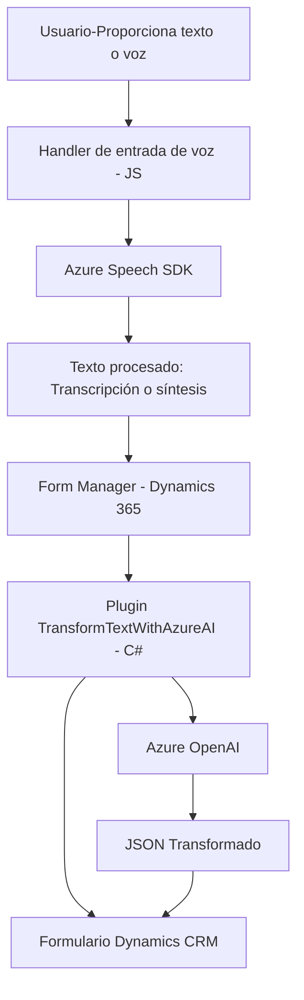

### Breve resumen técnico
Este repositorio parece estar relacionado con la integración de funciones de voz e inteligencia artificial (Azure Speech SDK y Azure OpenAI) en un sistema CRM basado en Dynamics 365. Su objetivo es proporcionar interacción mediante entrada de voz, procesamiento de datos en formularios y transformación avanzada de texto usando servicios de Azure.

---

### Descripción de arquitectura
La solución utiliza una **arquitectura modular** con componentes bien definidos:
1. **Front-End**:
   - Gestiona entrada y salida de voz en tiempo real, integrado con **Azure Speech SDK**.
   - Permite interacción directa con formularios basados en Dynamics 365.

2. **Plugin en CRM**:
   - Amplía la funcionalidad de Dynamics 365 mediante la API de plugins del CRM.
   - Procesa texto con **Azure OpenAI Service** y genera estructura JSON transformada.

### Tipo de arquitectura:
La solución combina el enfoque de **Microservicios**, en donde servicios externos como Azure Speech SDK y Azure OpenAI son invocados vía API, con una **arquitectura de complemento de CRM**, en la que el comportamiento del sistema central se extiende mediante plugins. Sin embargo, evidencia un enfoque de **n capas** en la separación entre lógica de voz/SDK, datos (formulario) y procesamiento IA.

---

### Tecnologías y patrones usados
**Principales tecnologías/frameworks:**
1. **Azure Speech SDK**: Para reconocimiento de voz y síntesis de texto a voz.
2. **Azure OpenAI Service**: Para procesamiento avanzado y transformación de texto.
3. **Microsoft Dynamics 365 SDK**: Para desarrollo de plugins y manipulación de los formularios.
4. **JavaScript**: En archivos relacionados al frontend (para gestionar discurso y formularios).
5. **.NET Framework (C#)**: Para el desarrollo de plugins utilizando `Microsoft.Xrm.Sdk`.
6. **REST APIs**: A través de llamadas a servicios externos (Azure Speech y OpenAI).

**Patrones detectados:**
1. **Fachada**: La simplificación de procesos mediante puntos de entrada principales (e.g., `startVoiceInput`).
2. **Delegación de responsabilidades**: Las funciones están divididas en tareas específicas para modularidad y reutilización (e.g., `processTranscript` para mapeo de datos).
3. **Programación basada en eventos**: La carga dinámica de Azure SDK se realiza con callbacks (`ensureSpeechSDKLoaded`).
4. **Integración de microservicios**: Uso de SDKs y APIs externos para delegar responsabilidades específicas como IA y procesamiento de voz.

---

### Dependencias o componentes externos
**Externos**:
1. **Azure Speech SDK**: Reconocimiento y síntesis de voz.
2. **Azure OpenAI Service**: Procesamiento avanzado de texto con modelos GPT.
3. **Dynamics CRM SDK**: Interacción directa con datos, atributos y entidades del formulario.

**Internos**:
1. **API personalizada de Dynamics 365**: Personalizada en el sistema central para obtener mapeos y aplicar datos procesados.

---

### Diagrama Mermaid válido para GitHub

---

### Conclusión final
Este sistema implementa una solución híbrida, combinando microservicios y una arquitectura modular para integrar voz e inteligencia artificial en Dynamics 365. Los componentes están claramente divididos entre frontend (JS para entrada/salida de voz), backend (plugin de Dynamics para procesamiento avanzado) y servicios externos (Azure Speech SDK y Azure OpenAI). La estructura es eficiente para casos donde CRM requiere interfaces avanzadas basadas en voz e inteligencia artificial.