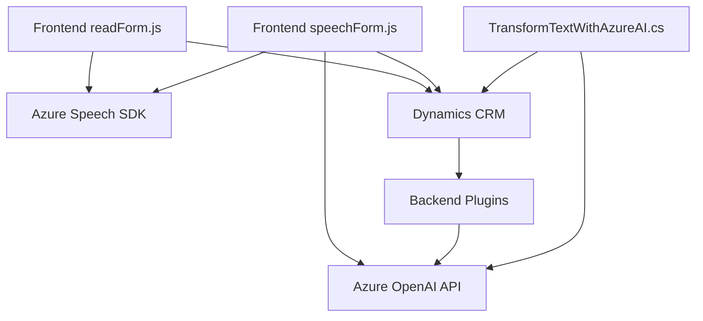

### Breve resumen técnico:
El repositorio es parte de una solución que integra la funcionalidad de reconocimiento y síntesis de voz junto con la interacción y manipulación de formularios en el contexto de **Microsoft Dynamics 365 CRM**. Además, utiliza componentes externos como **Azure Speech SDK** y **Azure OpenAI API** para procesar voz y texto a través de avanzadas capacidades de inteligencia artificial. La solución incluye tanto componentes frontend (JavaScript) como backend (.NET) orientados particularmente a servicios y plugins.

---

### Descripción de arquitectura:
La arquitectura aparenta ser una solución híbrida centralizada en torno a Microsoft Dynamics CRM. Se utiliza una combinación de programación frontend con JavaScript y backend con C# para la integración de servicios y lógica empresarial. Se puede clasificar como una **arquitectura n-capas**, donde se manejan:
1. **Capa de presentación**: Contiene los archivos JavaScript `readForm.js` y `speechForm.js` para interactuar con los elementos de la interfaz en Dynamics 365.
2. **Capa de servicios**: Plugins como `TransformTextWithAzureAI.cs` gestionan la lógica empresarial y se integran con servicios externos como Azure OpenAI por medio de la Web API del CRM.
3. **Capa de datos**: Interaction con la base de datos de Dynamics a través de la API `Xrm.WebApi.online.execute`.

La solución está diseñada para integrarse principalmente con servicios externos, siguiendo un enfoque de **modularidad funcional** y una arquitectura basada en eventos.

---

### Tecnologías usadas:
1. **Frontend**:
   - **JavaScript**
   - **Azure Speech SDK** (para Text-to-Speech y Speech-to-Text).
   - APIs del navegador (DOM, `window`, etc.).

2. **Backend**:
   - **C#** (Framework .NET).
   - **Microsoft.Xrm.Sdk** (para interactuar con Dynamics CRM).
   - **Azure OpenAI API**:
     - Usada para procesamiento avanzado de texto mediante OpenAI (GPT models) desplegado en Azure.
   
3. **Frameworks/Librerías**:
   - **Newtonsoft.Json:** Para manipular datos en formato JSON.
   - **System.Net.Http:** Para realizar llamados HTTP a servicios externos.

### Patrones de diseño:
1. **Plugin Design Pattern**:
   - Implementación de lógica dinámica en el contexto de Dynamics CRM (plugins).
2. **Observer Pattern**:
   - Usado en los archivos de frontend para manejar eventos relacionados con la carga de SDK y escucha de comandos de voz.
3. **Factory Method**:
   - Creación dinámica de configuraciones, audio y reconocimiento en `Azure Speech SDK`.
4. **Service Abstraction**:
   - Interacción con servicios externos (Azure Speech SDK y Azure OpenAI API) mediante funciones específicas y desacoplamiento modular.

---

### Diagrama Mermaid compatible con GitHub Markdown:

---

### Conclusión final:
La solución analizada parece ser creada para enriquecer la experiencia de usuario en aplicaciones de **Microsoft Dynamics 365 CRM** mediante funcionalidades avanzadas, como reconocimiento y síntesis de voz en español, además de procesamiento inteligente de texto. El uso de Microsoft Azure como backend potencia las capacidades de la solución mediante servicios de inteligencia artificial. Por su estructura modular y el uso de servicios externos, la arquitectura puede alinearse a un modelo **n-capas** con un patrón de integración basado en eventos.