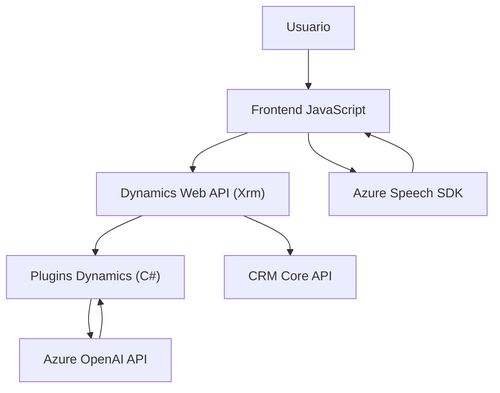

### Breve resumen técnico

El repositorio contiene una solución destinada a la integración de funcionalidades avanzadas de voz y procesamiento textual en aplicaciones basadas en Dynamics 365. Utiliza capacidades ofrecidas por el servicio `Azure Speech SDK` para reconocimiento y síntesis de voz, junto con el servicio `Azure OpenAI` para transformación inteligente de texto. La solución se divide en múltiples componentes: un frontend implementado en JavaScript para manejo de formularios con texto/voz, y un plugin en C# diseñado para transformaciones de texto en el servidor.

---

### Descripción de arquitectura

La arquitectura general de la solución parece adherirse al **patrón de arquitectura de n capas**. La división entre la capa de presentación (**frontend** basado en JavaScript) y la capa de negocio (**plugin en C#** para Dynamics) es evidente. Además, la integración con servicios externos como `Azure Speech SDK`, `Azure OpenAI`, y `Dynamics APIs` confirma un enfoque orientado a servicios con dependencias externas. Internamente, el código utiliza principios de modularidad mediante funciones y clases independientes.

#### Características clave:
1. **Frontend:** JavaScript para manejo de formularios y reconocimiento/síntesis de voz.
   - Manejo de la capa de presentación.
   - Manipulación directa del contexto de ejecución en Dynamics 365.
   - Uso de funciones modulares para procesar datos.
   
2. **Backend (Plugins):** C# para transformación avanzada del texto con integración directa hacia Dynamics y Azure OpenAI Service.
   - Manejo de lógica de negocio.
   - Transformaciones complejas usando servicios de cloud (Azure OpenAI).
   - Seguimiento de procesos en CRM.

3. **Backend Cloud Integration:** Servicios externos:
   - Azure Speech SDK.
   - Azure OpenAI API endpoint.
   - Web API de Dynamics CRM para interacción con datos y entidades.

Esto clasifica la solución como una combinación de una SPA (Single Page Application) para interacción de frontend y una arquitectura basada en servicios con capacidades extendidas por plugins de Dynamics.

---

### Tecnologías utilizadas

#### En el frontend:
1. **JavaScript (Vanilla HTML/JS):** Procesamiento dinámico y modular mediante funciones.
2. **Azure Speech SDK:** Reconocimiento de voz y síntesis Text-to-Speech desde el navegador.
3. **Dynamics 365 Web API (`Xrm`)**: Para acceso y manipulación de entidades y formularios CRM.

#### En el backend (plugins en C#):
1. **C# con Microsoft.Xrm.Sdk:** Implementación del modelo de plugins en Dynamics CRM.
2. **Azure OpenAI Service:** Procesamiento de texto avanzado mediante la API de GPT.
3. **System.Net.Http y JSON Serializers:** Para realizar y manipular respuestas de APIs externas.

#### Patrones utilizados:
1. **Modularidad:** Funciones y clases independientes con responsabilidades únicas.
2. **Delegación:** Uso de callbacks en funciones asíncronas (`ensureSpeechSDKLoaded`).
3. **API Gateway:** Integración externa para servicios como Azure Speech y Azure OpenAI.
4. **Dynamic Entity Mapping:** Generación de mapeos dinámicos entre atributos de formularios y entidades.

---

### Diagrama **Mermaid** compatible con GitHub Markdown

---

### Conclusión final

Este repositorio implementa una solución completa que conecta usuarios, datos y capacidades de inteligencia artificial con formularios dinámicos en Dynamics 365. Combina un enfoque modular orientado a servicios cloud como Azure con diseños orientados a eventos para manejar interacción, voz y texto.

La arquitectura de **n capas** está bien representada, integrando tecnologías modernas (Azure Speech SDK, OpenAI) con la infraestructura existente de Dynamics 365. Sin embargo, hay ciertas prácticas que podrían mejorarse:
1. **Gestión de seguridad:** Las claves de Azure expuestas en el frontend representan un riesgo significativo.
2. **Escalabilidad:** Aunque la estructura en fases es robusta, depender de un único endpoint de Azure para cargas intensas podría requerir una arquitectura más distribuida como microservicios.
