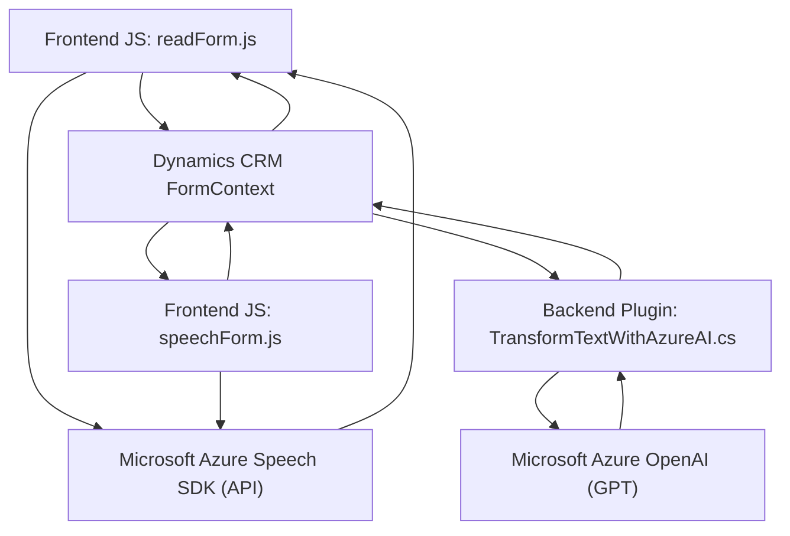

### **Breve resumen técnico:**
El repositorio contiene archivos con implementaciones para integrar servicios de procesamiento de voz y texto. Estos archivos hacen uso de tecnologías modernas y patrones arquitectónicos adecuados para la comunicación con servicios externos en la nube, específicamente con Microsoft Azure (Speech SDK, OpenAI). La solución se orienta principalmente a la funcionalidad como soporte interactivo, tanto en el frontend como con un plugin para Dynamics CRM.

---

### **Descripción de arquitectura:**
1. **Tipo de solución:**
   - La solución es una integración híbrida entre servicios en la nube (Microsoft Azure Speech SDK y OpenAI), un frontend manejado por JavaScript, y un backend basado en Dynamics CRM plugins.

2. **Arquitectura:**
   - El sistema utiliza una arquitectura de varias capas (n capas) donde:
     - **Presentación**: Frontend, scripts JavaScript para la interacción con el usuario, captura de voz en el navegador y manipulación del cliente Dynamics.
     - **Lógica Aplicativa**: Plugin en Dynamics CRM ejecuta operaciones relacionadas con la transformación de texto mediante las APIs de OpenAI (Azure).
     - **Servicios Externos**: Servicios en la nube de Microsoft Azure (Speech SDK y Azure OpenAI) realizan el procesamiento.

---

### **Tecnologías usadas:**
- **Frontend:**
  - JavaScript: Código que gestiona la interacción con el usuario, incluyendo reconocimiento de voz, procesamiento y comunicación con los servicios de Microsoft Azure y Dynamics CRM.
  - Microsoft Azure Speech SDK: Para reconocimiento de voz y síntesis del texto en audio en el cliente.

- **Backend:**
  - Microsoft Dynamics CRM: Extendido con un plugin (C#) que utiliza la interfaz `IPlugin`.
  - Microsoft Azure OpenAI via REST API: GPT para la manipulación de texto con IA.

- **Librerías y Frameworks:**
  - **Microsoft.Xrm.Sdk**: Para interactuar con Dynamics CRM.
  - **Newtonsoft.Json.Linq**: Para el manejo y manipulación de JSON transformado por la API.
  - **System.Net.Http**: Para enviar y procesar solicitudes HTTP hacia las APIs de Azure.
  - **().Microsoft.SqlServer.Server**, **System.Text.Json**: Serialización de JSON y operaciones auxiliares.

---

### **Dependencias o componentes externos:**
1. **Servicios Cloud:**
   - Microsoft Azure Speech SDK para la síntesis y reconocimiento de voz.
   - Microsoft Azure OpenAI (GPT models) para la IA que transforma texto.

2. **APIs internas de Dynamics CRM:**
   - `Xrm.WebApi.online`: Utilización de Custom API de Dynamics CRM desde el frontend con llamadas REST.
   - Contexto de CRM proporcionado por `IPluginExecutionContext`.

3. **Desarrollo con tecnologías .NET:**
   - Utilización de librerías y el framework CRM extensible de Microsoft.
  
4. **Common Utilities:**
   - Manipulación del DOM en el frontend utilizando funciones JS estándar.
   - Uso de patrones como la encapsulación de funciones que facilitan la integración con cloud.

---

### **Diagrama Mermaid válido para GitHub**

---

### **Conclusión final:**
La solución se presenta como una implementación modular y extensible para integrar servicios avanzados de voz y procesamiento de texto en un sistema basado en Microsoft Dynamics CRM. El enfoque arquitectónico de **n capas** permite separar claramente la lógica de frontend, la backend (CRM plugin), y la interacción con servicios cloud externos. Se integran patrones de encapsulación y desacoplamiento mediante la carga dinámica de scripts.

Esto es ideal para aplicaciones que necesitan aprovechar servicios avanzados de Microsoft Azure mientras generan integraciones versátiles y accesibles directamente en formularios de Dynamics. Sin embargo, se podrían mejorar aspectos de configuración centralizada, manejo de errores más robusto, y el uso de integraciones proactivas para aumentar la resiliencia y escalabilidad del sistema.